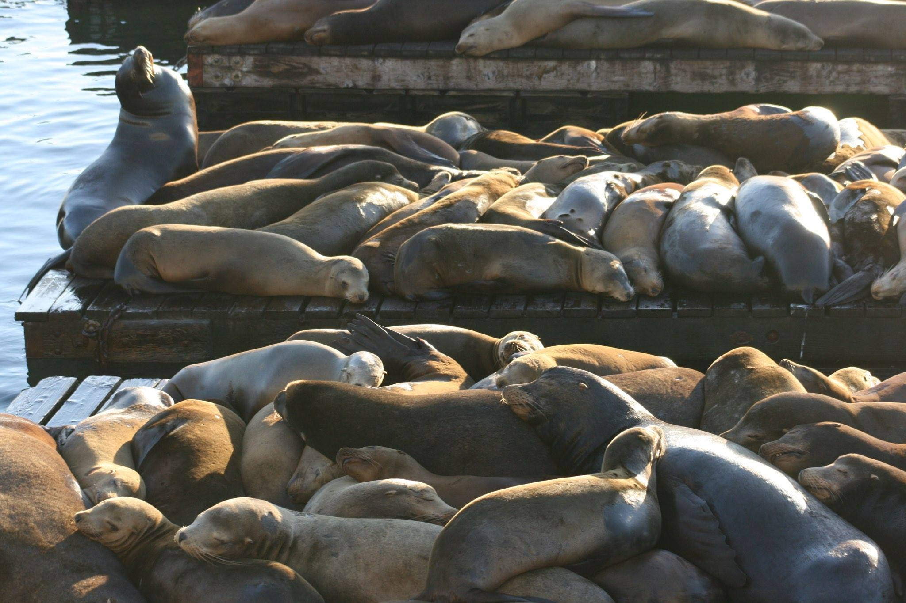
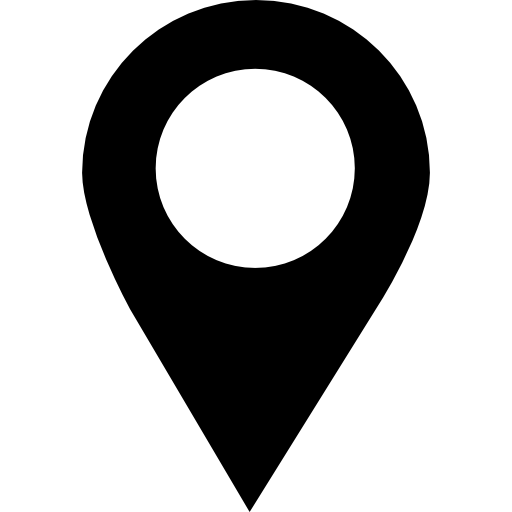

 

<!-- Draw the contact box style-->

<meta name="viewport" content="width=device-width, initial-scale=1">

<!-- First column -->

  

  <!-- Email address -->
    j.palacios[at]oceans.ubc.ca
  </a>
   
   
  <!-- UBC location -->
  
  <a href="https://oceans.ubc.ca">The Institute for the Oceans and Fisheries
  </a>
   
   
  <!-- Googl Scholar address -->
  
  <a href="https://scholar.google.ca/citations?user=EZpBcjcAAAAJ&hl=en">Google Scholar
  </a>
   
   
  <!-- GitHub webpage -->
  
  <a href="https://github.com/jepa">GitHub
  </a>
  

  <!-- Second column -->
  

  <a class="twitter-timeline" data-width="500" data-height="250" data-theme="light"
  href="https://twitter.com/julianop_a?ref_src=twsrc%5Etfw">Tweets by julianop_a
  </a>
  
  

<!-- Google translate code -->

----

<!-- Credit to logos -->

<a href="https://www.flaticon.com/free-icons/gps" title="gps icons">Gps icon created by Freepik - Flaticon</a>
<a href="https://www.flaticon.com/free-icons/email" title="email icons">Email icon created by Pixel perfect - Flaticon</a>