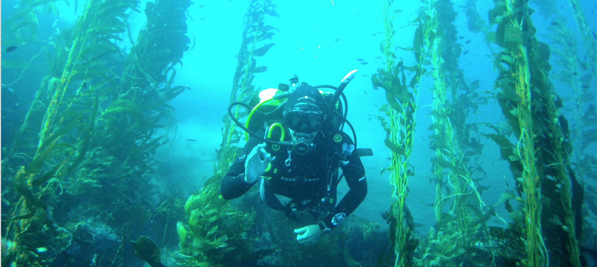
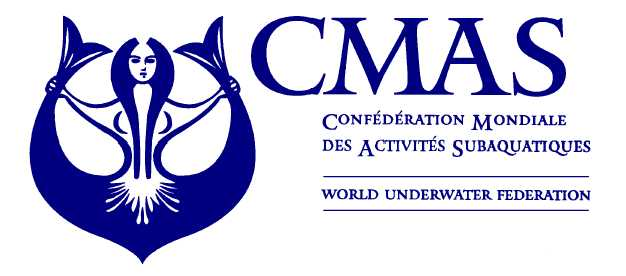

<!-- Google tag (gtag.js) -->
<script async src="https://www.googletagmanager.com/gtag/js?id=G-HG1RRBT88J"></script>
<script>
  window.dataLayer = window.dataLayer || [];
  function gtag(){dataLayer.push(arguments);}
  gtag('js', new Date());

  gtag('config', 'G-HG1RRBT88J');
</script>



<br>

My first official contact with the underwater world was in 2008. Since then I was sure that this was a lifetime activity. The underwater world grew on me so much and so quickly that I became a dive instructor and co-owned a diving center in Mexico city. The diving center is called Medusa Buceo. During that time I taught, traveled and dived a lot. Now I’m retired from all that excruciating responsibility and only dive for fun or research. I’ve dove in many different places and conditions and there is always something new to see, even in those places that you already visited.

You should really try it; for me diving is the closest feeling to floating in outer-space. It is so quiet that even though you are always (hopefully you are!) diving with a buddy, I still feel I’m all alone. The feeling of floating in the vastness of nothing, by yourself, hearing only abstract noises in the distance, is invaluable!

----

<center>
##  Diving Certifications


<style>
  .col2 {
    columns: 2 300px;         /* number of columns and width in pixels*/
    -webkit-columns: 2 300px; /* chrome, safari */
    -moz-columns: 2 300px;    /* firefox */
  }
</style>

<div class="col2">
<br>

### CMAS/FMAS

- Dive Instructor
- Advanced Diver
- Basic Diver
- Cave 1 Diver

<br>

### SDI/TDI

- Advanced Dive Instructor
- Advanced NITORX diver
- Basic NITORX diver
- Scientific Diver

</div>

<br>

[](http://www.cmas.org/federation-list/federation-federacion-mexicana-de-actividades-subacuaticas-ac) [](https://www.facebook.com/medusabuceo/)[](https://www.tdisdi.com/)

<br>

---- 

## Underwater Worlds Explored

```{r Diving_Places, eval = F, echo =FALSE, warning=F,message=F}
library(leaflet)
library(dplyr)
Diving_Data <- read.csv("Data/Dive_Log.csv") %>% 
  mutate(Pop = paste(Site, City,
                     sep=", "))


leaflet(Diving_Data) %>%
  addTiles(
    urlTemplate = "//{s}.tiles.mapbox.com/v3/jcheng.map-5ebohr46/{z}/{x}/{y}.png",
    attribution = 'Maps by <a href="http://www.mapbox.com/">Mapbox</a>',
    # urlTemplate = "//{s}.tiles.mapbox.com/v3/jcheng.map-5ebohr46/{z}/{x}/{y}.png",
    # attribution = 'Maps by <a href="http://www.mapbox.com/">Mapbox</a>'
  ) %>%
  addProviderTiles(providers$Stamen.Toner) %>% 
  setView(lng = -90, lat = 1.3, zoom = 2) %>% 
  addMarkers(
    lng = ~Long*-1,
    lat= ~Lat,
    popup = ~City
  )


```

<br>

*“The sea is everything. It covers seven tenths of the terrestrial globe. Its breath is pure and healthy. It is an immense desert, where man is never lonely, for he feels life stirring on all sides. The sea is only the embodiment of a supernatural and wonderful existence. It is nothing but love and emotion; it is the Living Infinite. ”* 
<br>
Jules Verne, Twenty Thousand Leagues Under the Sea

<br>
<hr>

<center>

**Contact**

j.palacios [at] oceans.ubc.ca | [Google Scholar](https://scholar.google.ca/citations?user=EZpBcjcAAAAJ&hl=en){target="_blank"} | [Bluesky](https://bsky.app/profile/julianop.bsky.social){target="_blank"}

</center>


<div id="google_translate_element"></div><script type="text/javascript">
function googleTranslateElementInit() {
  new google.translate.TranslateElement({pageLanguage: 'en', includedLanguages: 'es,pt'}, 'google_translate_element');
}
</script><script type="text/javascript" src="//translate.google.com/translate_a/element.js?cb=googleTranslateElementInit"></script>