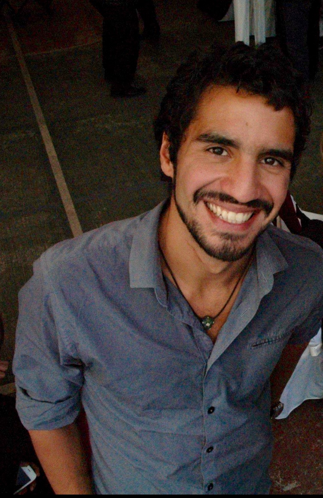

<!-- Global site tag (gtag.js) - Google Analytics -->

 

Welcome to my personal webpage. I am a Ph.D. candidate at the University of British Columbia in Vancouver, Canada. As part of the Changing Ocean Research Unit [(CORU)](http://coru.oceans.ubc.ca/){target="_blank"}, I am particularly interested in how climate change impacts fisheries management in Latin America and how to mitigate its socio-ecological implications. My current work explores how climate change is shifting the known distribution of marine fishes around the world. Specifically, I look at how such shifts are having uncertain feedbacks on marine systems and dependent fishing communities, accentuating sources of conflict over shared marine resources, and highlighting the need for adaptive, collaborative, ecosystem- based management strategies.

I support collaborative interdisciplinary work and I believe that all scientific work (and data) should be public and open access. As a Brazilian-Mexican citizen, I am committed to support policy-making and resource management decisions with a strong interdisciplinary science. In parallel with my research, I have worked with different governmental (e.g. *Comisión Nacional Para el Conocimiento de la Biodiversidad (CONABIO)*) and non-governmental organizations (e.j. Environmental Defense Fund - Mexico) to tackle important problems facing fisheries in Latin America.

 

In my free time I like to explore the above-and-under water world, play soccer, go for random walks, and watch movies. On my webpage you will find information regarding my research and other work-related activities. You will also find a section intended to share some of my personal hobbies. Please refer to the contact section for any comments or future communication.

 

**Contact**

Juliano Palacios Abrantes | j.palacios@oceans.ubc.ca • [Google Scholar](https://scholar.google.ca/citations?user=EZpBcjcAAAAJ&hl=en){target="_blank"}

<meta name="google-site-verification" content="a-gNWkz77aNh8H8s6f67IV1-OBWnJuxHRQWSVhyV7D0" />