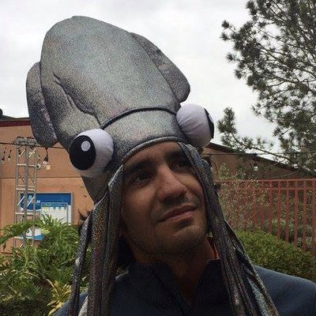

<!-- Global site tag (gtag.js) - Google Analytics -->

 

Welcome to my personal webpage. I am a multidisciplinary scientist motivated to answer complex, real-life questions threatening the ocean and its social-ecological systems. I am particularly interested on how climate change is affecting the oceans and the management and conservation of marine resources. Currently, I hold a position as a Research Associate at the Center for Limnology of the University of Wisconsin-Madison.

Overall, my research focuses on three main areas that relate to ocean health and responsible usage of marine resources: i) the management of shared fisheries under a changing world, ii) exploring the social-ecological impacts of climate change to conservation and iii) improving fisheries management and marine conservation in Latin America. These are complex narratives which require a mix of quantitative and qualitative methods, interdisciplinary collaborations, and genuine partnerships with local not-academic institutions.

I support collaborative interdisciplinary work and I believe that all scientific work (and data) should be public and open access. As a Brazilian-Mexican citizen, I am committed to support policy-making and resource management decisions in Latin American countries with a strong interdisciplinary science. In parallel with my research, I work with different governmental and non-governmental organizations to tackle important problems facing fisheries and marine conservation in Latin America.

 

**Contact**

Juliano Palacios Abrantes | jpalacios2 [at] wisc.edu • [Google Scholar](https://scholar.google.ca/citations?user=EZpBcjcAAAAJ&hl=en){target="_blank"}

<meta name="google-site-verification" content="a-gNWkz77aNh8H8s6f67IV1-OBWnJuxHRQWSVhyV7D0" />