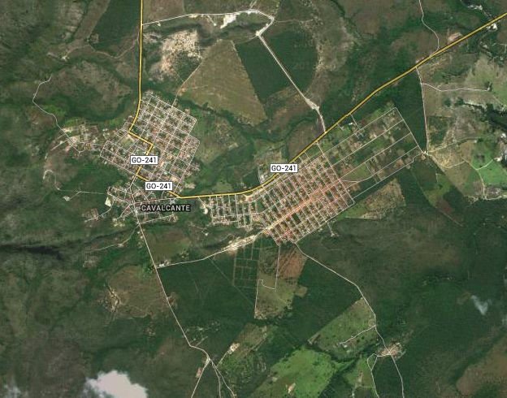

Hablar de la Chapada de Veadeiros es hablar de la naturaleza, de lo excepcional y de lo fantástico. Es un contacto con la naturaleza que pocas veces he vivido (y eso que soy biólogo-hippie-come-flores) son horas enteras de reflexión frente a caídas de agua de 80 metros, pláticas con cascadas silenciosas (que te escuchan) u otras que sólo te gritan, son encuentros fugaces con aves exóticas (al menos para mi) persecuciones pacientes por una foto mediamente buena, es todo eso y es más. Es el sentimiento de aventura en la tercería nada cuidada, es el sentimiento de compañerismo la conocer gente nueva a la mitad de la nada, es una experiencia que te hace recapacitar tu vida en la mayor ciudad del mundo, a 2mil metros sobre el nivel del mar, encerrado.

## Generalidades

Pasando la romántica (o intento de) introducción pasaré a los datos que le gustan a la gente, los duros. La chapada es un lugar de mucha agua así que lo que se va a ver allá son cascadas, hay tres lugares principales para verlas (con principales me refiero a comunidades con la mínima infraestructura) Cavalcante, Alto de Paraiso y São Jorge, así que aquí escribiré generalidades que encajen en todas las cascadas y después haré entradas de cada lugar..

**Primero** hay una cuestión de seguridad, yo fui en diciembre, época de lluvias y calor, mucho calor. Esta temporada se caracteriza por lluvias torrenciales en la tarde y tanto las cascadas como los ríos se llenan, esto trae consigo el principal miedo de los lugareños (que el turista siempre, sintiéndose omnipotente, ignora) “las enchentes” es decir, un chingo de agua bajando desde la cabecera del río y que te lleva hasta la otra vida. Hay que tener cuidado con ellas, no se confíen porque el verdadero peligro es que no llueva donde ustedes estén pero si en algún lugar río arriba, por esto es MUY RECOMENDABLE siempre llevar un guía local, éstos se la saben y nos pueden asesorar en estos casos.
 
  
  
  
 
 
 
**La segunda** cuestión de generalidades es la vestimenta, son días calurosos de sol a plomo y calor húmedo, ese calor húmedo que te hace perder 10 kilos en puro sudor (que recuperas con la cantidad ridícula de agua que beberás, ja) así que los morenitos de piel candela como yo no tendremos muchos problemas, pantalones de caminata son recomendables por los caminos hacia las cascadas pero la verdad es que unas bermudas hacen buen paro. Las personas transparentes parientes de Gasparin necesitarán mangas largas, sombrero y harta protección solar química, repito harta hartísima protección solar.

 
 
 
 

**La tercera** generalidad son las carreteras. A pesar de que puedes llegar a cualquier lado por carretera (al menos acercarte mucho al agua) las carreteras están maderadas y son todas de tierra (lo cuál nos gusta pues hay pocos lugares pavimentados en el mundo). Cómo pueden ver en la foto, hay carreteras muy maltratadas como esta ---------------------------------------------->   
y hay algunas que no están nada mal, de todas formas, en época de llovía que es cuando más complicado se vuelve el traslado el Palio 1.0 litros sufrió pero llegó a todos lados, claro que lo ideal es un jeep 4x4 para que los "amantes" de la naturaleza llenen sus 80 litros de gasolina y pasen por todos los terrenos habidos por haber, es más pueden llegar a estacionarlo en algún pedazo de río si quieren, (por favor no lo hagan).  Tomen en cuenta la gasolina, es escasa al nivel de que en São Jorge NO HAY abastecimiento y en Cavalcante se acostumbra a ir la luz en esta época a nosotros nos sucedió dos veces y los locales dicen que a veces tarda hasta 2 semanas en volver, ¿por qué es importante? "No power no gas, no gas no car, no car no power"

 

## Cavalcante

Cavalcante tiene tres salidas principales. Las cascadas se encuentran en las salidas Norte y Sur, son lugares maravillosos en donde el agua es completamente cristalina, con colores azules y verdes esmeralda, no te las puedes perder, vale la pena ir todos los días y descansar cuando regreses a casa. Por cuestiones prácticas voy a dividir las cascadas en salidas, las del norte se salen por la carretera de piedra rumbo a la comunidad Kalunga, las del sur por el bar de Manolo y Sole.

 

