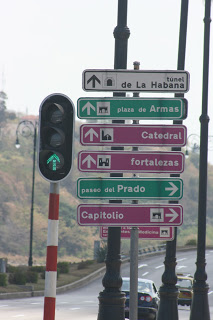

# Generalidades
Durante el insomnio de la noche, uno no tiene otra opción más que escribir. Podría leer, pero la verdad es que el libro queda muy lejos y las cobijas con el edredón nuevo pesan toneladas. Así que, ¿por qué no poner al tanto mis viajes pasados?

Iniciemos con Cuba la Linda, pero ¿por donde empezar? Creo que vale la pena empezar con una advertencia: Cuba es una país controvercial, hermoso, lleno de candela, difícil de vivir, relativamente fácil de turistear, con buena gente y definitivamente es un lugar del que solo puedes opinar habiendo estando ahí, es regla. Mézclate con su gente, camina por sus barrios no famosos, come en sus paladares, siéntate en la banqueta con el plato de arroz, frijol y servilleta de puerco en las manos y  viaja en sus "guaguas. Solo así, verás la verdadera Cuba. Si estás pensando en un viaje lujosos, de grandes comodidades y demás, Varadero podría ser el destino pero mejor vete a Cancún.

## El principio.
Es relativamente fácil: la visa te la dan en el aeropuerto, pagas 25 morlacos por ella (Olvídate de la paranoia Neoliberal que si vas al país socialista no te dan la visa gringa, que si te sellan el pasaporte, blablabla (eso no existe) el dólar es moneda local, el calor es el clima local (harto); no es, para nada, un país caro. Hay un detalle para tomar en cuenta y es que casi no hay cajeros automáticos en la isla y mucho menos lugares donde acepten tarjeta así que lleven cash, money, dinero en especie, etc...  OJO AL SALIR DE CUBA TENDRÁS QU PAGAR 20 DÓLARES ASÍ QUE SEPÁRALOS Y NO LOS GASTES.

## Tips importantes
- Lleva suficiente dinero, Cuba es bastante barata pero no hay infraestructura bancaria. Tomar taxis del aeropuerto no tiene ningún problema, no cambies ahí mismo, dile al taxista que te lleve a una "Cadeca" (casa de cambio cubana) o a un Banco, te darán más por tu dinero. Puedes cambiar directo pesos mexicanos, solo asegúrate de llevar billetes nuevos y prepárate porque será tardado pues la/el cajer@ va revisar en una base de datos uno por uno tus billetes (hay algunos que ya no aceptan) De todas formas siempre es bueno llevar una reserva en dollar o euro.

- Tenis cómodos hechos para el calor, una mochila pequeña, un sombrero y mucha agua. Si llevas una buena combinación de esos cuatro ítems, no tendrás problema alguna para caminar.
- La gente en Cuba es MUY amable y simpática, no te enojes si después de lo que hagan te pidan dinero, así sucede. El darles dependerá de ti, pero tenlo por hecho que es casi una regla. Mejor aprovecha de su cultura pero siempre con los ojos abiertos, es fácil ser chamaqueado.

- Yo me fui sin guía, Lonely Planet (lo hay en inglés y en español) o mapa y sobreviví bien, pero supongo que llevar algo no estaría de más, sobre todo si piensas salir de la Habana.- Hay una manera de hospedarse sin ser en hotel, en casas particulares que están inscritas en un programa gobernamental, afuera de las casas tienen un letrero (azul) Acostumbran ser más baratas e interesantes puesto que convives más con los cubanos, te pueden preparar comida y demás, no se como contactar estas casas antes de llegar, pero yo conozco un par si gustas. Las casas van a tener este logo en su parte de afuera

- Deja guardado tu Impuesto de salida (en mi época era 20 dólares) si no los tienes no te dejan salir y es muy fácil olvidarlo y gastarlos.

# La Habana

Calurosa ciudad, llena de vida y mensajes de revolución "Estamos contigo Raúl", "La revolución..." Es  súper segura, la apariencia nos va intentar engañar con edificios desnudos, gente en la calle haciendo nada, barrios presuntamente peligrosos en cualquier ciudad del mundo, menos en Cuba. Caminar con la cámara colgada al cuello solo tiene un inconveniente, el atosigamiento del cubano:

- Hey chico, de donde tu viene?
- Hey my friend Cuba linda, hola?
- Hola Habanos baratos, ron, paseo?

La fórmula es muuuuuuy sencilla "no, no, no y más no". No te desesperes, disfrútalo, analízalo, recuerda que este viaje también es un estudio sociológico de un mundo muy controversial. Quien se enoja pierde.

La mejor manera de conocer la habana es caminar, cómprate unos buenos tenis de "hiking" (¡para clima cálido por favor!) bermudas, camisa de manga corta (o larga pero fina), un sombrero una mochilita para cargar litros de agua y a darle. Por cierto en Cuba se bebe agua de la llave por lo que rellenar la botella en cualquier lugar es fácil, así mismo en ningún lugar te niegan un vaso de agua; SI vienes de México no tendrás ningún problema con beber agua de la llave, al menos yo no he tenido. 

Si no quieres caminar, puedes rentar una bicicleta y pedalear la isla, puedes rentar un "bicitaxi", o incluso, puedes freserar durante todo el día en un carro americano convertible por toda la ciudad.

•

Obviamente la Habana tiene sus barrios imperdibles:

*Habana Vieja.* El barrio más folclórico de la Habana (si es que se puede hacer una categoría ya que casi todo lo es) cuenta con calles muy chiquitas, bares y restaurantes al aire libre, perfecto lugar para caminar de día o de noche.

*Centro Habana.* Al lado de habana vieja, tiene bares muy buenos, muy parecido a Habana vieja, también es ideal para caminar de día y/o de noche. 

*El Malecón.* una de las partes favoritas de los cubanos, las noches del fin de semana suceden aquí. Una vía grande a la orilla del mar, recuerda el Puerto de Veracruz, sentados en la barda se divierten los cubanos, bebiendo Cristal y ron, riendo y platicando. OJO: caminar por aquí durante el día puede ser mortal, no hay una sombra y el "sol pega de a plomo chico"

Donde me quedé: El barrio más nuevo de la Habana, barrio residencial donde el caminar se vuelve un análisis social de la comunidad. Buen barrio para hospedarse. 

Sin embargo, no dudes en salirte un poco de este foco turístico y adentrarte en barrios tradicionales, en donde podrás ver mucho más a detalle la vida cubana.

 

**... Y también sus lugares:**

**El cañonazo de las 9.** 

Un clásico que no puede faltar en el viaje. Es una ceremonia que se hace todas las noches en la Habana para recordar tiempos de la conquista. Vale MUCHO la pena acordar con el taxista que los lleve que también los recoja puesto que después del evento ya no hay nada más que caminar o taxis estafadores.

**Callejón Hamel.** Una calle pequeña toda artísticamente decorada, en la noche hay música en vivo y un ambiente de 10. Vale mucho la pena tanto de día como de noche.

**Helados Copella.** Los tradicionales helados cubanos, si vas al que está en el malecón te van a cobrar en CUC pero si vas al de la plaza central, en donde está el cinema el precio es en Pesos Cubanos y es EL HELADO MÁS BARATO DE LA HISTORIA, pero no esperes el lujo de pedir por sabor, ahí se come lo que se venda.

**Granizado.** EL típico Raspado Cubano, no tengan miedo, me tomé mil ochenta mil y nunca me enfermé de la panza y para la calor es lo más refrescante del mundo mundial

**Pizzas "no se qué"**. Famoso restaurante de pizza entre los cubanos, no está en la zona turística. 

**Casas de Baile.** Las casas de baile son lo más cercano a los antros en la Habana, centros nocturnos en donde pocos cubanos van y muchos extranjeros están presentes. Las cubanas no faltan y... Bueno, aquí se ve un poco del mito cubano. La mejor hora para ir a estos lugares es en la tarde, al rededor de las 5 y los domingos pues es cuando hay mayor presencia de locales y se baila a todo dar. La entrada normalmente cuesta  10CUC y hay dos centros famosos, uno en algún  lugar del centro y el otro en el barrio de los hoteles grandes (no recuerdo el nombre).

**Museo de la Revolución.** No debe de faltar en el itinerario, aun que no seas una persona de museo, aquí está descrita toda la historia de la Revolución Cubana y de la batalla. Vale la pena.
**El Parlamento.** Edificio que recuerda el parlamento gringo, está en el corazón de la Habana, toda la zona es muy padre de caminar.  

**El edificio Bacardí.** No tiene nada de nada más que el mirador hasta arriba, según yo no cobran nada pero el poli de la entrada te cobrará un CUC o dos. 

**La bodeguita de en medio.** Supongo no necesita explicación, tomate una para decir que te tomaste una Y YA, el precio es de no mamar.

**El Floridita.** Al igual que la bodeguita.

**La cervecería.** Una cervecería local que se encuentra en una de las plazas de la Habana, la plaza donde está la catedral, es un bar-restaurante con mesas en la plaza, súper cómodo en el cual puedes pedir litros de cerveza de barril, clara, oscura y ambrar. definitivamente es un lugar imperdible.

•

# Camilio Cienfuegos

 

 

El gran Camilo Cienfuegos, miembro reconocido del movimiento revolucionario de Cuba tiene su ciudad. Un lindo pueblito a unas cuantas horas de la Habana. La manera más fácil de llegar es en Bus, carros muy buenos, con aire acondicionado, asientos reclinables, tv, etc. No extrañarás nada. No es nada cara y la corrida sale muy temprano y tarda unas 5 horas.

Rumbo al sur-este Cubano por la carretera que nos lleva a Trinidad en la costa sur de la isla se llega a la pequeña ciudad de Cien Fuegos, una ciudad costera, de pocas calles, una avenida principal y gente muy amable.

Si aún no tienes donde hospedarte, déjate llevar por uno de los mil cubanos ofreciendo alojamiento en casas locales, son confiables, baratas y siempre encontrarás grandes personajes con los cuales puedes pasar un día entero platicando y escuchando sus historias.

Cienfuegos es una ciudad de una noche, muy pequeña y sencilla, se camina muy agusto. El centro de la ciudad es patrimonio de la humanidad

No pierdas la caminata por toda la avenida principal, al final llegas al malecón de Cienfuegos y al final de ésta hay una especie de hotel donde puedes entrar al ridículo caribe color escarlata, beber mojitos y pasarla bomba. En el camino hasta allá pasarás por el Hotel Palacio Azul, vale ña pena entrar porque es, literal, un palacio grande, lujoso y muy bonito, azul con blanco.

Cienfuegos es, sin duda alguna, una ciudad maravillosa que vale la pena darse una escapada.

