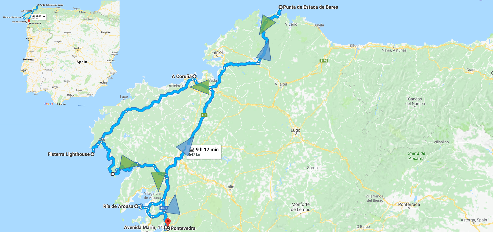

Me gusta estar a un lado del camino fumando el humo mientras todo pasa, me gusta abrir los ojos y estar vivo. Tener que vérmelas con la resaca, entonces navegar se hacer preciso.

*- Andrés Calamaro, Al lado del camino*

<!--  -->

Hay varias cosas que uno no debe de hacer cuando va a viajar en carretera, por ejemplo: no ponerse una borrachera tremenda el día anterior, no manejar un auto en mal estado, no hacer un *road trip* sin rádio, etc. Al mismo tiempo, hay muchas cosas que uno si debe hacer cuando va a viajar en carretera: revisar que el velocímetro, el medidor de gasolina y demás medidores básicos del funcionamiento del automóvil funcionen, viajar bien descansado, explorar el camino en un mapa, tener un plan (p.j. dónde dormir o qué ruta seguir), etc. Uno creería que con más de 10 años de experiecia en carretera yo no caería en dichos errores, pero la verdad es que no, sigo cayendo, por lo que el siguiente relato trata de como lidiar con varios problemas que te puedan pasar en un *road trip* mientras recorro Galicia con mi gran amigo Pablito. No tiene necesariamente un órden cronológico ya que distintas ocaciones del viaje se les atribuyen a distintos problemas, además de que estoy concluyendo este texto más de un año después y me falla la memoria. En fin, espero que no terminen igual de mareados que Pablo intentando leer el mapa en la carretera.

#### ¿Qué hacer cuándo uno está tan crudo que no es capáz ni de contar pingüinos? 

La mañana de un sábado de verano se hacía presente cuando la luz del sol ibérico se colaba en la alcoba poniendo en alerta los pocos sentidos que me quedaban. Con una severa falta de líquidos en el cuerpo, la cabeza latiendo como corazón y una familiar repugnancia hacia el lúcido invasor, busqué en el espacio desconocido el resto de mis pertenencias, llevé acabo el ritual social correspondiente y me aventuré a las vacías calles de Pontevedra con Pablito, que no presentaba un mejor caso clínico. Las calles de Pontevedra en el verano no presentan un escenario más amigable al sujeto resaqueado. Cuando uno tiene pocas horas de sueño y una alta concentración de destilado aún en el cuerpo, lo mejor es aumentar el segundo para opacar el primero, sin emabrgo, como a nosotros nos esperaban 350 kilómetros de carretera gallega, la añeja estratégia bélica de unirse al enemigo en vez de atacarlo tuvo que ser descartada. En situaciones como estas, en las que cómo diría mi sabio amigo Santi, *uno está tan crudo que no tiene capacidad ni de contar pingüinos*, lo mejor que puede hacer es preparar al cuerpo para lo peor. Así que paramos en el supermercado para comprar desayuno y bebida hidratante y emprendimos camino (por la sombra) a prepararnos un café bien fuerte, el invaluable aliado de todo crudo. 

En los escazos minutos siguientes al desayuno,  mientras intentábamos volver a la calidad de personas Luisiño y la Maite nos ayudaron a trazar un plan de ataque, ¿resultado final? tomar prestado el auto del hermano de Luisiño para un viaje por las vastas tierras gallegas saliendo de Pontevedra hacia Punta de Estaca de Bares, dormir en A Coruña, partir al día siguiente hacia el faro de Fisterra y de regreso a Pontevedra pasando por la *Costa da Morte*, un total de 650 kilómetros en dos días.

Ya medio compuestos, pero aún descompuestos, salimos del departamento y caminamos bajo el ya potente sol ibérico hacia el auto. A los lejos se oían las palabras de Luis, como aquella alarma que suena por minutos durante el sueño profundo, "Buenao, a ver chicos, que aquí hay muchos policías así que POR NADA vayan a más 120 km", "El auto de mi hermano...". Un par de metros adelante nos esperaba nuestro fiel acompañante de aventuras: un flamante coupé francés de dos puertas, alerón tracero, rines, escape cromado y vidrios medianamente polarizados: ¡un verdadero deportivo digno de dos galanes en búsqueda de aventuras gallegas! El amor a primera vista inmediatamente generó un nombre: *"El Bólido Amarillo"*

#### El caso del rubio platino 

El Bólido Amarillo representa dos clásicos de las relaciones sociales humanas: el "tiene buen lejos" y "lo que importa es lo de adentro" ya que a pesar de su gran porte deportivo que enamoraba a la distancia, el fiel acompañante carecía de algunos elementos medianamente importantes. Lo primero que resaltó en las limitaciones del Bólido Amarillo era su incapacidad de llenar las horas muertas con música y su extraña obseción con los frenos, representada por un testigo de alerta que no se apagaba pero que, en palabras del buen Luis, *"no era problema porque se prendía y se apagaba hace ya un tiempo y el auto seguía bien"*. Al subirme al bólido reparé que mi respaldo no se movía y al girar el volante escuché la queja de un viejo empleado que ya sirvió al prójimo demaciadas décadas. Era claro que el Bólido Amarillo vivía en un constante estado de resaca. Una de las consequencias de viajar en el estado en el que viajábamos es que no le das la importancia necesaria a cuestiones de ese estilo, que si requieren importancia, así que no le dimos más vueltas al asunto y resaquados los 3, emprendimos carretera, no sin antes recibir un penúltimo mensaje de precuación: (Léase con acento español) *"Ah si chicos, el medidor de gasolina no funciona muy bien así que mejor que no baje de medio tanque, ¡buen viaje chicos!"*.

<!-- 
 -->

<!--  -->

<!-- 
 -->

Salimos de pontevedra rumbo al norte gallego y unos 20 kilómetros adelante decidimos pasar los 80 kilómetros por hora y lo que sucedió a continuación es, sin duda alguna, lo mejor que me ha pasado desde mi viaje con S-TV al **Sureste[Link],** y para explicarlo voy a desviarme un poco de la ruta. 

Los velocímetros son aparatos extremadamente sensillos cuyo único objetivo es informarle al piloto, sin importar el vehículo en el que navega, la velocidad a la que va en referencia a un punto parado en ese mismo momento y espacio. En autos, se mide en millas por hora o en kilómetros por hora y su medición es a partir de.......... Así, naturalmente, si el automovil pasa de estar estático a moverse aumentando su velocidad, la ahujita que simpáticamente descansa en la izquierda de la media luna del medidor, despierta y empieza a subr linealmente a como aumentas la velocidad. Este no era el caso del Bólido Amarillo. No, en El Bólido Amarillo la ahuja tranquilamente sigue las leyes de la física que gobiernan el mundo material que conocemos hasta los ~80 klm/hr, a partir de dicha velocidad es poseída por los agentes de la entropía y cada km/hr en aumento es representado por un epiléptico movimiento sin sentido y sin esperanzas de brindar ninguna información a su locutor.

Entonces, feliz estábamos manejando a 80 km/hr según el medidor cuando derrepente, saliendo de una curva, traz un pequeño gane de velocidad aparente contado pero la frecuencia de pinos que pasaban por la ventana la ahuaja pasó de 80 km/hr a 100 km/hr a 140 km/hr a 40 km/hr a 78 km/hr a 140 km/hr a 50km/hr y de regreso a 80 km/hr...

Juli, vas hecho la madre -dijo Pablito en algún momento en el que, de reojo, vió el exorsismo en acción - No Pablito, si apenas estoy tocando el acelerador, -Flaco, no te hagas, si vi que íbamos como a 140, ya ves lo que dijo Luis-, Amigo, te lo juro, el memdidor está poseído, -Juli, güey, ya, no pasa nada, sólo bájale-, - Oh que la chingada, te voy a demostrar, a ver, saca tu celular y ponte a filmar el medidor que en cualquier momento se pone como loco - -jajaja, Va-.

<!-- 
 -->

<!--  -->

<!-- 
 -->

¡Apuesto a que ustedes tampoco me creían! Después de dicha demostración decidimos (no me pregunten por qué) componer una canción con el ritmo de "Despacito" caso el oficial de tránsito nos detuviera, porque, en realidad, pasando cierto límite entrábamos en la incertidumbre de la velocidad, fácilmente podríamos estar viajando a **VELOCIDAD DEL SONIDO** o 2 klm/hr, por qué ¿quién dice que los 80 klm/hr del medidor eran verdaderos?

La falta de radio puede volver al más cuerdo loco y al más cuerdo loco. A pesar de que Pablito y yo no somos de lo más cuerdo que digamos llevábamos ya unas ~6 horas en el auto sin música y eso ya no nos estaba gustando. Buscamos otra vez por todo el auto la carátula del radio, nada. Intentamos poner música en el celuar pero tuvimos que abandonar la idea al darnos cuenta que el cargador del Bólido Amarillo no funcionada. En momentos de estrés o en momentos críticos antes de que se desate, hace una enorme diferencia la persona con la que viajas. Afortunadamente somos muy buenos amigos de hace muchos años y aventuras, así que esto no iba a quedarse así. Si usted es como nosotros, puede vencer el silencio del radio pasando horas y horas, y más horas, y... unas cuantas horas más, "washawasheando" acapela pop en español Latino Americano del más hediondo (gusto subjetivo) sin pena ni gloria para substituír la falta de radio. Este ejercicio no solo resulta bueno para matar las horas interminables sin música sino que, además, ayuda a fortalecer la memorioa y la autocrítica ya que puede terminar "washawasheando" canciaones como: "washawashawasha... de noches negraaas, porque la vida duele, duele, duele sin tu amor"; "Ouuuooo imagina a las sirenas en la luuuuuna, ooouoo washawash-eando a las estrellas con pintura", ahora que escribo esto creo que tuvimos unas buenas, es más todo inció con la necesidad viceral de acordarnos de la letra de Jumbo para "washawashaaaa mis sueños mi dulce sirena, los girasoles pasan horas sin poder washawashearrrrr".

En algún punto de nuestro viaje, creo que después de Estaca de Bares, el washawasheo estaba en la cumbre del éxito cuando pasamos por Ortigueira donde se estbaa celebrando el famoso "festival celta" y le dimos un aventón a un chavo español que había perdido el autobus a causa de "una amiga". Como el washawasheo estaba pegando más duro que "despacito"" no nos detuvimos y al compadre no le quedó de otra más que participar (el Bólido Amarillo es de dos puertas así que, "pelation"). El invitar al nuevo intengranto no solo aportó al DIFANAMIENTO de esta gran actividad,si no que además, al ser español, el repertorio se expandió y canciones como "ese toooooro enamoraaaado de la luuuuuuuuna washawasha washawasha la ciudad" ó "que yo se que la sonrisa que se dibuja en mi cara tiene que ver con la brisa que abanica tu mirada, tan despacio y tan deprisa, tan washawa y tan washawa tu me washawashaaaa la washawaaa, como camaróoooon". Sin emabrgo, el tiro te puede salir por la culata cuando las únicas canciones "Mexicanas" que el visitante reconoce son las de Julio Iglesias "porque son las que escucha mi madre" y acabas teniendo que escuchar "...y tu te vas washawahseando la mirada washawahseando washawasha...  y tu te vas" ¿Esta es de Julio Iglesias, no?

#### Caminante no hay camino

Las carreteras gallegas están llenas de cruces, rotondas y desviaciones que hace de la navegación un verdadero arte. Cientos de años atrás, los Polinesios desarollaron la navegación marítima a partir de observaciones detalladas de las estrellas, al punto de que conquistaron los mares del mundo. Los Navegantes Polinesios, personajes que dedican su vida a la navegación sin instrumentos, pueden navegar largas distancias con tan solo ver a los ástros reconociendo miles de estrellas en la bóveda celeste. Yo no. Para viajar siempre es bueno llevar un mapa de carretera de papel y y no depender del celular. El celular puede perder señal y eso descarga la pila mucho más rápido (Una opción siempre es descarguen el mapa antes de salir), además de esto, si están en El Bólido Amarillo, obviamente el ensendedor no funciona por lo que no puedes re-cargar la pila y finalmente, si viajan con un Pablito de copiloto, aun que tengan celular no les va ser de utilidad porque "se marea viendo el celular". Cuando navegas en caminos nunca antes recorridos pero en un sistema de carreteras que conoces, el mapa es de alguna manera menos necesario, cooces los letreros, el tipo de entradas, el órden del caos. Pero cuando estás en un sistema de carreteras que no concoes, con un sistema de guía distinto y sobre todo, es el sistema Gallego, brother más te vale llevar un mapa o te vas a dar unas buenas perdidas. En la misma nota si tu medidor de gasolina no funciona a la perfección, siempre que llegue a la mitad, llénalo así no te arriesgas a que se te acabe a la mitad de la nada. Yo diría que este consejo es bueno en cualquier momento ¿Mencioné que el medidor del bólido dejaba de servir después de medio tanque?

#### Medio día, esto debe de ser Estaca de... ¿A chingá, El Pescadero? 

Una de las pocas ventajas de no tener un buen sistema de navegación es que uno acaba en lugares no planeados que con la flexibilidad temporal adecauda pueden resultar en acontecimientos muy agraciados. Si llevas un mapa o sabes lo que estás haciendo manejas en dirección a Estaca de Bares desde A Coruña por la AC-862 y en O Barqueiro doblas a la izquierda para subir al faro de Estaca de Barres, como señala tu mapa. Bueno pues nosotros no somos organizados. En vez de doblar a la izquierda hacia el faro seguimos por la derecha que unos ~20 km hasta que llegamos a un pubelo llamado "El Pescadero". Desde la carretera el paisaje es expectacular, una pequeña bahía con un arenal en medio, destapado debido a la baja mar, al menos 4 tonos distintos de azul, barquitos de colores anclados frente a la playa, todo esto rodeado de montañas cubiertas de pinos. El muelle, no es un sitio muy grande pero tiene unos 5 restaurantes para comer, uno en especial que se ve excelente pero que estaba lleno a la hora que llegamos. Definitivamente parar en El Pescadero fue una grata consecuencia de nuestro despite natural (Léase: falta de mapa).

#### El punto más norte de España, Estaca de Bares

Me hubiera gustado haberme tomado un tiempo cuando estábamos en Estaca de Bares para escribir sobre este lugar, ya que no voy a lograr, meses después, capturar toda la mágia de la zona más septentrional de la panínsula Ibérica, donde salvajes olas y fuertes vientos evidencían un intenso vínculo entre los mares Atlántico y Cantábrico.

Empecemos por la descripción, Estaca de Bares es la punta más norte de Galicia, y por consiguiente, en 2017, España. Aquí habita un antíguio (¿el más?) faro montado en un acantilado a 101 metros sobre el nivél del mar y mientras uno creería que dicho faro está sólo en este fin del mundo, la realidad es otra. A esta altura y posición geográfica la zona es una clara evidencia de la fuerza con que los **vientos alisios** llevaran a Colón a América 500 años atrás. En el horizonte, el cielo azul turquesa es espectador del intenso baile del el mar Atlantico con los vientos alisios anunciando la *la costa di la morte* a los pocos valientes navegantes que se animan a cruzar el sinfín de montañas cubiertas de nuves de espuma. En tierra no se observan muchos turístas, un puñado nada más y el espacio es suficiente para que encuentres una roca peligrosamente colocada al filo del abismo (muerte segura) para que te sientes (con los pies flotando) y simplemente disfrutes del espectáculo mientras pienasas en lo insignificante que eres en este mundo.

Este lugar es espectacular, te da una amigable probada de la cantidad de energía que existe en el planeta y al mismo tiempo te hace recordar lo pequeño e insignificante que eres frente a toda esta inmencidad. Te invita a fantaciar con la formación de los contienntes, la evolución de la corteza terrestre y lo espectacular que son los fenómenos físicos que equilibran todos los componentes del planeta. El acantilado que hace millones de años surguió del mar y que ahora cae dramáticamente pareciendo que se lo están comiendo las olas que revientan en sus pies, reformado por millones de añós las siluetas de los contientes con ayuda del viento, ¡y el viento!, ¡nunca en mi vida lo había sentido soplar con tanta fuerza de manera narural! Este lugar es sin duda alguna uno de mis sitios favoritos en los que he estado, no solo en este viaje pero en mi vida. Es un lugar donde la energía del mundo natural se ve a todos colores, en todos los elementos. Un lugar donde uno no se siente amenazado, no se siente en sincronía pero tampoco se siente fuera de lugar. Para mi, no es un lugar para contemplar tu existencia frente a esto, más para contemplar la existencia de esto. Aún no conozco Noruega, pero si la península Ibérica tiene estos acantilados, ¡muero por ver el perfil que le dió un premio a Slartibartfast! 

De vuelta al Bólido Amarillo. Dejamos Punta de Estaca de Bares atrás y fijamos curso hacia A Coruña, nuestro lugar de reposo.

#### A Coruña

<!-- 
 -->

<!--  -->

<!-- 
 -->

LLegamos a Coruña por ahí de las 7 de la tarde (creo) y aprovechamos el tener que dejar a nuestro compita que recogimos en Ortigueira en la estación de autobúces para cargar el teléfono. Verán queridos lectores, a medio camino se nos ocurrió que no teníamos donde dormir en Coruña por lo que estábamos dependiendo del celular de Pablito y el "wifi" para reservar lugares en AirBnB. Conseguimos uno cerca de una calle céntrica y nos fuimos a cenar. La zona de *CALLE* es muy simpática, llena de bares y restaurantes de calle, !no se lo pueden perder! Fue justo aquí donde comí el mejor pulpo de la historia, pulpo a la vinagreta.

Al día siguiente fuimos a dar la vuelta por la ciudad, empezando por caminar hacia TAL. En esta zona de la ciudad hay una gran estatua de ALGP... así como el faro de ALGO. Si mal no recuerdo es el mayor faro de ¿España? ¿Europa? ¿Lo fue? Algo así... De ahí caminamos hacia la playa principal (NOMBRE) y de regreso a carro. La Coruña es un lugar muy agradable para caminar enntre las calles, tomarse una cerveza, comer un bocadillo, etc. La playa, aun que no nos quedamos, se veía bien buena.

Abandonamos A Coruña hacia a autopista de la morte, o al menos, eso intentamos porque la verdad no es nada fácil enteder las calles de este país y nos dimos un par de buenas peridads, lo cuál nunca es buena combinación cuando uno quiere mear.

#### Como todos los viejos lobos de mar saben: ¡orina a barlovento! 

Bueno, pues, verán, debería de ser conocimiento básico mundial el no mear contra el viento. Pablito, que es un hombre del mundo, entiende muy bien ese concepto, pero me parese no entiende muy bien la física del viento. Verán, las bejigas nos estában presionando así que decidimos detenernos a campo traviesa. Cada quién meó en un lado del auto, yo obviamente (y tal vez estúpidamente) fui a la izquierda del auto y Pablo a la derecha, el viento, perpendicular al auto. Pues Pablo sintió el viento y dijo pues voy a mear paralelo al viento justo en dirección a Juliano. Así que la regla, mis estimados, es nunca orines contra el viento, pero si tu compita está meando a tu lado, pues no seas culei y tampoco mees en paralelo al viento, ¡siempre a barlovento!

#### A autopista di la Morte 

La autopista de la muerte es un lugar maravilloso que no se pueden perder si visitan Galicia. La autopista acompaña, en muchos pedazos, el relieve de la costa, revelando la inmesidad del Atlántico. En varios lugares de la carretera puedes parar a la playa, a comer, o a tomar fotos. Es un paseo súper agradable que no se pueden perder. Nosotros paramos en ...

#### Un manjar final

Terminamos nuestro viaje con broche de plata y... oro. Primero fuimos a pasear al pueblo frente a la ría de Luis, NOMBRE DE PUEBLO. Es muy simpático y tiene unos callejones muy ricos de caminar, restaurantes y bebida (a estas alturas espero que los haya convencido de las tres cosas que uno no puede dejar de hacer en Galicia). De ahí, el amigo Luis, o más bien su madre, nos invitó a una última cena en su casa, una paella maravillosa. Un manjar esquisito que tuvimos mucha suerte de ser invitados, así que el último tip que tengo para ustedes es: ¡tengan a un amigo como Luis! heheheh
