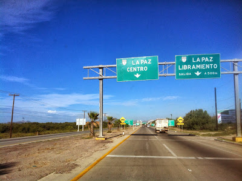
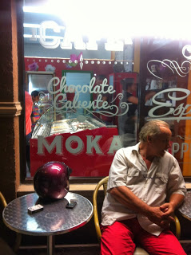

#Generalidades 

Ayer volví de La Paz y el nombre define la ciudad, la paz total. Una ciudad que vive de… ¿de qué vivirá la Paz? La verdad es que no lo se, fui 4 días a buceo recomendado por amigos, por familia, por el espíritu de la Baja, ay la Baja… 

Pues no se de qué viven los "pacíficos de la paz" turismo, cuestiones fronterizas, deportes extremos, no lo se, lo que si se es que es un pueblo que se disfruta, de lento pasar y rápido enamorar. El malecón no tendrá más de 10 kilómetros de largo y...

El malecón, el malecón merece un párrafo completo, la última vez que un lugar así me transmitió tanta vida fue el de la Habana, así como el cubano, el de La Paz tiene su propia vida. En la mañana se viste de tenis, licras y camisas holgadas (o tops guiño-guiño*), escuchando música se vuelve un mundo de corredores, al caer la mañana/tarde, cuando el sol de las 12 está cayendo a plomo se va a dormir, como buena criatura nocturna no se le ve hasta las 5 de la tarde, cuando las mamás empiezan a desfilar con los carritos, los niños, con sus uniformes de secundaria pública, invaden el asfalto. Como a las 6pm entra en un trance, el pobre demuestra una clara crisis de indemnidad… corredores, escolares, caminadores, niños en bicicleta, patines, triciclos, ¡pobre! no sabe a qué apostarle, las bancas llenas de parejas, hasta la pequeña isla de aparatos de ejercicio están llenas. En la noche, el malecón se vuelve EL centro social por excelencia, música en vivo, jóvenes parejas caminando presumiendo su amor a medio mundo, jóvenes pavoneándose por los 10 kilómetros, es un ciclo encantador, me pregunto a qué se dedica en las misteriosas horas de la madrugada…

Vamos a darle un poco de estructura a esta entrada si no, esto no se va lograr, empecemos con lo más importante, ¡la comida!

Antes de empezar aclaro, recuerden que La Paz es en paz, el servicio es lento, tranquilo, personal así que bájale a las revoluciones citadinas y relájate, porque las cosas van a tardar, la espera valdrá la pena mil cinco mil.

El lugar más famoso de la ciudad es "El Bismark-cito"en plena costera, un restaurante grande y de precios accesibles, lo que más presume son los tacos, una cosa de locos puedes empacharte de tacos de pescado, marlin, callo de hacha, langosta, camarón y demás, no salgas de los tacos, no hay necesidad. Si vas un segundo día, las almejas chocolatas son un verdadero manjar (dicen los que la comen).

Si tu onda es más casera, al final del malecón (o al principio) queda la Marina La Paz, sigues por la calle de la Marina y a dos cuadras vas a encontrar dos lugares maravillosos, el primero es "La Costa" un lugar casero de mariscos que queda "a la orilla del mar", dirían los locales (no es esperen mucha vista) ahora, la comida es otra cosa, platos muy bien servidos, mariscos frescos y muy buenos. OJO, la comida acostumbra a ser MUY pero muy pinche picosa, les recomiendo ampliamente pedir su plato sin chile o con poco chile si no, les juro que van a sufrir. 
Dirección: Topete esquina con Antonio Navarro

Después de los dos lugares de mariscos acabé en una parrillada al mero estilo norteño. El lugar se llama "Bandidos" la leyenda cuenta que empezó como un lugar pequeño y familiar, ahora es un patio grande, con muchas mesas, una parrilla montada en un carro clásico y unas hamburguesas BUE-NI-SI-MAS, no dejen de pedir las costillitas BBQ que son una reverenda delicia, es más, éntrale al colesterol Costillitas de entrada y hamburguesa de segundo, ¡no te arrepentirás!

- PD. No dejes de probar los cokteles exóticos que tienen
- Dirección: Topete esquina con Antonio Navarro

En la vida hay cosas que determinan casamientos, por ejemplo si eres una persona de perros o eres una persona de gatos, si te gustan lo Beatles o no te gustan los Beatles, ya sabes, cosas que pueden romper matrimonios, yo considero el postre una de esas, la persona que no disfrute un buen postre después de la comida no tiene futuro a mi lado, por lo que hice cuestión de caminar y buscar una buena heladería al buen estilo Italiano y oh buena noticia, ¡existe! Les presento Guilietta E Romeo una auténtica heladería Italiana donde la clave (cito al dueño) no es la receta o los ingredientes si no la forma de hacerlo. Para los fanáticos (adictos) al café este es el lugar ideal para tomarse un buen express, ¡no te lo pierdas!

Dirección: Calle Agustín Arreola esquina con la Costera.

 
 
 
 

#Hospedaje

 

De esta vez debo de admitir que freseamos agusto, nos quedamos en el último edificio de la costera (al menos del área civilizada) El Hotel Araiza- Palmira, no hay mucho que decir, les dejo la página que habla por si sola y la foto de la alberca que es básica en esta vida.

http://araizahoteles.com/palmira/index.php/es

Hay una sensación que sólo me ha sucedido en Baja California, y es una especie de contradicción del corazón, como estar frente a dos amores, no necesariamente carnales, sin embargo el Corazón Loco del Cigala lo definió muy bien "yo no puedo comprender como se pueden querer dos mujeres a la vez y no estar loco" pues lo mismo me pasó con la Paz. El mar, siempre que lo veo me produce una sensación de profunda alegría de bien estar, confianza, alegría, llego y estoy en casa, mi casa. Esa inmensidad que parece tener todas las respuestas del mundo que en él he guardado todos mis secretos, tan solo tienes que sentarte una noche a sus pies y contarle todos tus problemas, te escuchara cantará mientras te escucha y tus secretos estarán a 11 mil metros bajo agua, si te toca la luna y algunas estrellas se unirán, entonces te sentirás como en una canción de Sabina, bebiendo con tus viejos amigos. Te da lecciones de vida y se hace respetar, puede ser hermoso, horrible, romántico y cruel. Pero en La Paz sucede algo interesante, cuando estás recorriendo el Mar de Cortés deleitado por su azul celeste o azul fuerte (dependiendo de su humor) y alzas la vista, algo sucede en tu corazón, derrepente te das cuenta que no están solos, que alguien los observa. Las montañas desérticas vestidas de rojo pardo y algunos detalles verdes parecen llamarte de una manera muy sensual, te inoptizan, cambian de forma conforme las vas viendo, cambian de perfil, unas dicen algo otras simplemente te miran, al principio es un desfile histérico de formaciones que no tienen nada que hacer ahí, no tienen formas fluidas, muchas veces parecieran un perfecto ejemplo de arte cubista, se terminan repentinamente como un amorío prohibido y, aun que ya no las veas, siguen presentes; sin embargo, conforme tus ojos se educan en esta nueva musa aprendes a quererla y rápidamente te ves encantado por formas cada vez más armónicas, por colores cada vez más llamativos y cuando menos te lo esperas, tu subconsciente ya está pensando en pasar la noche sobre ella y no sobre el mar. Pero entonces, cuando mueres de vergüenza por engañar al mar en pensamientos prohibidos empiezas a voltear a tu al rededor y entonces te das cuenta que ellas no te llaman a ti, en esta historia, el mal tercio eres tu, cuando ves bien hay una unión estrecha entre el mar y las montañas una unión tan natural que te hace entender que en La Paz el Mar y la Montaña son un mismo ser complementario hasta dentro de ti.

Como fui a un viaje de buceo lo que sería correcto es subir un video, pero por alguna extraña razón el blogger no me lo permite así que lo mínimo que puedo hacer por ustedes es subir una foto del mundo subacuático del mar de Cortéz, ¡saludos!

