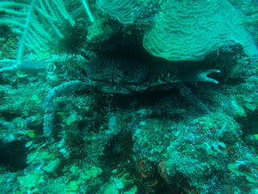

Según Wikipedia Mahahual significa “lugar de no se que chingados” Un pueblito a cientos de kilómetros de Cancún, es el destino turístico ideal para los que buscan el relajamiento caribeño. Un pueblo de calles sin pavimentar, donde todo sucede en 800 metros de calzadón costero con restaurantes y palapas en la arena, renta de kayaks, paseos en velero y buceo, mucho buceo.

# ¿Cómo llego a ese fin del mundo? 

## Por tierra

Desde la capital se toma la misma ruta vía Chetumal que hacia (enlace) Tulum. Pasando Chetumal, a tu derecha encontrarás la desviación a aproximadamente 75 kilómetros (si llegaste a un pueblito llamado Limones es porque te pasaste como 5 km). A partir del libramiento son otros 45 km hasta el faro que anuncia la llegada al Caribe. Hay una gas entrando a Mahahual así que no te preocupes con quedarte sin gas en el fin del país.

## Volando 

Lo más sensato es volar a Chetu, actualmente Aeroméxico e Interjet vuelan. La clave está en el acto siguiente. Los taxistas del aeropuerto van a cobrar al rededor de mil pesos por el viaje. Por lo que las siguientes recomendaciones son pertinentes:

El más barato. Sal del aeropuerto y toma un taxi de calle. Dile al taxista que te lleve a la terminal de vans y ahí toma una a maha. El costo total de dicho viaje será de aproximadamente $100 y te tomará un par de horas y media, dependiendo del horario en el que encuentres la van.
La intermedia. Sal del aeropuerto y negocia con los taxistas el viaje a Maha, no todos te querrán llevar pero es muy negociable y puedes encontrar por hasta $400. EN cuestión de seguridad no podría asegurar, no conozco a nadie que haya tenido problemas.
El más caro y cómodo. Sal del aeropuerto toma un taxi paga $1100 y se feliz. 

# Hospedaje 

## Blue Bay
Unas cabañas muy monas que parten de la premisa “¿qué necesitas si vas al mar?” Una cama para dormir y ya. Modestas cabañas frente al mar donde encontrarás una cama matrimonial, un mosquitero y párale de contar. Los baños son compartidos (salvo tres cabañas grandes). Tienes un temazcal y el área de bar es muy agradable.

## Kabahná
Un lugar muy tranquilo, atendido por su dueño, un italiano que cocina maravillosamente y mis amigos Luciana y Luis, es un lugar para relajar, descansar, hamacas y veleros. Los amigos de Kabanah Dive and Adventures se encargarán de divertirte caso no tengas ánimo de descanso.

Definitivamente Mahahual es un lugar en el cuál solo hay dos modalidades:
- a) En pareja
- b) Un grupo grande de amigos

Es un pueblito muy acogedor en donde todos, o casi todos, viven de los cruceros que desembarcan en el pueblo vecino, "Casitas".  En maha se come bien y se puede conseguir hospedajes muy coquetos pensando en pareja, cabañas con vista al mar, camas matrimoniales de agua, desayunos en la cama, camastros a la orilla del caribe, ese tipo de cosas que uno disfruta más en pareja. Por lo mismo no hay mucho que hacer, bucear un par de días, velear una tarde, ¿kayak? Y párale de contar. Si eres más aventurero puedes rentar un carro y bajar a Xcalak o a Rio Wash, salir de la zona hacia algunas ruinas o incluso la laguna de bacalar, pero fuera de eso no hay mucho que hacer. Así que es un destino perfecto para ir a echar romance, "namorar".

#### En conclusión

Sin lugar a dudas este es el nuevo paraíso del buceo, al extremo sur del caribe, los que lograron bucear en playa del carmen y tulum antes del crecimiento exponencial de ambas ciudades dicen que así se veía, metros y metros de hermoso arrecife. Para esto del buceo mis amigos de Kabanha Dive Adventures lo hacen muy bien, en mahahual vas a ver mantas, arrecife por todos lados, tortugas, pez león, entre otras cosas, si tienes la oportunidad no dudes en ir a banco chinchorro son dos horas de lancha que valen mucho la pena.

  

Mahahual, Quintana Roo
México