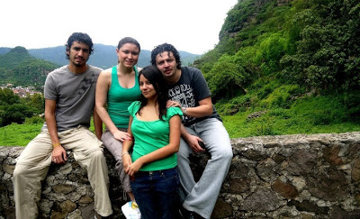
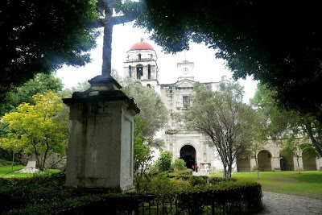
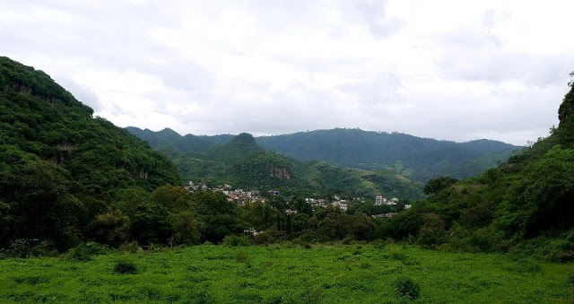

Los años maravillosos región 4

Escucho el llanto de mi hijo a todo volumen a la vez que recuerdo: han pasado siete años desde que conocí a mi esposa y me invitó a pisar por primera vez Malinalco; hoy, Juliano me pide que escriba una reseña turística del lugar y encuentro difícil ser objetivo al describir un pueblo que entremezcla el espacio público con mi historia personal. Es difícil, también, tratar de convencer al lector de salir a conocer un lugar sobre el que no puedo asegurar que la realidad de mis vivencias concuerde con el romanticismo de mis recuerdos sin temor a mentirle, sin embargo ¿Qué acaso no es lo delgado de la línea entre lo vivido y lo recordado lo que genera lo más hermoso de los viajes que es nuestra experiencia? ¿De qué, si no es de eso, se trata este blog? En todo caso, tratare de ser lo más descriptivo que pueda.

Llegué a aquel pueblo ubicado a dos horas de la Ciudad, en el Estado de México,  algún día de Diciembre de 2005 siguiendo a mi mujer. En aquel entonces, recuerdo que no estaba interesado en investigar nada al respecto y como buen chilango creía que al ir a Malinalco había de dos sopas: o me iba a encontrar un “pueblito bicicletero” de EdoMex o iba a toparme con la “freses” de otro Tepoztlan, sin embargo, lo que me encontré fue una mezcla suigeneris encuadrada en su propio tiempo y espacio. Malinalco es un pueblo que ha desarrollado, a mi parecer, tras varias historias paralelas: por un lado, está la de los colonos que, en búsqueda de una alternativa a la Ciudad, se asentaron y conformaron la inversión necesaria para el crecimiento turístico al establecer la infraestructura correspondiente(hoteles, restaurantes, bares, etc); por otro, la de la población que ha estado ahí desde tiempos inmemoriales y conforma las tradiciones del lugar y por último, la de la herencia histórica de la región de la que da fe su zona arqueológica.

Así las cosas, Malinalco ofrece una diversidad interesantísima acorde a la variedad de los turistas que, en mi experiencia, llenan todo tipo de perfiles. Si bien el pueblo es famoso por el criadero de truchas en donde los turistas pueden pescar y disfrutar de su trucha en una amplia gama de presentaciones, este no es su único atractivo o servicio. En lo personal soy un gran entusiasta de las fiestas que, a lo largo del año, celebran los distintos barrios que conforman esa comunidad y de las cuales destaca la del 6 de agosto en la parroquia principal. Éstas fiestas se caracterizan por la actitud festiva y relajada del pueblo, en ellas los habitantes suelen disfrazarse evocando diversas imágenes tradicionales (diablos, catrinas, monstruos, etc)  para formar parte de los famosos  “locos” cuya principal actividad es emborracharse y “cotorrear” con los asistentes. Por su parte, la plaza se llena de puestos de comida, cohetes, juguetes, micheladas y “chuchulucos”.  

Respecto a la comida he de decir que llevo años visitando los mismos 2 puestos de tacos que, a mi parecer, no han sido superados hasta la fecha: los tacos del “pelao” y los de cecina del centro. Los primeros se encuentran por las noches, entre semana, junto a la entrada de la parroquia principal y se caracterizan por la peculiar “barbacoa de res” que al ritmo del “¿va a querer o la tiro?” es acompañada por la buena vibra del taquero al que todos conocen como “elpelao”. He de decir que tanto para mí como para los que habitan ahí, es uno de los puestos imprescindibles y debería de serlo para todo aquel que visite el lugar, además, los fines de semana puedes ir directo al rancho del “pelao” a desayunar y el servicio es excelente. Por su parte los tacos de cecina pueden encontrarse durante la mañana y si bien hay muchos puestos que los ofrecen, los mejores son los de “la güera” que además de ser los más sabrosos, vienen en porciones generosas. También hay restaurantes entre los quehay un par que pueden dejarte con el ojo abierto, el primero se llama “Las Palomas” que destaca por tener un servicio de bar excelente y platillos deliciosos que van desde la receta tradicional hasta cosas más sofisticadas e innovadoras que la chef ha diseñado. El segundo, por su parte, se denomina “Los placeres” y destaca por la excelencia de sus platillos que se encuadran en la tradicionalidad malinalca. Cabe aclarar que los precios de estos lugares son ligeramente elevados y puedes llegar a gastar unos 350 pesos por persona, sin embargo, a mi gusto, valen cada centavo. Otros lugares dignos de mención son “La Flor de la vida” y el “Koi”

Los bares por su parte suelen ser itinerantes, sin embargo se preservan dos desde que yo tengo memoria del pueblo: “El breve espacio” (comúnmente conocido como “El breve”) que como su nombre lo dice, es pequeño, tiene un perfil más privado y  fresón y por lo general es ahí donde  cae la chaviza del club de golf y “El Mamitas” que tiene una actitud más relajada y un ambiente mucho más fresco. El dueño conocido como Jonhy es muy amable y por lo general podremos encontrarlo atendiendo la barra. Si bien “El Mamitas” tampoco es muy grande suele haber espacio suficiente en ambos y la fiesta se desarrolla entre uno y otro dado que las distancias no son significativas. He de mencionar, en este punto, que no son los únicos dos baresque hay, pero sí son los únicos que pueden constarme que existan y estén abiertos en cualquier momento que el lector decida visitarlos, aun así los otros suelen tener un ambiente igual de amigable y recomendable.

Ahora, no todo son fiestas y comida, Malinalco ofrece diversos servicios para los turistas de perfil más familiar: para los niños se organizan visitas guiadas a lo largo del pueblo donde pueden apreciar la diversidad de los “bichos” que hay en la región  y aprender sobre la importancia de su preservación; también, está la ya mencionada zona arqueológica que solía ser un centro dedicado a la capacitación de guerreros jaguar y cuyo legado se complementa con el pequeño museo municipal que alberga historia y curiosidades del pueblo, además, para todos los amantes del esoterismo holístico, el pueblo ofrece servicios y eventos que van desde masajes y temazcales de todo tipo hasta cursos de reiki, clases de yoga y diversos e interesantes talleres. La parroquia, por su parte, también es digna de visitarse; data del siglo XVI y en su interior se albergan algunos murales originales de los agustinos que la establecieron, además su amplio atrio constituye un espacio tranquilo para sentarse un rato y disfrutar con la familia o correr con los infantes. Cabe destacar que en semana santa y durante la fiesta de Agosto en esta parroquia se pueden apreciar impresionantes castillos de cohetes y en particular, durante semana santa, a su rededor se puede presenciar el desfile de “judíos” (gente caracterizada como soldados romanos representando la crucifixión de Cristo) que, a caballo y pie, recorren el pueblo año con año y de cuyos disfraces, mi hijo es particularmente fan.

Solo queda hablar del hospedaje y no porque el pueblo no tenga mucho más de que hablar sino por que hacerlo me tomaría páginas enteras y le quitaría al viajero la emoción de descubrir lugares aún más interesantes, pero al respecto he decir que los hoteles de Malinalco van de los 300 pesos por noche a los 1800, he de destacar que no suelo hospedarme en hoteles cuando voy y mi rango de precios puede estar sesgado por la inflación de los últimos años, sin embargo me parece un estimado razonable. Entre los más lujosos se encuentran “Las cúpulas”, “Casa Mora” y “Casa Limón” de estos, el ultimo es el más famoso, privado y  a mi parecerchidoliro (su bar es excelente y no aceptan niños) aun asítodos ofrecen una experiencia única en sí misma y podrías no salir de ellos. En un rango de precios más bajo hayhoteles como “El Marmil”, “Plaza del sol” y “El asoleadero” que tienen perfiles más familiares y no ofrecen atractivos mayores al hospedaje. Si lo tuyo es ir con la band ita, bandera, banda o como les digas a tus amigos, en la entrada del pueblo hay un complejo de Cabañanas que si bien ya tienen algunos años, son perfectas para compartir y echar la fiesta con los cuates; otra opción es “Tenacaxco” en donde se puede acampar y echar la chela a gusto.

En conclusión, Malinalco es un pueblo que puede encantar a quien le visite así dicho visitante no planee llegar ahí. Le he visitado miles de veces y es de los pocos pueblos, por no decir el único, en el que estaría dispuesto a vivir si no fuera por el enorme cariño y gusto que le tengo a esta ciudad. Hace poco recibió el título de “pueblo mágico” y no es para menos, en Malinalco converge mágicamente el eclecticismo del valle de México encuadrado en sustradiciones locales y metropolitanas, sus modas y sus aspiraciones lo que hace que este punto, concéntrico a Cuernavaca, Toluca y DF, sea un verdadero lugar de encuentro del cual no podrás escapar.

 

Osvaldo Morales V. | Fotos: Deli Luna