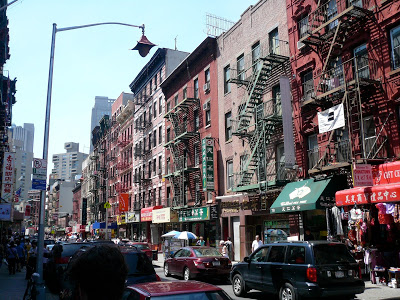
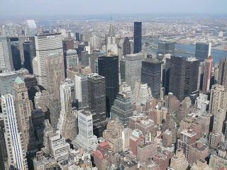

*"The city seen from the Queensboro Bridge is always the city seen for the first time, in its first wild promise of all the mystery and the beauty in the world.”* 

F. Scott Fitzgerald, The Great Gatsby

---

Definitivamente New York City fue, es y será el destino favorito de miles de millones de turistas de todo el mundo y no solo turistas si no de habitantes. Y con esto, pretendo dejar claro la inmensa diversidad fenotípica que se puede ver en una sola ciudad. Da la impresión que todos son turistas, turistas que fueron una vez y volvieron enamorados y que viven debajo de una especie de hechizo del cuál no pueden salir, ¿cuál será la verdadera cara del New York City boy?

Es impresionante como todo aquél que regresa de the city of bright lights parece ser víctima de un encanto morticiano por esta ciudad. No dejan de hablar de ella, de su vida, usan playeras que gritan histéricamente su amor, se ven los edificios y el glamour en sus ojos, quieren volver, quieren vivir allá, quieren hacer el amor con ella, dejarían todo por compartir un pedazo de su historia con esta mujer (en efecto, después de que los escuchas, por un momento olvidan que es una ciudad y la tratan de La). Si yo fuera pareja de cualquiera de estas personas, diría sin duda alguna, que mi pareja me engañó, que se ha enamorado de otr@ y tal vez, tenga razón... A mi, por otro lado, no me pasó eso, hemos tenido 3 citas y aún no me enamoro.

Ahora, si, yo soy conocido por mi amargura y también, no siempre concordar con todos. Ojo, no me tomen a mal, me encantó NYC, es mágico maravilloso, ¡tienen que ir! con el playlist adecuado y la lectura finamente elegida este viaje puede estar dentro de su top 5 viajes, un viaje romántico que te hará pensar en cosas de tu vida que nunca habrías pensado, meditado ni visualizado. Muchas canciones se han hecho sobre esta ciudad (estoy listando las que recuerdo abajo) y si haces un playlist adecuado, puedes recorrer más de 15 kilómetros sin darte cuenta, volviéndote parte de las canciones, actuando los versos de Sting, Pet Shop Boys, Sinatra, Bono, entre otros. Mientras escribía me pregunté ¿cuántas canciones habrán que mencionen algo ella? Pues bueno, recurrí al buen google que obviamente me redireccionó con Wiky y les dejo el link (http://en.wikipedia.org/wiki/List_of_songs_about_New_York_City) el artículo es de febrero de 2010, se llama "List of songs about New York" y debe de haber más de 2mil canciones, así que si no conocen muchas, de aquí pueden hacer su playlist.

Debido a que soy una persona muy musical y creo que en eso, ella y yo nos paresemos, cerraré esta entrada para comenzar mi relato con una canción, que a pesar de no ser mi favorita del playlist, definitivamente describe como me sentí el primer día en esta metrópoli y creo que muchos de ustedes (o solo TU, porque no se si más de 1 lee esto) compartirán mi sentimiento.

 

... Takes more than combat gear to make a man, takes more than license for a gun, confront your enemies, avoid them when you can... a Gentelman will wlak and walk, but never run, I'm an englishman in New York...

-Englishman in New York, Sting-

 

Pensaba, cerrar con el verso de Sting, en mi cabeza era muy romántico porque le daría entrada al siguiente realato (mucho más productivo que romántico) sin embargo recordé...

Obviamente con ella no todo es música, grandes escritores internacionales han vivido y escrito (afortunadamente) sobre ella, han situado sus novelas en esta gran ciudad, sin duda alguna, de los 3 que he leído estado ahí, el que más recomiendo es Scott Fitzgerald, sus novelas situadas en NYC y Chicago te envuelven en la ciudad, tómate una hroa del día para sentarte en Central Park, o en algún café con mesas afuera para leer y vivir la historia a través del papel. Ahora Scott, no es el único y para mi, tampoco fué el que más me envolvió, verán, cada quién lee los libros de una manera y para mi fue la primera vez que  fuicuando, recomendado por mi padre, me llevé  The Catcher in the Rye de J. D. Salinger. Me volví LO-CO, una especie de ficción me consumió durante 9 días. Yo tenía 19 años cuando fui por primera vez, fui mi primer viaje solo, en plena adolescencia, me sentía inmortal, era "rebelde", caminaba por todos lados oscuros claros, metro callejones y sobre todo esto leía este libro sobre un chavo de 17 años que se escapa de la escuela para ir a NYC, en donde tiene los primeros acercamientos con los vicios de la vida, el sexo, me convertí, por una semana me sentía parte de este tenebroso, complicado, conflictivo personaje que rondaba las calles de NYC como un rey intentando encontrarse o al menos pensando en todas las sandeces que tiene un puberto en la cabeza a los 20 años. Como les digo, cada quién lee un libro de una manera distinta, lo mejor es, dejarse llevar.

Ahora si, para terminar esta entrada, fui abajo a buscar mi edición de Salinger y busqué entre las páginas subrayadas (si, alguna vez alguien muy especial me dijo "libro no subrayado es libro no leído) las frases que más me llamaron y aquí les dejo el fin del libro que, creo que es de las frases más famosas del mismo...

"Don't ever tell anybody anything. If you do, you start missing everybody."

##### Canciones para tu playlist (durante este realto)

- New York City Boy - Pet Shop Boys
- The city of bright lights - U2
- Englishman in New York - Sting 
- New York New York - Sinatra

##### Libros para leer antes y/o mientras uno está en NYC

- F. Scott Fitzgerald, The Great Gatsby
- J. D. Salinger, The Catcher in the Rye

