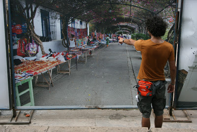
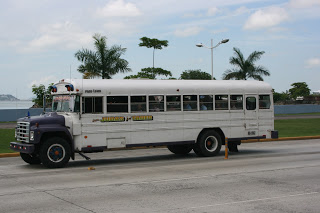

 

## Inicio

Haber decidido empezar con mi viaje a Panamá fue simple, aquí sigo. Tirado al lado de la alberca en un sábado a las 4pm “cuando podrías estar conociendo” nah, Panamá es una ciudad muy pequeña, caótica y extramadamente ruidosa. Su breve historia corre en torno del canal y mi impresión es que su crecimiento como ciudad inició en 1999 cuando los panameños recuperaron el control de la zona del Canal antes ocupada por los gringos. Por lo tanto, desde entonces la ciudad a sufrido un “bum” hormonal impresionante. Rascacielos que te hacen creer desde el avión que estás llegando a NYC, un par de grandes avenidas arregladas coquetamente, con puentes peatonales muy monos cuya localización pareciera estar muy bien pensado, centros comerciales gigantes, con decenas de pasillos y tiendas y camionetas lujosas, todo con aire acondicionado que parece invierno, todo esto debajo de un cielo azul relativamente nublado, una temperatura de 30ºC, humedad relativa del aire al rededor del 80%. Resultado: calor infernal (una maravilla). Pero la realidad es otra, Panama es una ciudad de dos caras, al lado de edificios de 25 pisos ves edificaciones viejas que solo el milagro las mantiene en pié. Transitando por las calles, la temperatura se vuelve como de 40ºC la humedad aumenta mientras el sudor hace una capa al rededor de todo tu cuerpo, los rascacielos parecen personas muy altas, torpes, que solo te estorban, te rodean te sofocan y el famoso “tranque” se apodera de una metrópoli de poco más de millón y medio de habitantes. 

El edificio más padre de Panamá en forma de tornillo

 

## Moviéndome de aquí pa'ya y de allá pa'ca...

Los taxistas, de impresionante buen humor dicen: “obras en toda la ciudad, metro, viaductos, carreteras (calles), desniveles, edificios... Hay tranque por todos lados los carros no avanzan carajo” a lo cuál yo, inocentemente digo: “si claro, pero es necesario ¿no?, de aquí a unos años esto acabará” el amigo taxista suelta una carcajada “si chico pero... ¡coño! ¿tiene que ser todo al mismo tiempo? Y es exactamente eso, la ciudad entera está en obras, las pequeñas calles de un carril están atascadas de carros y choferes desesperados, lo mejor en panamá es caminar. Ya que estamos en estas, prepárate para conocer a los taxistas más cagados de la vida, llenos de historias y preguntas casi todos padecen “verborrea”. Puntos a saber de los taxistas en Panamá:

- No trabajan con taxímetro si no que te cobran por zona, no te dejes, lo más que se cobra en un viaje “normal” son 3 dólares, en la noche si te bajan como 7, pero durante el día, a pesar del tranque, no más de 3. Pregunta antes de subir
- Es muy normal que los pares, digas a donde vas y simplemente se arranquen así que nunca bajes el pie de la banqueta, puede sufrir harto, jejeje.
- Son comunitarios así que si se para para subir a alguien más, no temais y así. No te van a asaltar solo subirán más pasaje. La plática se vuelve una noche en un bar cuando hay más de un pasajero.
- HABLAN HASTA POR LOS CODOS
- En general moverse en taxi por la ciudad es muy cómodo y no resulta muy caro.

Los buces también representan las dos caras de la ciudad, por un lado ves a los “metrobus” corriendo por las avenidas bonitas, autobuces brasileiros, nuevos, con aire acondicionado y por otro lado ves los famosos “Diablos Rojos” Autobuses estilo Acapulco, con el mismo “buen gusto” por la decoración, la misma bestialidad al manejar y ruido. En la noche son unos verdaderos diablos pasando hechos la chingada con focos de colores por todo el exterior.

 

Los "Diablos Rojos" autobuces viejos, sin luces y sin frenos que hacen carreritas, durante el día parecen cualquier autobus viejo, durante la noche se visten de luces y atemorizan la ciudad. Recuerdos de Acapulco

Definitivamente lo mejor en Panamá es caminar, pero eso si, prepárate para un sol machón-gon y un calor igual, que su sombrerito, que su litro de agua que su baño en protector solar factor mil cinco mil son muy recomendados. Ah y ten por certeza que en algún momento te va caer una tromba de agua que NO refresca.

## De la granja al horno y del horno a la panza.

La comida en Panamá es rica, siempre y cuando seas fan del arroz, frijol y pollo. Los restaurantes locales (fondas), sirven platos completos de no más de 3 dólares así que se come bien y bastante, frijol, arroz y pollo o cerdo. Fuera de las fondas se encuentra, como siempre comida italiana, árabe, MxDonalds, etc. El promedio de comida en Panamá es de 10 dólares, pero claro, busca y busca que logras pagar 3. La gente de acá bebe agua de la llave, llevo 5 días sin diarrea :D.

### Restaurantes que visité:

- Nápoli. Restaurante Italiano, muy grande con aire acondicionado, las pizzas se ven buenas. Yo comí un "combinado gratinado" lasanha, canelones y raviolis, una booooomba buenísimo. Precio al rededor de los 12 dólares.

Dirección: Calle 57 casi esquina con Av. España. Enfrente al Bingo 90.

- Pizzas enfrente a Nápoli. Pizzas atascadas de cosas, ricas, nada del otro mundo.  Pero tiene un agradable espacio de terraza para los que odiamos el aire acondicionado. Precio al rededor de los 7 dólares.

- La universidad. En la universidad de Panamá puedes comer el menú completo por $ 2.45 una ganga. 

- Tacos Don Manoel. Si en efecto terminé en una taqueria mexicana en Panamá, obvio no es recomendable comer de casa fuera de ella, pero bah, aquí les dejo la dirección por si están cerca. Costo al rededor de $6 dlrs. 

 

- Mi Ranchito. Este restaurante es enorme, localizado en el Caseway, a la derecha en la primera isla. Se come típica comida panameña (fritura), gran variedad de pescado, muy rico. El ceviche es increíble. El costo es al rededor de 14 dólares.
Dirección: The causeway de amador en la primera isla del lado derecho.

- Fondita. El casco viejo, probablemente el lugar más turístico de la ciudad, tiene varios restaurantitos nada baratos, pero si subes un poco hacia El chorrillo (por anda del mundo vayas ahí) llegas a una plaza ahí hay una fondita buenísima. Se come delicioso por $3.45.

### Hospedaje.

- Hostal Cocos Inn. Es un hotel con nomre de hostal. Cuarto para mi solo, aire acondicionado, tele con cable, agua caliente, alberca, desayuno incluido. La gente es súper simpática, está un poco retirado pero altamente recomendable. Yo pagué 45 dólares la noche. Oí que hay un par de hostales nada mal por ahí, pero no se bien donde están.

- Cocos Inn.Obarrio calle 59, Ciudad de Panamá. Tel (507) 214 43 22. hostalcocosinn@hotmail.com y www.hostalcocosinn.com

