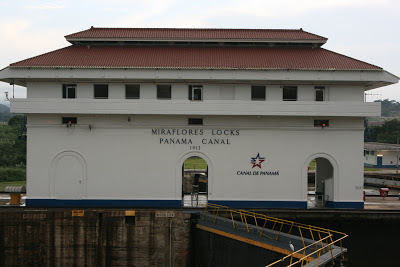
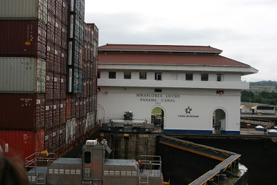

Son pocos los lugares turísticos que ofrece la capital:

- El casco Viejo. El barrio bohemio de la ciudad, recuerda el Centro Histórico del D.F ya que hay un par de policías por cada esquina, hace frontera con los barrios más peligrosos de Panamá sin embargo es muy seguro y agradable en el día, la noche es muy buena aquí.

- Panamá viejo. No se no fui.

- Los seguros Miraflores en el canal. Impresionante ver como funciona el canal, no se lo pierdan. El taxi les debe de cobrar como 7 dólares ida Y vuelta, intenten hacer un deal con el taxista porque conseguir taxis allá es difícil. Hay un restaurante que presume ser muy bueno, se ve caro.

- La línea de costa. Una calzada que sigue la costa, tiene como 5 kilómetros y solo un par de puentes peatonales para llegar a ella, hay que cruzar una especie de "periférico" Usa los puentes.

- Parque Metropolitano. Un parque enorme lleno de senderos, muy rico y... biológico. En algún lugar del parque hay una torre de observación ves casi toda la ciudad. (La bandera de Panama que se ve al tope tiene el tamaño de una cancha de basquet)

- The Causeway. Islas conectadas por una calzada echa con la tierra que se dragó del canal, los 3 kilómetros de calzada tienen al mar de ambos lados y puedes rentar una bici al inicio, muy agradable paseo en la mañana o en las tardes, sobre todo fin de semana. Se come, se bebe y se "fiestea" solo que ojo, si vas de fiesta ahí, el taxi de regreso te va cobrar como 10 dólares, no se te ocurra caminar en la noche fuera de ahí porque es tierra de nadie. 

A las afueras de la ciudad, puedes encontrar unos programas más interesantes como:

- La isla de Barro Colorado, isla a cargo del Smithsonian Tropical Institute of Research. La isla es una reserva ecológica así que ya se imaginarán como está, para ir hay que contactar al STRI ya que son ellos los que hacen los paseos, hay que reservar con una semana de anticipación, al menos. www.stri.si.edu 

- Hay otra Isla cerca en donde la playa es muy agradable en la marea baja, se llama Taboga y al parecer no es tan caro llegar

Todo esto lo puedes hacer en 2 o 3 días. Para La isla de Barro Colorado se necesita un día pues el tour empieza a las 8am y termina al rededor de las 4pm.
La línea de costa termina en el Casco viejo y de ahí te puedes pasar al canal (solo lelga antes de las 4 para que veas el museo) El parque lo haces ese día en la mañana o al día siguiente antes de ir de compras. La última gracia de Panamá.

Panamá City, Panamá.

