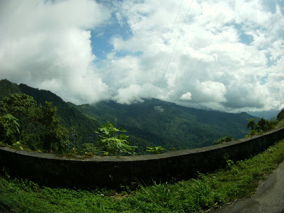

“All that mysterious life of the wilderness that stirs in the forest, in the jungles, in the hearts of wild men.” Joseph Conrad, Heart of Darkness*

En mi vida he recorrido muchas carreteras, debo de tener "chingos" de días nalga en un carro, he visto playas, desiertos, selvas, montañas, nieve, lluvia, neblina, sol a plomo y puedo afirmar con la más absoluta sinceridad que nunca había visto una cosa tan bella, impactante e imponente como la sierra norte de Oaxaca, pero empecemos por el principio...

## Generalidades:

La ruta que tomamos en esta ocasión es la larga (no lo sabíamos en ese momento) sales de Palenque rumbo a Villahermosa y tomas la autopista 145D rumbo a Minatitlán, por ahí no hay nada interesante, esa autopista es una recta aburridísima que lo más difícil es no quedarse dormido. Pero una vez que llegas a la caseta de Cosamaloapan te desvías tumbo a Tuxtepec pasando el segundo pueblo la carretera cambia, un plano verde y después de una curva, un gran puente sobre el río Papaloapan es el primer aviso de lo que nos espera adelante. Aquí, es el momento indicado para cargar gas porque después, vienen 200 kilómetros de sierra en donde el carro no pasa de tercera y el consumo es alto, no te quieres quedar sin gas a 3mil metros sobre el nivel del mar.

## La sierra Norte...

Pasando el puente San Juan Bautista, en donde nos bajamos a tomar fotos de lo que, ilusamente creíamos, sería la vista más bonita de nuestro viaje, una curva pronunciada nos hizo dudar. Conforme las curvas aumentaban la altitud también, la vegetación se fue haciendo cada vez más espesa y verde, el
ambiente era húmedo a madre, apagamos el radio del auto, bajamos las ventanas, el ruido de la selva era impresionante, como si estuviera viva, a la derecha, un barranco de miles de metros, un valle a la distancia, todo bajo un cielo azul gaseoso, a la izquierda una pared de unos 30 metros, llena de vegetación, caídas de agua cristalina por las paredes te invitaban a beber y tomar un baño, el asfalto bajo nuestros pies impecable, la meche forzando revoluciones en segunda, a mi lado Martin fascinado con la SportPro, atrás Lucile impactada con México y yo sin creer en el lugar donde estaba...

Acelera, frena, curva derecha, acelera frena curva izquierda, curva derecha, izquierda, acelera, frena curva derecha, curva curva curva, acelera, frena, para, camión (aaahhhhh), acelera, curva izquierda curva curva... Acelera, para foto, acelera curva derecha, curva izquierda, para foto, acelera para, camión (aaahhhhh), curva... Se dan una idea de lo que son los 200 kilómetros de la sierra norte de Oaxaca. 200 kilómetros que recorres en +- 4 horas desde su inicio hasta la llegada a Santa Lucía del Camino, no hay una sola gas en todo el camino, hay 3 paraderos para comer y descansar que si eres de estómago fuerte puedes comer, nosotros no paramos por lo que no se como es la comida, hay poco transito pero la sensación de cruzarte con un camión en plena curva te cala los huesos. Una carretera llena de vida, de experiencias y aventuras.

Conforme uno va subiendo la población empieza a disminuir y los pinos se vuelven amos del lugar, la vegetación del suelo disminuye considerablemente, en su punto más alto, la carretera alcanza los 3mil metros de altura (dato del celular de dudosa procedencia), cabe mencionar que puede tocar un buen tramo con neblina, por lo que les recominedo tomar su debida precaución. El próximo sentido a ser afectado y de una manera maravillosa, es el auditivo, al principio el ruido de la selva se conforma por una estrofa continua de insectos que mantienen un tono constante, con solos esporádicos de pájaros, distintas melodías de los cientos de especies que habitarán el lugar, recordé a mi profesor de la carrera, Meléndez, un experto ornitólogo que puede identificar cientos de especies tan solo con oírlas cantar, dentro de esta sonata, como un platillo suenan las cascadas de vez en cuando, conforme vas subiendo, la sonata va llegando a su fin, el ruido del auto y el viento van tomando lugar en el aire, a 3 mil metros, solo escuchas el motor y uno que otro pájaro festejando tu pasar. El tercer y último sentido es el tacto y este se siente en dos casos principales, la temperatura va bajando conforme vamos subiendo y la humedad aumenta muchísimo, a los 3 mil metros, el asfalto está completamente mojado aún sin haber indicadores de lluvia.

Es una experiencia única en la vida, y digo única porque con una vez basta, es cansada, batallosa, y sobre todo, altamente mareante para los navegantes traseros, mientras que el piloto (aquí uno se convierte en piloto) se divierte en una pista llena de retos, los demás van admirando el paisaje que va cambiando durante el recorrido. Lo más fabuloso es que, uno normalmente está acostumbrado a ver como cambia visualmente la carretera, en este caso cambia en 3 sentidos principales; la vista, es el que más resalta, al principio la vegetación parece metro de la ciudad de México, toda encimada, verde que te quiero verde, hojas grandes, árboles altos y de grandes hojas, una auténtica selva templada-tropical.

En conclusión esta entrada es principalmente para describir los 200 kilómetros de la sierra norte de Oaxaca, carretera hermosa pero que no es para cualquiera, y que, sin duda, es la carretera más bonita que he circulado. Espero haya cumplido mi objetivo y si alguien lee esto le den ganas de ir a conocerla, vale mucho la pena. Para los que prefieren la comodidad y no les importa el camino si no el destino, en vez de salir de la autopista en Tuxtepec, sigan hasta las Cumbres de Maltrata y ahí toman la "semiautopista" a Oaxaca, los dejará en la ciudad en 3 horas.

 
 

###### Nota
Con esta entrada quiero aprovechar para aclarar una cosa, ahora por cada entrada "especial" voy a empezar a citar libros que dicha entrada me recuerden. En este caso el libro de Conrad estaba en mi mente todo el tiempo. Si no les gusta leer pero si el cine, vean "Apocalypse Now" de F.F Coppola, dicha película etsta basada en el libro de Conrad (aun que el primero llevado a la guerra de Vietnam y el segundo sucede en África)

¡Saludos!
