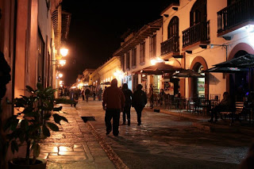

                           

"No se qué demonios vas a hacer ahí, es un pueblo de opresión, en donde hacen menos a los indígenas, abusan de ellos, donde quienes mandan son europeos abusivos y está llena de ONG's oportunistas que más que ayudar perjudican"... le comentaba G. Constancio al futuro apóstata. Sin embargo éste, terco y curioso como es (gracias al propio G. Constancio) claro que no hizo caso, preparó la carroza y tomó el camino que lleva a SCdlC. 

"¡Es una locura! vas a viajar 900 kilómetros para estar dos días, es mucho camino, es mucho tiempo, no tiene sentido" volvió a argumentar el Grande, en un segundo intento desesperado de persuadir al joven, pero el honorable había olvidado una cosa básica y es que él viajó y exploró mucho más en su infancia y sin querer, pero con una pequeña pizca de malicia, le inyectó al muchacho, cuando joven, el gusano de la carretera, de la aventura de explorar el mundo ver las cosas para así generar su propia opinión, aveces él olvida esto, el muchacho nunca, porque estaba de lo más agradecido con su señor progenitor. 

Entonces el llamado Apóstata se reunió con su hermano Galo y su mujer y se fueron los 3 en lo que parecía una gran aventura, salieron de la capital de la nación el lunes temprano (lea el pasaje aquí http://olardopassarinhoeoar.blogspot.mx/2013/07/san-cristobal-de-las-casas.html) y en efecto después de un largo camino, llegaron a la capital de Chiapas, Tuxtla Gutierrez. Posteriormente, después del pit-stop, empezaron a subir lo que parecía una sierra interminable, linda, que subía hasta las nubes con verdes paisajes en los dos lados, ríos enormes cruzaban por abajo de los puentes flotantes en el vacío.

Una curva, una pendiente y abajo en el valle un pueblo disfrazado de ciudad... O ¿acaso era una ciudad disfrazada de pueblo? Juliano nunca lo supo, caminó por el centro histórico de la pequeña ciudad, una zona llena de hoteles, bares, turistas, indígenas vendiendo cosas y niños pidiendo dinero, una rabia lo empezó a consumir sólo de pensar que su progenitor podría tener razón. Se alejaron del centro en busca de algo menos tumultuoso, llegaron al mercado y sin suerte se terminaron metiendo en un hotel muy bonito de la época colonial, ahí se tomaron un jugo de cebada bien frío y comieron en paz. La noche calló y como buenos aventureros buscaron un lugar para tomar un café local ya que, el café chiapaneco es de los mejores manjares del sur del país. Mientras tomaban un delicioso café y comían unos panes descomunalmente buenos (panadería francesa) en las mesas externas del cafe "Oh La La" en el Andador Guadalupe, niños e indígenas se acercaban a un ritmo de 1 por minuto a vender, rentar, pedir, rogar. En efecto, es un lugar que vive del turismo, pero lo que más vende, es la apariencia frágil, pobre y triste de los indígenas. Los amantes de SC no me odien, no es un pueblo feo, el centro histórico es muy bonito, tampoco se come mal, al contrario gracias a su internacionalización puedes comer verdaderos manjares en restaurantes de autor como el "Tierra y Cielo" o el "Sensaciones" (este segundo en la plaza).  

Los tres compañeros siguieron caminando por el pueblito, sin poder generar una opinión objetiva, es una ciudad grande con un pequeño pueblo en el centro, con un andador turístico que recuerda a Playa del Carmen, lleno de turistas tomando fotos con los indígenas obviamente muy pobres, vendiendo cosas por menos de 2 kilos de tortillas, fuera de las cuatro calles arregladitas no hay nada. Al fin de el Andador Guadalupe, hay una iglesia en lo alto que llama la atención, el interior es horrible, parece un altar al mal gusto, luz neón, grabaciones en vez de misa, una cosa surreal, pero la vista vale la pena. 

En un día llegaron a la conclusión de que San Cristobal no es nada del otro mundo, la tan marcada diferencia social no permite disfrutar a gusto de su culinaria sofisticada internacional (nada mexicana obvio). En un día (o tal vez una tarde) recorrieron todo el pequeño espacio turístico. Si vas al menos compra de las chiapanecas para ayudar a la comunidad local, ya que los comercios parecen estar dominados por capital extranjero. Si eres indiferente a este paisaje, seguro te la pasarás bomba. La cuestión aquí es, ¿qué tipo de turista eres? Si eres una persona que quiere ir a experimentar hoteles Spa maravillosos como el "Hotel Posada Real de Chiapas", degustar culinaria internacional muy sofisticada y (repito) el ambiente no te causa tanto conflicto, definitivamente SanCris. es un destino ideal para ti, si no eres de esas personas, creo que hay otros destinos más interesantes que ver, sin embargo, ver las cosas por los propios ojos siempre es bueno.

PD. Todo parecido con la novela de Gore Vidal, "Juliano el Apóstata" es MERA coincidencia (guiño-guiño). 

Los alrededores de San Cris, en cambio, son otra cosa...

Saludos lector(es)