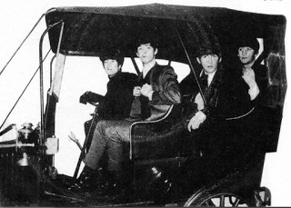

 

Pues parte de la experiencia de estar viajando por la vida es conocer gente y ahora, por primera vez en mis años de viajante practiqué la emocionante, (dicen que peligrosa) fascinante y divertida modalidad del aventón. 

Como ya les platiqué Tulum es un pueblo pequeño y a mi parecer es que ha crecido mucho y los servicios no están a la par, los transportes del pueblo a la playa son escasos, la caminata es de aproximadamente una hora (y eso que en la tarde sin sol) Y los taxis te cobran al rededor de $60, cosa que, cuando viajas solo no está padre. Por todo esto, la mayoría de los jóvenes piden aventón a la playa y de regreso al pueblo, una práctica muy común que no me pareció representara mayor peligro, descubrí por ende que durante dicha práctica conoces historias fabulosas y personas verdaderamente interesantes, a continuación escribiré un trío de anécdotas que me sucedieron siéntanse libres de leerlas, o no.

# La primera vez, siempre asusta pero al final te gusta.

Después de caminar todo el pueblo de Tulum y encontrarme a la Mati por ahí dando el rol, llegué a la carretera, el pueblo lo cruzas a pié en 30min. En la carretera paré unos 5 minutos para ver si tenía una suerte precoz que no llegó. Seguí con mi camino hacia la playa levantando el pulgar de vez en vez, concí unas argentinas que también estaban pidiendo aventón muy simpáticas, cotorreamos unos 10 minutos y luego seguí mi camino pensando porque chingados seguía caminando y no me quedé con las argentinas, lo sigo pensando. A la mitad del camino se me juntó piiii de Guadalajara, un compadre muy animado, se paró una Pic-Up y nos llevó. En el breve camino (el mío porque él siguió en la camioneta) intercambiamos procedencias, quehaceres y destinos. Diez minutos después bajé frente al Hotel Adoni Tulum y tomé la costera a la izquierda. Eran las 8.30 pm no había un alma en la costera, una luz o un carro, lo único que alumbraba mi recto camino era la luz de la luna en “cuarto menguante”, me permitía ver si una hormiga cruzaba mi camino, una cosa divina, puse un buen son latino en el “ahípone” y caminando a la mitad de la carretera y cantando a todo pulmón seguí mi hazaña sintiéndome un personaje Hesseiano. 30 minutos después llegue al “Bar de Luca” con horario de sobra en el 2x1 y finalicé con broche de oro mi primera vez pensando que no iba ser la última.

## La pareja

Escenario: 7.30am, Juliano ya salió de la tienda de campaña, ya fue al baño del hotel de alado al aseo matutino y está sobre la carretera caminando hacia el pueblo para empezar a bucear. 
Comentario del escritor: Obvio que a esa hora en... ¿sábado? ¿domingo? los días en la playa se vuelven como horas en una cita bien sucedida, sólo conoces el tiempo cuando tienes que partir; el caso es que era muy temprano en un día poco probable.
Narrador: Ahí estaba él recorriendo la orilla de la carretera con su tumbao que tienen los guapos al caminar, escuchando música convencido que nadie a las 7.30 am iría pasar por ahí, hasta que escucha un auto aproximarse tímidamente estira el brazo y levantando el pulgar da su mejor cara mañanera.
Escenario: Carretera Federal, selva por los dos lados, carro parado al lado de Juliano
Juliano: ¿Hola o Hello?
Él: ¡hola!
Ella: hello!
Juliano: Hello then! 
Todos: “jajaja”
Él: Thanks guys I never thought that somebody actually were passing by at 7.30 in the morning.
He: Yep. you’r a lucky guy man! hahah
She: Where are you from? 
Jul: Oh... Where Am I from... I’m the worlds son, I was born In Rio de Janeiro and lived there until I was 6, at that age my dad (is a sailer man) got a job on a big ship, so we where on the ocean for almost 4 years without home land, than we make base on Meixco, lived for about one year on the Windy City after that we moved to Mexico again aaaaaaaaand now here I am!
Comentario del escritor: En efecto, una de las maravillas de los aventones es que puedes adaptar la historia que quieras a tu vida, prácticamente puedes ser quien quieras.
He-she: woooow! amazing 

- **He:** I’m from Cali-California
- **She:** I’m from Piiiiii Canada.
- **Jul:** nice, so what are you doing in Mexico?
- **He:** oh well, we came to the meeting in Chichen Izta 
- **Jul:** oh nice, where do you guys live?
- **He:** San Diego
- **She:** Piiiiii, Canada
- **Jul:** wait, so... You guys didn't know each other be fore? 
- **He:** no
- **She:** I flew from Canada and he flew from Cali, we meet up in Chichen Itzaa just by chance
- **He:** Yeah man, and we just had an awesome time there
- **She:** and decided to rent a car and come to Tulum on a little car trip.
- **Jul:** NO WAY!  really? you’r kiding me... Thats have to be the best couple/love story I have ever hear off you should sell it to Hollywood!
- **Narrador:** El y ella rien mientras juliano se muestra extremadamente emocionado con las sorpresas que te da la vida y lo fantásatica que suena su “chick flick story”.
- **Jul:** I “me refiero a “, that's jut fantastic, I want to have a story like that to tell every one and look that I'm not a romantic guy
- **Narrador:** Ella le acaricia el cabello a él y sin dejarlo de ver habla
- **She:** Yeah its unbelivable unexpected what destiny can give you, one day you wake up on your amazing be loved bachelor apartment and the next day you wake up on a hotel room with a stranger who in 4 days is the farest thing to a stranger and whom you don't want to change for your apartment.
- **Narrador:** El sonríe y le toma la pierna, Juliano hace la señal de que el fin de su viaje ha llegado ella se voltea para decearle lo mejor en su viaje, él también, por fin se les ve las caras, una pareja joven y bonita, ella tiene una combinación de piel morena-dorada con ojos claros, pulseras de metales en una muñeca, de cuero en otra, muy atractiva. Juliano se baja creyendo que los dos son muy afortunados, pero él más, el viaje sigue.

## La hippie y el policía. 

La última historia es digna de una una novela “Bukowskiana” con personajes fumadores compulsivos, hippies, fritos, policías y demás, fue una despedida épica de los aventones. El último día, estaba igual que con la pareja pero ahora con la certeza de que iba a conseguir aventón y dicho y hecho, llevaba cinco minutos en la carretera cuando un carro con placas gringas se paró a mi súper-señal de positivo. Mientras me subía a lo que sería el viaje más bizarro de mis aventontes, pensaba en que si fuera un hombre gordo o muy fuerte el que iba manejando, subir a ese carro hubiera sido una pésima idea, el carro en general muy sucio y madreado, la parte de atrás tenía sleppings, cobijas, basura, cajas,   un cuadro de la virgen y seguramente un perro moribundo por ahí. La parte de adelanta no prometía un mejor visual, el cenizero del carro tenía no menos de una docena de colillas sepultadas y mi anfitriona, una señora de cierta edad, en el hueso, rubia de piel “peculiar” fumaba con todas las ventanas arriba. 
Pues bueno, resulta que la señora "Mary" venía de New Jersey (Para los que no sepan eso queda a 5,320 kilómetros de distancia) viajaba con su hijo, después me fui a encontrar con una especie de John Lenon y George Harrison en su etapa más... "experimental" fusionados, había estado en palenque, Chiapas en el "Rainbow meeting" (cosa de hippies) durante una semana y ahora andaban dando el rol por el Caribe, cuando le pregunté el día de su regreso, muy simpática y casualmente me contestó "when we ran out of money" a lo que yo contesté, ah no bueno pero que buen plan. jajajajaja. Íbamos carretera arriba cuando bajo una sombra de una palmera había una persona acostada y Mary dice muy casual "Oh ther's my son" a lo que yo con cara (O_o) dije ahhh, si, perfecto, igual aquí quería bajar (a la mitad de la nada) Me bajé y seguí caminando...

Unos cuantos cientos de metros más adelante pasé frente al cuerpo de bomberos, de donde estaba saliendo una Patrulla Municipal a quienes les pedí aventón y, a mis sorpresa me lo dieron. Sucedió así:

- **Jul:** ya poli, voy aquí al cruce, venga señor de la ley ya casi es navidad...
- **Oficial:** A ver joven, ¿de donde viene?
- **Jul:** Del DF Oficial
- **Ofi:** ¿trae drogas?
- **Jul:** ¡Que paso mi poli! Si yo puro sano, soy buzo!
- **Ofi: jaj**aja ¿traes armas?
- **Jul:** jajajajaja Una bazuca mi poli, pero anda descansado
- **Oficiales:** jajajajajajajajjajaja órale chato, súbase atrás

Y así fue como logré hacer que la policía me llevara a mi destino final... hashtagcuandoalbureasconelpolitodoselogra
