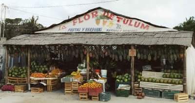
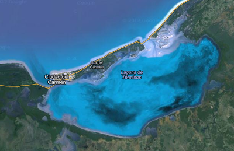
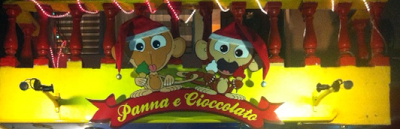

El pequeño pueblo de Tulum se encuentra a escasos 40 kilómetros al sur de Playa del Carmen, un pueblito donde todo sucede en una avenida principal y la playera, tiene un encanto que se nota por todo el caribe mexicano y que es, cuanto más al sur te diriges menos gente encuentras en los poblados. 

El pueblo ha tenido un crecimiento anual de 14% y seguramente en pocos años dejará de ser el pueblito simpático del que hoy les escribo para pasar a ser un Cancún/Playa del Carmen cualquiera. 

# Llegada

Para llegar por tierra se tiene dos opciones, la primera el mortal autobús que hace mil cinco mil horas y la segunda el carro propio que resulta bastante más interesante. La ruta sigue la misma desde la Ciudad de México a Villahermosa pasando por Puebla y Veracruz, hasta este punto se habrán gastado unas 9-10 horas del día y unos $700 de casetas. Aquí sucede la principal disyuntiva de la carretera ya que la ruta se divide en norte (vía Mérida) y sureste (vía Chetumal)

## Vía Mérida

Si eligen esta ruta, el costo puede aumentar $300 si utilizan la autopista y son 80 kilómetros más de carretera. Al final tardas como una hora más que si te fueras por la carretera de Chetumal.

Sin emabrgo esta ruta es, a mi parecer aun más bonita que la de Chetumal, hay que seguir norte rumbo a Ciudad del Carmen con destino final en Mérida. Por esta ruta cruzarán por la Reserva de la Biosfera de los Pantanos de Centla, la Laguna de Términos Solo hay una gas entre Villahermosa y Campeche así que les aconsejo tomar sus precauciones. Una vez en Mérida, pueden pasear por la capital maya (vean "Mérida" en este blog), tienen dos opciones: A) La autopista Mérida-Cancún y luego bajar a Tulum y la carretera Mérida-Valladolid-Tulum, es una carretera federal que va puebleando, no es mucho mas tardada que la autopista y tiene la gran ventaja de que puedes ir parando en los cenotes y sitios arqueológicos, vale mucho la pena.

Si se van por esta ruta no pueden dejar de parar en Mérida a comer deliciosa comida Yucateca...

## Vía Chetumal

Esta parece ser la ruta más directa, pero la diferencia no es mucha, de Villahermosa hayq ue tomar noreste rumbo a Escárcega y aquí dirigirnos este a Chetumal. La gran magia de este camino es que  pasa por dos de los sitios arqueológicos más impactantes de México, Palenque y Calakmul por lo que, si van a hacer esta ruta, es obligatorio hacer parada en al menos uno de los dos sitios. El otro par de atractivos de esta ruta es la laguna de Bacalar y el cenote Azul, aquí es el lugar ideal para la comida del segundo día y un chapuzón en las cristalinas aguas de los dos sistemas de aguas. 200 kilómetros norte llegarán a Tulum sin mayor complicaciones.

Sea como sea, siempre que viajen en carro por la república usen la página de la secretaría como guía, no solo es muy atinada en precios y tiempos si no que además te da un resumen de las condiciones de las carreteras, las obras y demás incidentes que puedas encotnrarte en tu ruta, les dejo el link a continuación:

http://aplicaciones4.sct.gob.mx/sibuac_internet/ControllerUI?action=cmdEscogeRuta

## Volando 

También se puede llegar volando, lo más directo es Cancún, pero también pueden volar a Chetumal (4 horas en bus) o a Mérida (me parece que son 6 horas en bus).

# Hospedaje

Aquí les dejo 3 opciones para que tengan una idea, consideren que los precios varían mucho (casi 50%) entre temporada alta y baja... : 

**Rancho Tranquilo.** Se encuentra sobre la Av. Principal dirección a Chetumal, casi al final de Tulum. La tarifa es al rededor de $680$ por 5 personas. Un hotel con cabañas de una persona hasta 5. Las individuales son cuartos con varias literas (estilo hostal) las de cinco personas son cuartos con dos camas matrimoniales y una individual. Los cuartos no cuentan con AC, tele o internet (internet en la zona común), en cambio tienen mosquiteros, ventiladores y hamacas (jejejeje) es rústico pero no es malo. Su gran debilidad es la ausencia de baños en los cuartos a pesar de que los 4 sanitarios que tienen están siempre limpios, a nadie le gusta compartir baño. Los huéspedes acostumbran ser europeos o gringos trotamundos hippie style buena honda y la cocina es compartida. Sirven desayuno todos los días y rentan bicis por $50$. 

**Santa Fé.** Un ligar de camping sobre la playa, casi llegando a las ruinas de Tulum. $100 p/p. No tiene gran ciencia, llegas montas tu tienda de campaña y eres feliz, tiene varias zonas de sombra lo cual es bastante bueno si se quiere dormir hasta tarde. El precio es alto considerando que los baños están hechos un asco, yo iba a los del hotel de al lado "Zalzikin" y ya no había tos. Si eres muy chaca puedes pasar tres o cuatro días durmiendo sin pagar, solamente pagando la primera noche. 
Hotel Addy. A una cuadra de la avenida principal dirección opuesta a la de Rancho Pequeño, es un hotelito más equipado, cuenta con estacionamiento, desayuno, aire acondicionado y los cuartos tienen su propio baño. La señal de internet llega a los cuartos. Rentan bicicletas por $150$ /24hrs ó $75$ /12 hrs.

# Comida.

Como todo buen pueblo de costa los mariscos aquí se comen, y se comen bien. Tulum (y casi todos los pueblos del caribe mexicano) está lleno de extranjeros, muchos europeos y su turismo atrae a los mismos, turistas que no están buscando resorts si no que cosas más "rústicas", digamos calidad por cantidad. Así son varios de los restaurantes que hay a lo largo de la avenida principal de Tulum.

**El Camello Jr.** Sin duda alguna es el mejor restaurante al que fui en estos días. Una auténtica marisquería, es famoso por sus ceviches bien servidos. El tamaño Jumbo cuesta $350$ pesos y comen 4 personas sin problemas. Filetes de pescado, calamares, pulpo, ostiones y más es sin duda alguna un lugar donde hay que ir varias veces. Nunca he logrado llegar sin hacer fila para lugar pero no os desesperéis, mejor entra, ver a la caja paga $20$ por una chela y relájate ya te tocará.

**Aguachile**
Unos 40 metros más retirado que El Camello JR. en la esquina de la cuadra está el Aguachile, este restaurante de apariencia humilde es todo lo contrario cuando llega la cuenta, platillos de mariscos muy a su manera, con combinaciones de la casa y muy buenos. Claro que lo tradicional aquí es el Aguachile con sus salsa muy picosas pero también cuentan con otras excelentes opciones. No dejen de probar la Cerveza clamato con ostiones sumergidos. 

**Kinich.** Al final del pueblo, rumbo a Chetumal, pasando la barricada de policias del lado contrario de la carretera hay un casaron donde se come una excelente comida Yucateca. El lugar no es barato, la cuenta por persona de tres tiempos y bebidas está al rededor de los $450$, pero sin lugar a dudas se come muy bien. A mi parecer es de las mejores cochinitas pibil que he comido en mi vida.

**La Nave.** En la dirección sur de la avenida principal, este restaurante Italiano cuenta con una muy buena opción para los vegetarianos, platos muy sofisticados con precios relativos, se come por persona con cerveza por al rededor de $200$. Se come bastante bien y las pizzas son al horno. 

**Helados Panna e Gicocolato.** Unos helados buenísimos que hay de los dos lados de la avenida, el de pistache y el de coco no tienen madre y no dejes de probar el de canela.

**Azafran.** Un maravilloso restaurante "alemán", excelente para comer, esta casa muy agradable es el mejor lugar para comer un buen desayuno. No olvides pedir el desayuno especial, parece un bomba pero, ¡si lo es! Después de desayunar aquí, vas a comer hasta las 4 de la tarde, ¡delicioso, agradable y rico!

**El Bar del hotel Zazilkin, Bar de luca.**
Este modesto bar en la playa es ideal para el pre copeo. Mejor conocido como el "Bar de Luca" por su dueño, tienen la mayor Happy Our de 2x1 que he visto ya que empieza a las 5.30 y termina hasta las 10pm. El bar se retira entre 11 y 12 pero para entonces ya te moviste a algún lugar. El fuerte de tulum no es la noche de reven, para eso mejor hay que ir a Playa del Carmen o Cancún.

