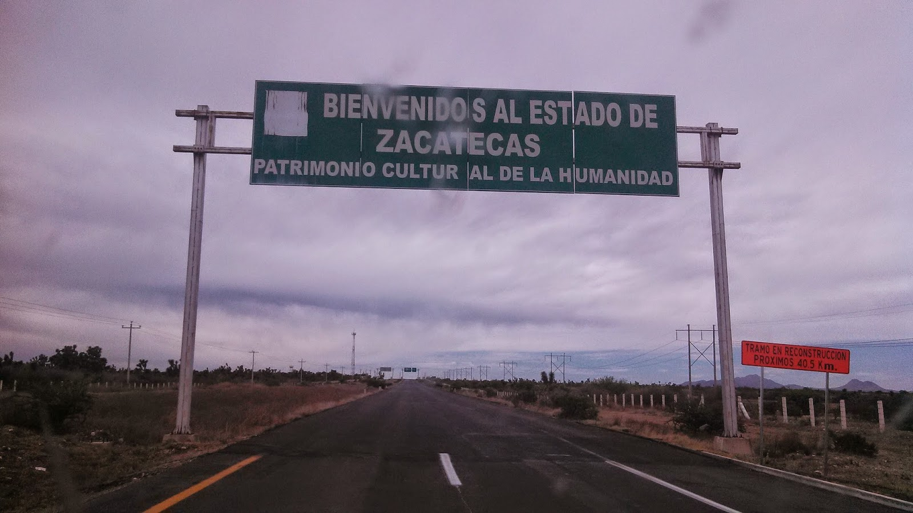
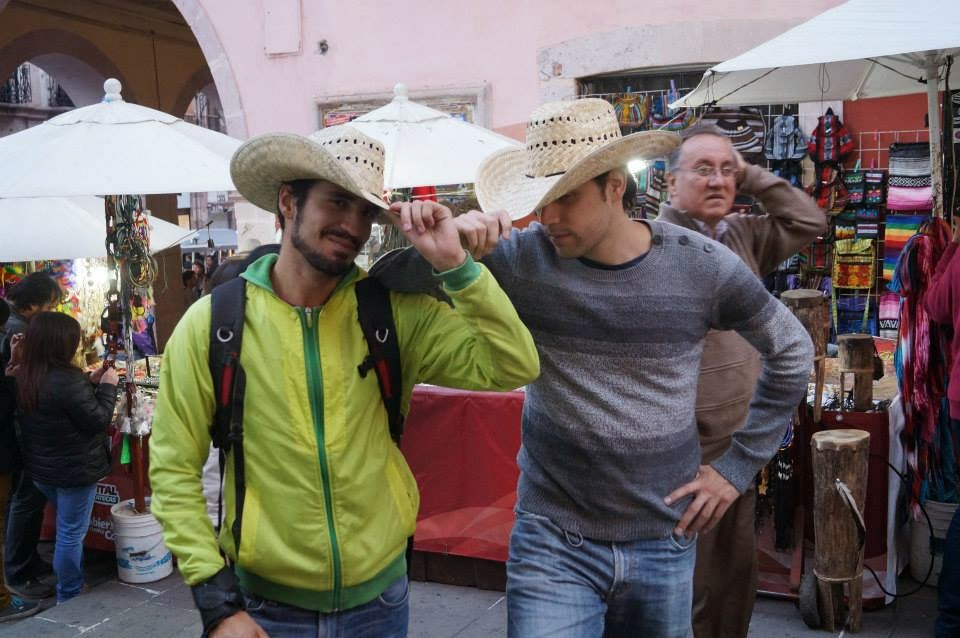

Lo más norte que he ido después de León, Guanajuato (si ya se que eso no es norte pero no me estén molestando) es la minera ciudad de Zacatecas, un pequeño aglomerado de casas con subidas y bajadas, montañas, casitas muy monas y muchos cables colgando... El norte es muy bonito, lleno de sombrerudos, latas grandes de modelo en donde compras cerveza sin bajarte del auto, caballos en las calles, camionetas y demás, una joya del folclor ranchero. Pero por ahora hablaremos del camino...

**Lo más importante es tener un sombrero de vaquero**, uno tiene que lucir el estilo del norte, uno tiene que aclimatarse a donde va, así que antes de irte a carretera ten un sombrero ranchero en la cabeza, un buen pantalón jeans y, bueno, algún día pasaré al nivel de bota, ¡no olvides el soundtrack carretero, pura banda! PD. no te preocupes, si no tienes sombrero en el camino puedes comprar en casi todos los paraderos. Pero en serio, si no tienes un sombrero la verdad es que mejor ni vayas al norte, "oso mil cinco mil weeee"

Saliendo del DF. hacia "Quererock" ya saben (porque obvio leen toooodas las entradas de este blog y ya leyeron la del camino a León), hay que pasar en la Barbacoa Santiago, pero, si está más llena que Coyoacán en domingo (lo cual es normal) sigan derecho y justo pasando la caseta hay un comedor grande de camioneros, ahí no hay barbacoa pero hay harto desayuno muy rico y llenador, además de un buen de camioneros, ¿quién puede resistir chilaquiles y camioneros? You will be living the dream!

El segundo comentario que les tengo es el siguiente, seguir la ruta hacia San Luis Potosí, según mis amigos los intensos gemelos que se la pasan viajando de un lado a otro del país (al parecer no tienen nada mejor que hacer) dicen que por SN es más rápido, nosotros por ahí fuimos e hicimos a buen paso como 6 o 7 horas del DF a Zacatecas, sin contar las paradas.

El tercer tip es, no tomen la desviación de San Luis, entren en la ciudad (bastante feita) al parecer la desviación te manda a casa de la guayaba (muy muy lejos) y acabas haciendo como una hora en ella, nosotros cruzamos SL en 30 montos y las instrucciones están muy claras, hay un museo del tren que se ve que está bien padre padrísimo, pero no lo se pues no paramos en él.

Si te tocó manejar el primer tramo de carretera y eventualmente vas a cambiar de chofer, ¡este es el momento! salva tu alma de los como 150km de tediosa recta que te llevan de San Luís a Zacatecas, ¡sálvate! dile al pobre diablo del copiloto que lo toca manejar, dile al dude que va a atrás que lo toca ser copiloto y échate una jeta, que no hay naaaaaaaaaaaada interesante más que recta, pasto y vacas (awwwww vacas... NOT)

En conclusión, la carretera está muy bien, es básicamente una recta interminable pa'rriba. Hay bastantes gasolineras y casi no pagas casetas. Hay lugares donde parar y atraviesa por San Luis, no tomes la desviación.

**¡Buen viaje!**

