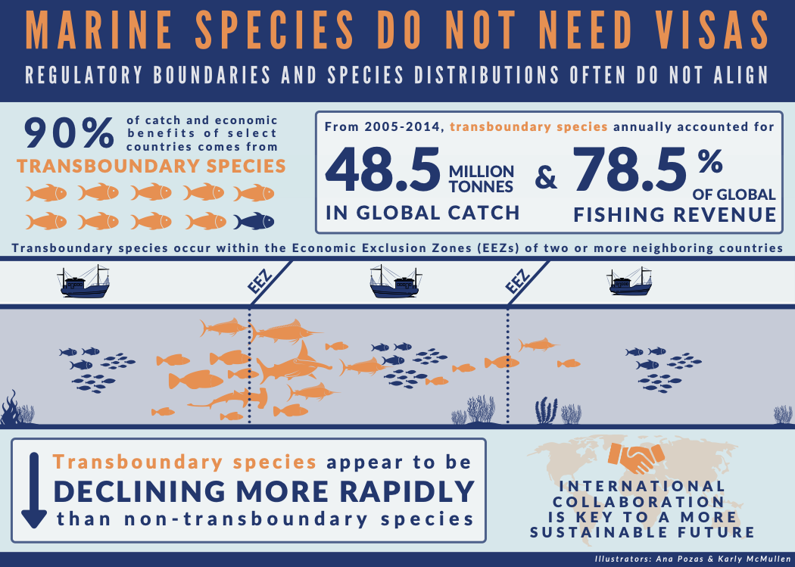

# Science outreach

This days outreach is an important part of science bla bla bla...

# Inphographics

<a href="Infographics/FishForVisa.png">

</a>

<a href="Infographics/FishForVisa.png">

</a>

# Translations to spanish

As a Brazilian-Mexican citizen, I am committed to reduce the North-to-South knowledge gap.

- [El potencial transfronterizo de las especies marinas de importancia pesquera del mundo]("https://www.julianopalacios.com/Translations/Fish_for_visa/Fish_for_visa_Esp.html)

- [Evaluación bioeconómica del plan de recuperación de la pesquería del callo de hacha (*Atrina maura, Atrina tuberculosa & Pinna rugosa*) de la bahía de La Paz (BCS) México]("https://www.julianopalacios.com/Translations/Callo_de_Hacha/Callo_de_Hacha_Esp.html)

# Presentations

# Media outlets