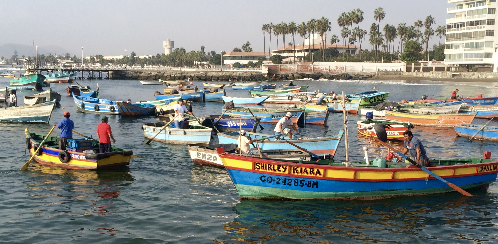

<center>



*Fishers arriving to port in Peru.*

</center>

<br>

Latin America is a highly diverse and dynamic region and there are many contexts to fisheries management and conservation. Nevertheless, there are several cross-cutting themes in Latin American countries, and very likely throughout the region. Actions to address current issues in fisheries management and conservation include improved clarity in marine resource policies, transparency in data sharing and collection strategies, institutional accountability, recognition and meaningful inclusion of all stakeholders, and incorporating climate change in management plans. These actions, aside from necessary support for operational aspects of resource management, are vital for establishing ecologically sustainable and socially equitable seafood production systems that meet food security needs and provide economic and social benefits at local and national scales.   

As a Brazilian-Mexican citizen, I am committed to support policy-making and resource management decisions in Latin American countries with a strong interdisciplinary science.


## Related Publications

- Spalding A.... **Palacios-Abrantes, J.**, *et al.* 2023. Engaging the tropical majority to make ocean governance and science more equitable and effective. *npj Ocean Sustainability*, 2 (1), 8.

- Cisneros-Montemayor, A., **Palacios-Abrantes, J.**, *et al.* 2020. Análisis espacial de efectos anticipados del cambio climático sobre la pesca en México: Un panorama para la adaptación *Ciencia Pesquera*, 28:31-44

- **Palacios-Abrantes, J.** and Cisneros-Montemayor, A. M., 2020. Tendencias de la investigación pesquera en México: necesidades y oportunidades para la adaptación al cambio climático. In: Mariño, U. U. and Alcalá, G., eds. Pescadores en México y Cuba Retos y oportunidades ante el cambio climático. Ciudad de México, México, 225.

- **Palacios-Abrantes, J.**, *et al.* 2019. A metadata approach to evaluate the state of ocean knowledge: Strengths, limitations, and application to Mexico. *PLoS ONE*, 14 (6), DOI 10.1371/journal.pone.0216723.

- **Palacios-Abrantes J.**, *et al.* 2018. Evaluating the bio-economic performance of a Callo de hacha (*Atrina maura, Atrina tuberculosa & Pinna rugosa*) fishery restoration plan in La Paz, Mexico. *PLoS ONE* 13(12): e0209431. DOI: 10.1371/journal.pone.0209431

## A Meta-database of Marine Research in Mexico

```{r metamares, child = 'Metamares.Rmd', eval = T}
```


---- 

<center>

**Contact**

j.palacios [at] oceans.ubc.ca | [Google Scholar](https://scholar.google.ca/citations?user=EZpBcjcAAAAJ&hl=en){target="_blank"} | [Twitter](https://twitter.com/julianop_a)

</center>


<!-- Google translator  -->
<div id="google_translate_element"></div><script type="text/javascript">
function googleTranslateElementInit() {
  new google.translate.TranslateElement({pageLanguage: 'en', includedLanguages: 'es,pt'}, 'google_translate_element');
}
</script><script type="text/javascript" src="//translate.google.com/translate_a/element.js?cb=googleTranslateElementInit"></script>


<!-- Global site tag (gtag.js) - Google Analytics -->
<script async src="https://www.googletagmanager.com/gtag/js?id=UA-105699898-4"></script>
<script>
  window.dataLayer = window.dataLayer || [];
  function gtag(){dataLayer.push(arguments);}
  gtag('js', new Date());

  gtag('config', 'UA-105699898-4');
</script>