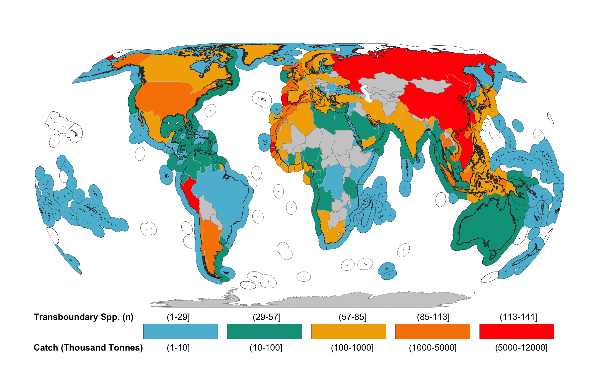

<!-- Global site tag (gtag.js) - Google Analytics -->

*Number of transboundary species per Exclusive Economic Zone and catch per fishing nation.*  
*Figure from 10.1038/s41598-020-74644-2*

 

Regulatory boundaries and species distributions often do not align. This is especially the case for at least 633 marine species crossing multiple Exclusive Economic Zones (EEZs). This  missalignment represents a challenge for fisheries management, as policies tend to focus at the national level, yet international collaborations are needed to maximize long-term ecological, social and economic benefits of shared marine species. Climate change is driving shifts in distribution of fish stocks towards areas with cooler environment, generally in higher latitude or deeper water. Particularly, distribution shifts in fish stocks that straddle between national jurisdictions or EEZs are challenging transboundary fisheries management. Using both global and regional examples, my research aims to answer the following questions: 

- Are transboundary fisheries management programs prepared for shifting stocks?
- How can we adapt to shifting stocks?
- What management schemes will be better fitted to shifting stocks?

## Publications

- **Palacios-Abrantes, J.**, Reygondeau, G., Wabnitz, C. C. C., and Cheung, W. W. L., 2020. The transboundary nature of the world’s exploited marine species. *Scientific Reports*, 10 (1), 415–12. DOI: 10.1038/s41598-020-74644-2

<!-- Original article -->
<a span class="label label-primary" href= "https://www.nature.com/articles/s41598-020-74644-2" target="_blank">Full Paper</a>
<!-- Español -->
<a span class="label label-success" href= "https://www.julianopalacios.com/Translations/Fish_for_visa/Fish_for_visa_Esp.html" target="_blank">Artículo en Español</a>
<!-- Github -->
<a span class="label label-warning" href= "https://github.com/jepa/FishForVisa" target="_blank"> Code </a>

- Pinsky M.L., Reygondeau G., Caddell R., **Palacios-Abrantes J.**, Spijkers J., Cheung W.L. 2018. Preparing ocean governance for species on the move. *Science*, Vol. 360, Issue 6394, pp. 1189-1191, DOI: 10.1126/science.aat2360

<a span class="label label-primary" href= "https://www.julianopalacios.com/Original_Articles/Pinsky_etal_2018.pdf" target="_blank">Full Paper</a>
<a span class="label label-success" href= "https://www.julianopalacios.com/Translations/Border_Crossing/Border_Crossing_Esp.html" target="_blank">Artículo en Español</a>

## Working Papers

- **Palacios-Abrantes J.,** U. Sumaila R., and Cheung W.W.L. n.d. Challenges to transboundary fisheries management in North America under climate change. *[In press; Ecology & Society]*

<!-- 
 -->
<!-- Original article -->
<!-- <a span class="label label-primary" href= "" target="_blank">Full Paper</a> -->
<!-- Press -->
<!-- <a span class="label label-info" href= "" target="_blank">OceanCanada Stories</a> -->
<!-- Github -->
<!-- <a span class="label label-warning" href= "https://github.com/jepa/OC_Transboundary" target="_blank"> Code </a> -->

<!-- 
 -->

- U. Sumaila R., **Palacios-Abrantes J.,** and Cheung W.W. L. n.d. Climate change, shifting threat points and the management of transboundary fish stocks. *[In press; Ecology & Society]*

<!-- 
 -->
<!-- Original article -->
<!-- <a span class="label label-primary" href= "" target="_blank">Full Paper</a> -->
<!-- Press -->
<!-- <a span class="label label-info" href= "" target="_blank">OceanCanada Stories</a> -->
<!-- Github -->
<!-- <a span class="label label-warning" href= "https://github.com/jepa/OC_Transboundary" target="_blank"> Code </a> -->

<!-- 
 -->

<!-- ## Related Work  -->

## Media

- [Centre for Ocean Solutions](https://oceansolutions.stanford.edu/stories-events/no-visas-fish-new-study-emphasizes-importance-cooperative-fisheries-management)
- [University of British Columbia](https://oceans.ubc.ca/2020/10/21/transboundary/)
- [CONACyT Prensa, Spanish](http://www.conacytprensa.mx/index.php/ciencia/ambiente/24771-cambio-climatico-pesquerias-mundo){target="_blank"}
- [National Geographic](https://news.nationalgeographic.com/2018/06/climate-change-drives-fish-wars-science-environment/){target="_blank"}
- [University of British Columbia](https://science.ubc.ca/news/climate-change-has-fish-migrating-faster-regulations-can-keep){target="_blank"}
- [University of British Columbia, French](http://pinsky.marine.rutgers.edu/wp-content/uploads/2018/06/Science-Policy-Forum_FINAL_FRENCH.pdf){target="_blank"}
- [Washington Post](https://www.washingtonpost.com/news/speaking-of-science/wp/2018/06/14/climate-change-is-moving-fish-around-faster-than-laws-can-handle-study-says/?noredirect=on&utm_term=.ef8d0372e603){target="_blank"}

<a class="btn btn-default" href="https://www.julianopalacios.com/Research.html">Back to Research</a>
<a class="btn btn-default" href="https://www.julianopalacios.com/Projects/Metamares.html">Previous Project</a>

**Contact**

Juliano Palacios Abrantes | j.palacios@oceans.ubc.ca • [Google Schoolar](https://scholar.google.ca/citations?user=EZpBcjcAAAAJ&hl=en){target="_blank"}

