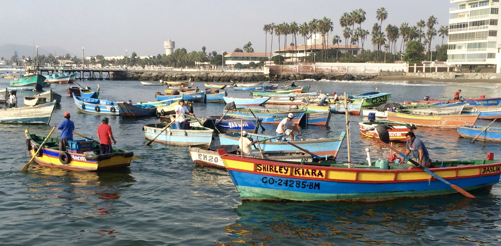
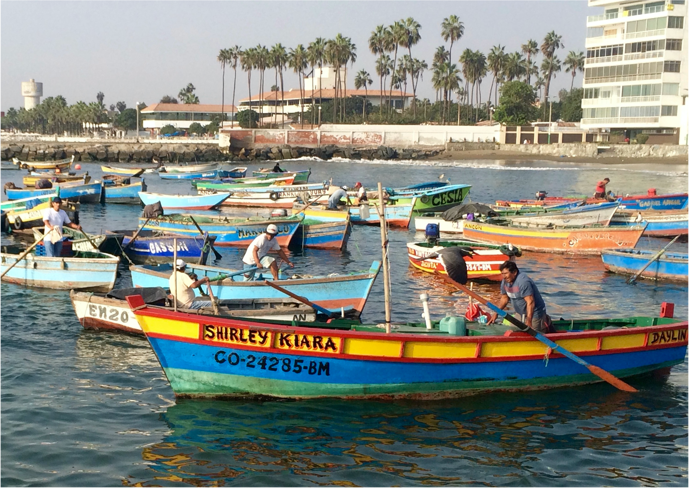
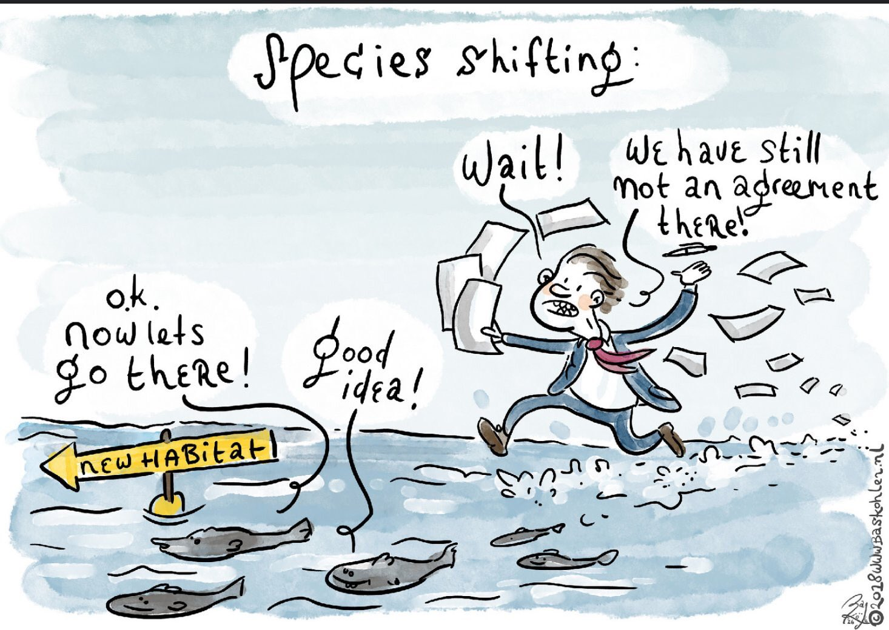
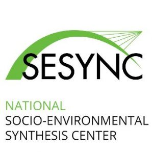

<!-- Global site tag (gtag.js) - Google Analytics -->

 

## Quick Intro

I graduated with a Bachelor of Science in Biology in 2012 from the *Universidad Autónoma Metropolitana* in Mexico City. During my time as an undergrad I did research aiming to improve food security in coastal communities in Mexico. After my undergrad, I worked at the Global Institute for Sustainability and managed my own diving center in Mexico City. In 2014 I was honored with a [Latin American Fisheries Fellowship](http://www.laff.bren.ucsb.edu/){target="_blank"} by the Walton Foundation to study a Masters in Environmental Science & Management from the Bren School of Environmental Science and Management at the University of California, Santa Barbara. My [group dissertation](http://www.esm.ucsb.edu/research/2016Group_Projects/documents/CopyofFinal_INTERTIDALFINALREPORT_Bren2016.pdf){target="_blank"} worked along with the Bureau of Energy and Management of the United States and focused on the development of a citizen science monitoring protocol for the rocky intertidal of the West Coast of the US. Recently, I earned a Ph.D. from the University of British Columbia in Vancouver, Canada. My [dissertation](https://open.library.ubc.ca/cIRcle/collections/ubctheses/24/items/1.0396646) looked at the socio-ecological implications of climate change on fish that move freely between the national waters (transboundary).

If you are interested, you can download my CV at the bottom of this page. Feel free to contact me to discuss any of my past or current projects and please keep in mind that the most recent ones might not be there. Feel free to email me for access to paywall papers. On my [GitHub](https://github.com/jepa?utf8=%E2%9C%93&tab=repositories&q=&type=source&language=){target="_blank"} profile you will find some of my scripts revealing my computer programming skills.

<a button type="button" class="btn btn-primary" href= "Data/CV.PalaciosAbrantes.pdf" >Download Full CV</a></button>

----

## Main Research Projects 

<!-- PescadoLatino  -->
<a href="Projects/PescadoLatino.html">

 Ocean management in Latin America

</a>

<!-- Transboundary  -->
<a href="Projects/Transboundary.html">

 Management of Shifting Stocks 

</a>

<!-- MPA's  SESYNC s -->
<a href="Projects/SESYNC.html">

 MPA's under Climate Change 

</a>

----
      

## Scientific Publications

<!-- NOTE: Use Harvard Bou. style -->

<a button type="button" class="btn btn-primary" href= "https://scholar.google.ca/citations?user=EZpBcjcAAAAJ&hl=en" >Google Schoolar Profile</a></button>

### 2021

- Outeiro, L., Otero, J., Alonso-Fernández, A., Bañón, R., and **Palacios-Abrantes, J.**, 2021. Quantifying abundance trends and environmental effects on a population of queen scallop Aequipecten opercularis targeted by artisanal fishers in a coastal upwelling area (Ría de Arousa, NW Spain) using a Bayesian spatial model. *Fisheries Research*, 240, 105963.

<!-- Original article -->
<a span class="label label-primary" title ="Oppen access until 6/5" href= "https://authors.elsevier.com/c/1cw3jbiU1rjxK" target="_blank">Full Paper</a>

- Sala, E., Mayorga, J., Bradley, D., Cabral, R. B., Atwood, T. B., Auber, A., Cheung, W. W. L., Costello, C., Ferretti, F., Friedlander, A. M., Gaines, S. D., Garilao, C., Goodell, W., Halpern, B. S., Hinson, A., Kaschner, K., Kesner-Reyes, K., Leprieur, F., McGowan, J., Morgan, L. E., Mouillot, D., **Palacios-Abrantes, J.**, Possingham, H. P., Rechberger, K. D., Worm, B., and Lubchenco, J., 2021. Protecting the global ocean for biodiversity, food and climate. *Nature*, 1–6.

<!-- Original article -->
<a span class="label label-primary" title ="Email me for PDF" href= "https://www.nature.com/articles/s41586-021-03371-z" target="_blank">Full Paper</a>
<!-- Press -->
<a span class="label label-info" href= "https://blog.nationalgeographic.org/2021/03/17/study-in-nature-protecting-the-ocean-delivers-a-comprehensive-solution-for-climate-fishing-and-biodiversity/" target="_blank">National Geographic</a>
<!-- Github -->
<a span class="label label-warning" href= " https://github.com/emlab-ucsb/ocean-conservation-priorities" target="_blank"> Code </a>

### 2020

- **Palacios-Abrantes, J.**, Reygondeau, G., Wabnitz, C. C. C., and Cheung, W. W. L., 2020. The transboundary nature of the world’s exploited marine species. *Scientific Reports*, 10 (1), 415–12. DOI: 10.1038/s41598-020-74644-2

<!-- Original article -->
<a span class="label label-primary" href= "https://www.nature.com/articles/s41598-020-74644-2" target="_blank">Full Paper</a>
<!-- Press -->
<a span class="label label-info" href= "https://oceans.ubc.ca/2020/10/21/transboundary/" target="_blank">UBC Stories</a>
<!-- Español -->
<a span class="label label-success" href= "https://www.julianopalacios.com/Translations/Fish_for_visa/Fish_for_visa_Esp.html" target="_blank">Artículo en Español</a>
<!-- Github -->
<a span class="label label-warning" href= "https://github.com/jepa/FishForVisa" target="_blank"> Code </a>

- **Palacios-Abrantes, J.**, Sumaila, U. R., and Cheung, W. W. L., 2020. Challenges to transboundary fisheries management in North America under climate change. *Ecology and Society*, 25 (4), art41–17. DOI: 10.5751/ES-11743-250441

<!-- Original article -->
<a span class="label label-primary" href= "https://www.ecologyandsociety.org/vol25/iss4/art41/" target="_blank">Full Paper</a>
<!-- Press -->
<!-- <a span class="label label-info" href= "" target="_blank">OceanCanada Stories</a> -->
<!-- Github -->
<a span class="label label-warning" href= "https://github.com/jepa/OC_Transboundary" target="_blank"> Code </a>

- **Palacios-Abrantes, J.** and Cisneros-Montemayor, A. M., 2020. Tendencias de la investigación pesquera en México: necesidades y oportunidades para la adaptación al cambio climático. In: Mariño, U. U. and Alcalá, G., eds. Pescadores en México y Cuba Retos y oportunidades ante el cambio climático. Ciudad de México, México, 225.

<!-- Original article -->
<a span class="label label-primary" href= "https://drive.google.com/file/d/1-dJytrPLkqamDn51bZuZUs2d53zVt8gQ/view" target="_blank">Capítulo de Libro</a>

- Sumaila, U. R., **Palacios-Abrantes, J.**, and Cheung, W. W. L., 2020. Climate change, shifting threat points, and the management of transboundary fish stocks. *Ecology and Society*, 25 (4), art40–9.

<!-- Original article -->
<a span class="label label-primary" href= "https://www.ecologyandsociety.org/vol25/iss4/art40/" target="_blank">Full Paper</a>
<!-- Press -->
<!-- <a span class="label label-info" href= "" target="_blank">OceanCanada Stories</a> -->
<!-- Github -->
<a span class="label label-warning" href= "https://github.com/jepa/OC_Transboundary" target="_blank"> Code </a>

- Cashion, T., Nguyen, T., Brink, ten, T., Mook, A., **Palacios-Abrantes, J.**, and Roberts, S. M., 2020. Shifting seas, shifting boundaries: Dynamic marine protected area designs for a changing climate. *PLoS ONE*, 15 (11), e0241771.

<!-- Original article -->
<a span class="label label-primary" href= "" target="_blank">Full Paper</a>
<!-- Github -->
<a span class="label label-warning" href= "https://github.com/timcashion/shifting_mpas" target="_blank"> Code </a>

<!-- - Cisneros-Montemayor, A., **Palacios-Abrantes, J.**, Abas, M., Gonzalez, P. 2020. Análisis espacial de efectos anticipados del cambio climático sobre la pesca en México: Un panorama para la adaptación *Ciencia Pesquera*, 28 (1) -->

<!-- 
 -->
<!-- Spanish version -->
<!-- <a span class="label label-success" href= "www.link" target="_blank">Artículo en Español</a> -->

<!-- 
 -->

- Andrews, E. J., Harper, S., Cashion, T., **Palacios-Abrantes, J.**, Blythe, J., Daly, J., Eger, S., Hoover, C., Talloni-Álvarez, N., Teh, L., Bennett, N., Epstein, G., Knott, C., Newell, S. L., and Whitney, C. K., 2020. Supporting early career researchers: insights from interdisciplinary marine scientists. *ICES Journal of Marine Science*, 77 (2), 476–485. DOI: 10.1093/icesjms/fsz247

<!-- Paper Links -->

<!-- Original article -->
<a span class="label label-primary" href= "https://academic.oup.com/icesjms/advance-article/doi/10.1093/icesjms/fsz247/5704875" target="_blank">Full Paper</a>

### 2019

- **Palacios-Abrantes, J.**, Cisneros-Montemayor, A. M., Cisneros-Mata, M. A., Rodriguez, L., Arreguín-Sánchez, F., Aguilar, V., Domínguez-Sánchez, S., Fulton, S., López-Sagástegui, R., Reyes-Bonilla, H., Rivera-Campos, R., Salas, S., Simoes, N., and Cheung, W. W. L., 2019. A metadata approach to evaluate the state of ocean knowledge: Strengths, limitations, and application to Mexico. *PLoS ONE*, 14 (6), DOI 10.1371/journal.pone.0216723.

<!-- Paper Links -->

<!-- Original article -->
<a span class="label label-primary" href= "https://journals.plos.org/plosone/article?id=10.1371/journal.pone.0216723" target="_blank">Full Paper</a>
<!-- Press -->
<a span class="label label-info" href= "http://oceans.ubc.ca/2019/06/12/understanding-the-data-about-data-how-metadatabases-could-improve-mexicos-ocean-management/" target="_blank">UBC Stories</a>
<!-- Spanish version -->
<a span class="label label-success" href= "Translations/Metadata/Metadata_Esp.html" target="_blank">Artículo en Español</a>
<!-- Github -->
<a span class="label label-warning" href= "https://github.com/jepa/metadatamexico" target="_blank"> Code </a>

### 2018

- **Palacios-Abrantes J.**, Herrera-Correal J., Rodríguez S., Brunkow J. and Molina R. 2018. Evaluating the bio-economic performance of a Callo de hacha (*Atrina maura, Atrina tuberculosa & Pinna rugosa*) fishery restoration plan in La Paz, Mexico. *PLoS ONE* 13(12): e0209431. DOI: 10.1371/journal.pone.0209431

<!-- Paper Links -->

<!-- Original article -->
<a span class="label label-primary" href= "https://journals.plos.org/plosone/article?id=10.1371/journal.pone.0209431" target="_blank">Full Paper</a>
<!-- Press -->
<!-- <a span class="label label-info" href= "https://academystories.org/nos/" >Academy of Systems Change</a> -->
<!-- Spanish version -->
<a span class="label label-success" href= "Translations/Callo_hacha/Callo_de_Hacha_Esp.html" target="_blank">Artículo en Español</a>

- Pinsky M.L., Reygondeau G., Caddell R., **Palacios-Abrantes J.**, Spijkers J. and Cheung W.L. 2018. Preparing ocean governance for species on the move. *Science*, Vol. 360, Issue 6394, pp. 1189-1191, DOI: 10.1126/science.aat2360

<!-- Paper Links -->

<!-- Original article -->
<a span class="label label-primary" href= "Original_Articles/Pinsky_etal_2018.pdf" target="_blank">Full Paper</a>
<!-- Press -->
<a span class="label label-info" href= "https://news.nationalgeographic.com/2018/06/climate-change-drives-fish-wars-science-environment" target="_blank">National Geographic</a>
<!-- Spanish version -->
<a span class="label label-success" href= "Translations/Border_Crossing/Border_Crossing_Esp.html" target="_blank">Artículo en Español</a>

### 2017

- **Palacios-Abrantes J.**, Melo-Ruiz V., Urbano B., Falcón-Gerónimo J. and Gazga-Urioste C. 2017. Nutritional Analysis of Octopus hubbsorum B (Cephalopoda: Octopodidae) from the Pacific Ocean, Acapulco, Guerrero, México. Journal of Applied Life Sciences International, 10(3), 1–6. 

<!-- Paper Links -->

<!-- Original article -->
<a span class="label label-primary" href= "http://doi.org/10.9734/JALSI/2017/31031" target="_blank">Full Paper</a>
<!-- Spanish version FALTA TERMINAR -->
<!-- <a span class="label label-success disabled" href= "Translations/Nutritional_Hub_Esp.pdf" >Artículo en Español</a> -->

### 2016

- **Palacios-Abrantes J.,** Melo-Ruiz V., Diaz-Garcia R., Gazga-Urioste C. and Urbano B. 2016. Iron Profile of Octopus hubbsorum (Cephalopoda: Octopodidae) for Enrichment of the Mexican Diet, 10, 1–4. doi.org/10.17265/1934-7375/2016.05.008 

<!-- Paper Links -->

<!-- Original article -->
<a span class="label label-primary" href= "http://www.davidpublisher.org/index.php/Home/Article/index?id=28446.html" target="_blank">Full Paper</a>
<!-- Spanish version -->
<a span class="label label-success" href= "Translations/UAM_Pulpos/Iron_Profile_Esp.pdf" target="_blank">Artículo en Español</a>

### 2013

- Ruiz V. M., Aguirre H. D., Martínez B., **Palacios-Abrantes J.** and Vargas, N. 2013. Plaga de ortópteros, recurso de nuetrientes para la población. Entomologia Mexicana (2) 1077–1079. 

- Melo V., Jiménez H., **Palacios-Abrantes J.** and Barreda T. Q. 2013. Fruto de Capulín Prunus Serotina y larvas de Synopsia Mexicanaria W, representan una buena fuente de nutrientes en la dieta cotidiana. Entomologia Mexicana, 12 (2), 1084–1086.

---- 

## Affiliations

 

 

 

**Contact**

Juliano Palacios Abrantes | j.palacios@oceans.ubc.ca • [Google Scholar](https://scholar.google.ca/citations?user=EZpBcjcAAAAJ&hl=en){target="_blank"}

