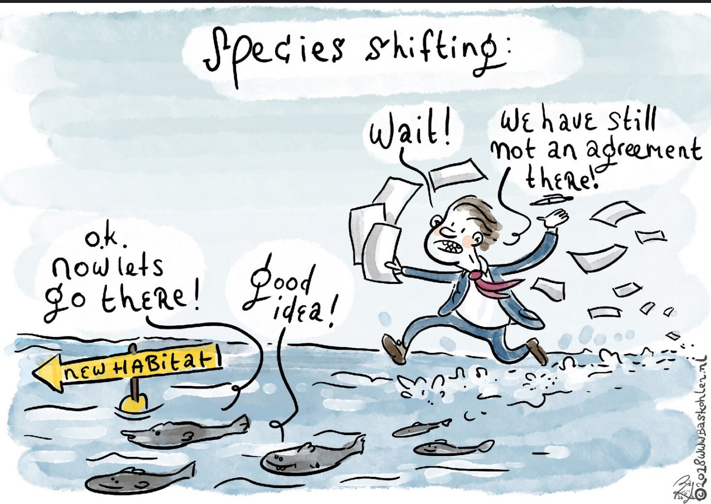
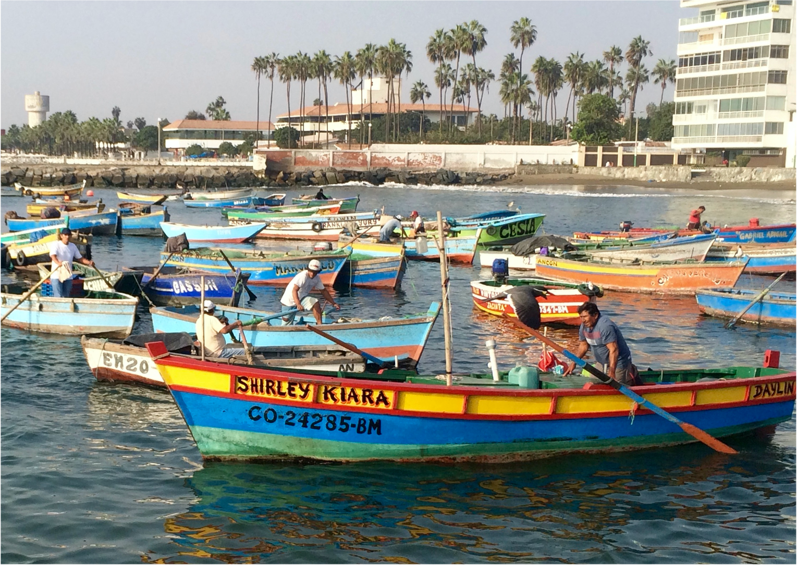

----

## Credentials

- Postdoctoral fellow (2022-current) - *The Institute for the Oceans and Fisheries, University of British Columbia (UBC), Canada*
- Postdoctoral researcher (2021 - 2022) - *Center for Limnology, University of Wisconsin-Madison, USA*
- PhD. Zoology (2021) - *The Institute for the Oceans and Fisheries, University of British Columbia (UBC), Canada*
- MESM (2016) - *Bren School of Environmental Science and Management, University of California at Santa Barbara (UCSB), USA*
- B.S. Biology (2012) - *Universidad Autónoma Metropolitana unidad Xochimilco (UAM-X), México*

----

## Main Research Lines 

### [Management of shifting shared stocks](projects/transboundary.html)

<!-- **[Management of shifting shared stocks.](Projects/Transboundary.html)**  -->
Regulatory boundaries and species distributions often do not align. This misalignment represents a challenge for fisheries management, as policies tend to focus at the national level, yet international collaborations are needed to maximize long-term ecological, social and economic benefits of shared marine species. My research aims to better understand (and inform) how fisheries management can prepare to shifts in the distribution of shared stocks.

 

### [Conservation under climate change](projects/conservation_cc.html)

<!-- **[Conservation under climate change.](Projects/SESYNC.html)**  -->
Marine protected areas (MPAs) are an important tool in the context of marine spatial planning to support both conservation and sustainable harvesting. Marine species are shifting their distribution because of climate change, potentially compromising the benefits and management objectives of currently established MPAs. My research focuses on better understanding the consequences of climate change to marine conservation.

 

### [Ocean management in Latin America](projects/pescado_latino.html)

<!-- **[Ocean management in Latin America.](Projects/PescadoLatino.html)** -->
Latin America is a highly diverse and dynamic region and there are many contexts to fisheries management and conservation. Nevertheless, there are several cross-cutting themes in Latin American countries, and very likely throughout the region. As a Brazilian-Mexican citizen, I am committed to support policy-making and resource management decisions in Latin American countries with a strong interdisciplinary science.

 

----
      

## Scientific Publications

<!-- NOTE: Use Harvard Bou. style -->

<a button type="button" class="btn btn-primary" href= "https://scholar.google.ca/citations?user=EZpBcjcAAAAJ&hl=en" >Google Scholar Profile</a></button>

### 2025

52. **Palacios-Abrantes, J.**, Llompart, F., Cardoso, L. G., Defeo, O., Gianelli, I., Jaureguizar, A. J., Lopes, P. F. M., Perez, J. A. A., Piccolo, N. I. P., Piola, A. R., Polejack, A., Prado, L. F. and Saraceno, M., 2026. Integrated ocean governance is needed in the Southwest Atlantic Ocean to foster fisheries, conservation and resilience to climate change. Discover Oceans, 3 (1), 19.
  

<!-- Original article -->
<a span class="label label-primary" title ="" href= "https://link.springer.com/article/10.1007/s44289-026-00134-4" target="_blank">Full Paper</a>
<a span class="label label-primary" title ="" href= "https://link.springer.com/article/10.1007/s44289-026-00134-4" target="_blank">Policy Brief</a>
<!-- <!-- Spanish version --> 
<a span class="label label-success" href= "./Translations/swao_esp.html" target="_blank">Artículo en Español</a>
<a span class="label label-success" href= "./Translations/swao_esp.html" target="_blank">Policy Brief (Es)</a>
<!-- <!-- Portuguese version --> 
<a span class="label label-success" href= "./Translations/swao_pt.html" target="_blank">Artigo em Português</a>
<a span class="label label-success" href= "./Translations/swao_esp.html" target="_blank">Policy Brief (Pt)</a>
<!-- Press -->
<a span class="label label-info" href= "https://abori.com.br/oceanografia/coordenacao-regional-biodiversidade-marinha/" target="_blank">Agência Bori</a>

51. Chin, J.-L. L., Rabone, M., **Palacios-Abrantes, J.**, Gobin, J., Jute, A., Kanhai, L. D. K. and Amon, D. J., 2026. A baseline assessment of deep-sea biodiversity, and guide for future actions to inform stewardship, in Trinidad and Tobago. Discover Oceans, 3 (1), 18.
  

<!-- Original article -->
<a span class="label label-primary" title ="" href= "https://link.springer.com/article/10.1007/s44289-026-00119-3" target="_blank">Full Paper</a>
<!-- Data -->
<a span class="label label-warning" href= "https://obis.org/dataset/7eca348a-9a68-4440-9333-c9b685527f96." target="_blank">Data & Code</a>
<!-- Github -->
<a span class="label label-warning" href= "https://github.com/jepa/tt_deepsea_biodiv" target="_blank"> Code </a> 

50. Selig, E. R., Achi, N. G., Sundnes, F., Wabnitz, C. C. C., Nakayama, S., Hjermann, D. ø., **Palacios-Abrantes, J.**, Spijkers, J., Hara, M., Isaacs, M., McClanahan, T. R., McKown, E., Mensah, A., Overå, R., Rustad, S. A., Thorarinsdottir, T. L. and Tollefsen, A. F., 2026. Patterns of marine resource conflicts across Africa highlight need for fair access and benefit sharing for a blue economy. One Earth, 101644.

<!-- Original article -->
<a span class="label label-primary" title ="" href= "https://www.cell.com/one-earth/fulltext/S2590-3322(26)00045-X" target="_blank">Full Paper</a>

49. Koerner, L. M., **Palacios-Abrantes, J.**, Novaglio, C., Blanchard, J., Melnychuk, M. C., Essington, T. E., Everett, J. D., Guiet, J., Harrison, C. S., Heneghan, R. F., Currey, R. J. C., Jardim, E., Polidoro, B. and Longo, C., 2025. Climate change risks to future sustainable fishing using global seafood ecolabel data. C*ell Reports Sustainability*, 100555.

<!-- Original article -->
<a span class="label label-primary" title ="" href= "https://www.cell.com/cell-reports-sustainability/fulltext/S2949-7906(25)00251-4" target="_blank">Full Paper</a>
<!-- Data -->
<a span class="label label-warning" href= "https://zenodo.org/records/17141646" target="_blank">Data & Code</a>

48. **Palacios-Abrantes, J.**, Santos B.S., Frölicher, T.L., Reygondeau, G., Sumaila, U.R., Wabnitz, C.C.C., and Cheung, W.W.L. 2025. Climate change drives shifts in straddling fish stocks in the world’s ocean. *Sci. Adv*.11,eadq5976

<!-- Original article -->
<a span class="label label-primary" title ="" href= "https://www.science.org/doi/10.1126/sciadv.adq5976" target="_blank">Full Paper</a>
<!-- <!-- Spanish version --> 
<a span class="label label-success" href= "./Translations/straddling_cc/straddling_ccb.html" target="_blank">Artículo en Español</a>
<!-- Press -->
<a span class="label label-info" href= "https://oceans.ubc.ca/2025/07/30/straddlingfishstocks/" target="_blank">UBC story</a>
<!-- Github -->
<a span class="label label-warning" href= "https://github.com/jepa/straddling_cc" target="_blank"> Code </a> 
<!-- Data -->
<a span class="label label-warning" href= "https://borealisdata.ca/dataset.xhtml?persistentId=doi:10.5683/SP3/JMBHER" target="_blank">Data</a>

47. Sora, K. J., Wabnitz, C. C. C., Steiner, N. S., Sumaila, U. R., Hoover, C., Niemi, A., Loseto, L., Lea, E. V., Breiter, C. C., **Palacios-Abrantes, J.**, Reygondeau, G., Farnole, P., Sou, T. and Cheung, W. W. L., 2025. Assessing vulnerability of Arctic fish species to climate change. *Discover Oceans*, 2 (1), 32.

<!-- Original article -->
<a span class="label label-primary" title ="" href= "https://link.springer.com/article/10.1007/s44289-025-00056-7" target="_blank">Full Paper</a>

46. Soifer, L. G., Lockwood, J. L., Lembrechts, J. J., Antão, L. H., Klinges, D. H., Senior, R. A., Ban, N. C., Evengard, B., Fadrique, B., Falkeis, S., Fredston, A. L., Guralnick, R., Lenoir, J., Neate-Clegg, M. H. C., **Palacios-Abrantes, J.**, Pecl, G., Pinsky, M. L., Smith, J. E., Stys, B., Tingley, M. W. and Scheffers, B. R., 2025. Extreme events drive rapid and dynamic range fluctuations. *Trends in Ecology & Evolution*.

<!-- Original article -->
<a span class="label label-primary" title ="" href= "https://kwnsfk27.r.eu-west-1.awstrack.me/L0/https:%2F%2Fauthors.elsevier.com%2Fc%2F1lRsrcZ3X3v8m/1/0102019816a62661-c8f8ae46-2597-412c-b23f-d80cf6fbffe6-000000/uRmU_2Lc9irYuaC9V2hahKFFU-4=435" target="_blank">Full Paper</a>

45. Kitchel, Z. J., Maureaud, A. A., Fredston, A., Shackell, N., Mérigot, B., Thorson, J. T., Pécuchet, L., **Palacios-Abrantes, J.**, Palomares, M. L. D., Acón, A. E., Belchier, M., Bono, G., Carbonara, P., Collins, M. A., Cubillos, L. A., Fairweather, T. P., Follesa, M. C., Ruiz, C. G., Garau, M. T. F., Garofalo, G., Isajlović, I., Kathena, J. N., Koen-Alonso, M., Maiorano, P., Manfredi, C., Mifsud, J., O’Driscoll, R. L., Sbrana, M., Sólmundsson, J., Spedicato, M. T., Stephenson, F., Werner, K.-M., Yepsen, D. V., Zupa, W. and Pinsky, M. L., 2025. Marine communities do not follow the paradigm of increasing similarity through time. *PLOS Climate*, 4 (7), e0000659.

<!-- Original article -->
<a span class="label label-primary" title ="" href= "https://journals.plos.org/climate/article?id=10.1371/journal.pclm.0000659" target="_blank">Full Paper</a>
<!-- Code -->
<a span class="label label-warning" href= "https://github.com/AquaAuma/FishGlob_data" target="_blank">Code</a>
<!-- Code -->
<a span class="label label-warning" href= "https://zenodo.org/records/10218308" target="_blank">Data</a>

44. **Palacios-Abrantes, J.**, B. S. Dias, I. Gianelli, M. Strand, S. Li, and G. A. Yeboah. 2025. The Role of the Interdisciplinary Marine Early Career Network (IMECaN) in Supporting Capacity Building, Ocean Literacy, and Collaborative Leadership of Early Career Researchers. *Limnol. Oceanogr. Bull.* 

<!-- Original article -->
<a span class="label label-primary" title ="" href= "https://drive.google.com/file/d/1cTpYlKZ5o69wHBvd4OYbtGaJPhBV1EQd/view?usp=sharing" target="_blank">Full Paper</a>

43. Fredston, A., Tingley, M., Neate-Clegg, M., Evans, L., Antão, L., Ban, N., Chen, I.-C., Chen, Y.-W., Comte, L., Edwards, D., Evengard, B., Fadrique, B., Falkeis, S., Guralnick, R., Klinges, D., Lembrechts, J., Lenoir, J., **Palacios-Abrantes, J.**, Pauchard, A., Pecl, G., Pinsky, M., Senior, R., Smith, J., Soifer, L., Sunday, J., Tape, K., Washam, P. and Scheffers, B., 2025. Reimagining species on the move across space and time. *Trends in Ecology & Evolution.* [*in press*]

<!-- Original article -->
<a span class="label label-primary" title ="" href= "https://www.sciencedirect.com/science/article/pii/S0169534725000874" target="_blank">Full Paper</a>

42. Gallo, N. D., Metaxas, A., Lidström, S., Hetherington, E., Alfaro-Lucas, J. M., Amon, D., Barry, J., Bax, N., Boyd, P. W., Colaço, A., Elegbede, I., Escobar-Briones, E., Halfter, S., Hilario, A., Hilmi, N., Huffard, C. L., Iglesias-Rodriguez, M. D., Levin, L. A., McCauley, D. J., Mestre, N. C., Mwangi, P. N., **Palacios-Abrantes, J.**, Rangani, E., Thurber, A. R. and Yasuhara, M., 2025. Illuminating deep-sea considerations and experimental approaches for mCDR proposals. *Environmental Research Letters*, 20 (6), 061003.

<!-- Original article -->
<a span class="label label-primary" title ="" href= "https://iopscience.iop.org/article/10.1088/1748-9326/add8a6" target="_blank">Full Paper</a>

41. Maureaud, A. A., Kitchel, Z., Fredston, A., Guralnick, R., **Palacios-Abrantes, J.**, Palomares, M. L. D., Pinsky, M. L., Shackell, N. L., Thorson, J. T., Alemany, D., Amador, K., Bandara, R. M. W. J., Belmaker, J., Beukhof, E. D., Bograd, S. J., Camara, M. L., Carbonara, P., Chaikin, S., Collins, M. A., Eddy, T. D., Edelist, D., Fock, H. O., Frelat, R., Friedland, K., Grüss, A., Hidalgo, M., Jouffre, D., Kidé, S. O., Koen-Alonso, M., Knuckey, I., Kotwicki, S., Lavender, E., Lindegren, M., Llope, M., Mannocci, L., Mason, J. G., Masski, H., McLean, M., Merillet, L., Mihneva, V., Nunoo, F. K. E., O’Driscoll, R. L., O’Leary, C., Pecuchet, L., Petrova, E., Ramos, J. E., Sobrino, I., Sólmundsson, J., Soni, V., Spies, I., Spedicato, M. T., Stephenson, F., Thiam, N., Tserkova, F., Tserpes, G., Tzanatos, E., Denderen, D. van, Vasilakopoulos, P., Webb, T., Yepsen, D. V., Ziegler, P., Zupa, W. and Mérigot, B., 2025. FISHGLOB: A collaborative infrastructure to bridge the gap between scientific monitoring and marine biodiversity conservation. *Conservation Science and Practice.*

<!-- Original article -->
<a span class="label label-primary" title ="" href= "https://conbio.onlinelibrary.wiley.com/doi/10.1111/csp2.70035" target="_blank">Full Paper</a>

40. Murphy, K., Fierro-Arcos, D., Rohr, T., Green, D., Novaglio, C., Baker, K., Ortega-Cisneros, K., Eddy, T. D., Harrison, C. S., Hill, S. L., Eskuche-Keith, P., Cataldo-Mendez, C., Petrik, C. M., Pinkerton, M., Spence, P., Stollberg, I., Subramaniam, R. C., Trebilco, R., Tulloch, V., **Palacios-Abrantes, J.**, Bestley, S., Bianchi, D., Boyd, P., Buchanan, P. J., Bryndum-Buchholz, A., Coll, M., Corney, S., Datta, S., Everett, J. D., Forestier, R., Fulton, E. A., Luzinais, V. G. de, Heneghan, R., Mason, J. G., Maury, O., McMahon, C. R., Murphy, E., Richardson, A. J., Tittensor, D. P., Spillias, S., Steenbeek, J., Veytia, D. and Blanchard, J., 2025. Developing a Southern Ocean Marine Ecosystem Model Ensemble to Assess Climate Risks and Uncertainties. *Earth’s Future*, 13 (3).

<!-- Original article -->
<a span class="label label-primary" title ="" href= "https://agupubs.onlinelibrary.wiley.com/doi/10.1029/2024EF004849" target="_blank">Full Paper</a>
<!-- Github -->
<a span class="label label-warning" href= "https://doi.org/10.5281/zenodo.11089934" target="_blank"> Code</a>
<!-- Data -->
<a span class="label label-warning" href= "https://agupubs.onlinelibrary.wiley.com/doi/10.1029/2024EF004849" target="_blank">Data</a>

39. Eddy, T., Heneghan, R., Bryndum-Buchholz, A., Fulton, B., Harrison, C. S., Tittensor, D., Lotze, H. K., Ortega-Cisneros, K., Novaglio, C., Bianchi, D., Büchner, M., Bulman, C. M., Cheung, W., Christensen, V., Coll, M., Everett, J. D., Arcos, L. D. F., Galbraith, E. D., Gascuel, D., Guiet, J., Mackinson, S., Maury, O., Niiranen, S., Oliveros-Ramos, R., **Palacios-Abrantes, J.**, Piroddi, C., Pontavice, H. du, Reum, J. C., Richardson, A., Schewe, J., Shannon, L., Shin, Y.-J., Steenbeek, J. G., Volkholz, J., Walker, N., Woodworth-Jefcoats, P. and Blanchard, J. L., 2025. Global and regional marine ecosystem model climate change projections reveal key uncertainties. *Earth’s Future*,

<!-- Original article -->
<a span class="label label-primary" title ="" href= "https://agupubs.onlinelibrary.wiley.com/doi/full/10.1029/2024EF005537" target="_blank">Full Paper</a>
<!-- Github -->
<a span class="label label-warning" href= "https://github.com/Fish-MIP/Regional_v_Global" target="_blank"> Code</a>
<!-- Data -->
<a span class="label label-warning" href= "https://www.isimip.org/gettingstarted/data-access/" target="_blank">Data</a>

### 2024

38. Blanchard, J. L., Novaglio, C., Maury, O., Harrison, C. S., Petrik, C. M., Fierro-Arcos, D., Ortega-Cisneros, K., Bryndum-Buchholz, A., Eddy, T. D., Heneghan, R., Roberts, K., Schewe, J., Bianchi, D., Guiet, J., Denderen, P. D. van, **Palacios-Abrantes, J.**, Liu, X., Stock, C. A., Rousseau, Y., Büchner, M., Adekoya, E. O., Bulman, C., Cheung, W., Christensen, V., Coll, M., Capitani, L., Datta, S., Fulton, E. A., Fuster, A., Garza, V., Lengaigne, M., Lindmark, M., Murphy, K., Ouled-Cheikh, J., Prasad, S. S., Oliveros-Ramos, R., Reum, J. C., Rynne, N., Scherrer, K. J. N., Shin, Y., Steenbeek, J., Woodworth-Jefcoats, P., Wu, Y. and Tittensor, D. P., 2024. Detecting, Attributing, and Projecting Global Marine Ecosystem and Fisheries Change: FishMIP 2.0. *Earth’s Future*, 12 (12).

<!-- Original article -->
<a span class="label label-primary" title ="" href= "https://agupubs.onlinelibrary.wiley.com/doi/full/10.1029/2023EF004402" target="_blank">Full Paper</a>
<!-- Github -->
<a span class="label label-warning" href= "https://fishmip.org/tools.html" target="_blank"> Tools</a>
<!-- Data -->
<a span class="label label-warning" href= "https://www.isimip.org/outputdata/isimip-repository/" target="_blank">Data</a>

37. Kaikkonen, L., Shellock, R. J., Selim, S. A., Ojwala, R. A., Dias, B. S., Li, S., Addey, C. I., Gianelli, I., Maltby, K. M., Garcia-Morales, S., **Palacios-Abrantes, J.**, Jiang, S., Albo-Puigserver, M., Alonso, V. A. G., Baker, C. A., Bove, C. B., Brodie, S., Dahlet, L. I., Das, J., Dunne, A., Ferse, S. C. A., Johannesen, E., Jung, J., Garcia, E. M., Karcher, D. B., Mahadeo, S., Millan, L., Lawal, K. O., Oloko, A., Ortega-Cisneros, K., Otoabasi-Akpan, S., Roy, D., Rouf, S. S., Smoliński, S., Vaidianu, N., Whidden, C. and Strand, M., 2024. Fostering diversity, equity, and inclusion in interdisciplinary marine science. *npj Ocean Sustainability*, 3 (1), 49.

<!-- Original article -->
<a span class="label label-primary" title ="" href= "https://www.nature.com/articles/s44183-024-00087-1" target="_blank">Full Paper</a>
<!-- <!-- Spanish version --> 
<a span class="label label-success" href= "./Translations/fostering_edi.html" target="_blank">Artículo en Español</a>

 

36. Cappa, P., Andreoli, V., La, C., **Palacios-Abrantes, J.**, Reygondeau, G., Cheung, W. W. L. and Zeller, D., 2024. Climate change undermines seafood micronutrient supply from wild-capture fisheries in Southeast Asia and Pacific Island countries. *Science of The Total Environment*, 177024.

<!-- Original article -->
<a span class="label label-primary" title ="" href= "https://kwnsfk27.r.eu-west-1.awstrack.me/L0/https:%2F%2Fdoi.org%2F10.1016%2Fj.scitotenv.2024.177024/1/01020192ad52d053-2523cd2b-6070-41f0-9b37-d180db481f77-000000/uOAcKiMq11xfQTi_YKUtxBb9tLo=396" target="_blank">Full Paper</a>
<!-- Press -->
<!-- <a span class="label label-info" href= "https://theconversation.com/accepting-uncertainty-in-sustainable-fisheries-is-essential-in-a-rapidly-changing-arctic-229559" target="_blank">The Conversation</a> -->
<!-- Data -->
<a span class="label label-warning" href= "https://ars.els-cdn.com/content/image/1-s2.0-S004896972407181X-mmc1.pdf" target="_blank">Data</a>
<!-- Github -->
<a span class="label label-warning" href= "https://github.com/jepa/ocea_nutri_cc" target="_blank"> Code </a>

35. Mason, J. G., Bryndum-Buchholz, A., **Palacios-Abrantes, J.**, Badhe, R., Morgante, I., Bianchi, D., Blanchard, J. L., Everett, J. D., Harrison, C. S., Heneghan, R. F., Novaglio, C. and Petrik, C. M., 2024. Key Uncertainties and Modeling Needs for Managing Living Marine Resources in the Future Arctic Ocean. *Earth’s Future*, 12 (8).

<!-- Original article -->
<a span class="label label-primary" title ="" href= "https://agupubs.onlinelibrary.wiley.com/doi/10.1029/2023EF004393?af=R" target="_blank">Full Paper</a>
<!-- Press -->
<a span class="label label-info" href= "https://theconversation.com/accepting-uncertainty-in-sustainable-fisheries-is-essential-in-a-rapidly-changing-arctic-229559" target="_blank">The Conversation</a>
<!-- Data -->
<a span class="label label-warning" href= "https://github.com/jepa/an_uncertain_arctic?tab=readme-ov-file" target="_blank">Code & Data</a>

34. Vogel, J. M., Levine, A., Longo, C., Fujita, R., Alves, C. L., Carroll, G., Craig, J. K., Dancy, K., Errend, M., Essington, T. E., Farchadi, N., Glaser, S., Golden, A. S., Jensen, O. P., LeFlore, M., Mason, J. G., Mills, K. E., **Palacios-Abrantes, J.**, Rogers, A., Samhouri, J. F., Seeley, M., Selig, E. R., Trudeau, A. and Wabnitz, C. C. C., 2024. Fisheries in flux: Bridging science and policy for climate-resilient management of US fisheries under distributional change. *Marine Policy*, 170, 106385.

<!-- Original article -->
<a span class="label label-primary" title ="" href= "https://kwnsfk27.r.eu-west-1.awstrack.me/L0/https:%2F%2Fauthors.elsevier.com%2Fsd%2Farticle%2FS0308-597X(24)00383-X/1/01020191ca1b355c-68792af3-c982-4a48-bd18-10c99e4745e9-000000/B3J8v2QaXQk3QmCF2uzvzyGRVac=390" target="_blank">Full Paper</a>

33. Tai, T. C., **Palacios-Abrantes, J.**, Saltos, J. J. A., Ban, N. C., Bryndum-Buchholz, A., Cheung, W. W. L., Courtenay, S., Harper, S., Hoover, C., Lotze, H. K., Steiner, N., Sumaila, U. R., Talloni-Álvarez, N., Whitney, C. K. and Wilson, K., 2024. Rapid Changes across Canada’s Oceans and Their Impact on Coastal Communities. In: Sumaila, U. R., Armitage, D., Bailey, M., and Cheung, W. W. L., eds. Sea Change: Charting a Sustainable Future for Oceans in Canada. *UBC Press*, 276.

<!-- Original article -->
<a span class="label label-primary" title ="Get chapter" href= "https://drive.google.com/open?id=1GJOpP1SERXe9x3ly6JZzNfcT1mIjAVjF&usp=drive_fs" target="_blank">Full Chapter</a>

32. Steiner, N. S., Bryndum-Buchholz, A., Cheung, W. W. L., Holdsworth, A. M., Lotze, H. K., Nagabhatla, N., Newell, S. L., Okey, T. A., **Palacios-Abrantes, J.**, Sumaila, U. R., Tai, T. C., Wilson, K. L. and Inlet, C. of C., 2024. Large Changes in Canada’s Oceans and Their Impacts on Ecosystems and Fisheries. In: Sumaila, U. R., Armitage, D., Bailey, M., and Cheung, W. W. L., eds. Sea Change: Charting a Sustainable Future for Oceans in Canada. *UBC Press*, 276.

<!-- Original article -->
<a span class="label label-primary" title ="Get chapter" href= "https://drive.google.com/open?id=1Fl4hUrF9scMzx69gTXIafW23SER41urf&usp=drive_fs" target="_blank">Full Chapter</a>

31. Beaty, F., Domínguez-Sánchez, P. S., Nalven, K. B., **Palacios-Abrantes, J.**, Oken, K. L., Ban, N. C., Nickols, K. J., Juanes, F., Okey, T. A., Spalding, A. K., Morzaria-Luna, H. N., Jenkins, L. D., Tulloch, V. and McKechnie, I., 2024. Centering relationships to place for more meaningful research and engagement. *Proceedings of the National Academy of Sciences*, 121 (25), e2306991121.

<!-- Original article -->
<a span class="label label-primary" title ="" href= "https://drive.google.com/open?id=1Zw916IRP0U7EuaB6z-cAyqOa9EUFuxt3&usp=drive_fs" target="_blank">Full Paper</a>
<!-- Press -->
<a span class="label label-info" href= "https://www.compassscicomm.org/leaders-for-sea-change-centering-relationships-to-place/" target="_blank">COMPASS</a>

30. Cheung, W. W. L., **Palacios-Abrantes, J.** and Roberts, S. M., 2024. Projecting contributions of marine protected areas to rebuild fish stocks under climate change. *npj Ocean Sustainability*, 3 (1), 11.

<!-- Original article -->
<a span class="label label-primary" title ="" href= "https://doi.org/10.1038/s44183-024-00046-w" target="_blank">Full Paper</a>
<!-- Press -->
<!-- <a span class="label label-info" href= "https://jepa.shinyapps.io/allocation_tool/" target="_blank">Dynamic tool</a> -->
<!-- Data -->
<a span class="label label-warning" href= "https://doi.org/10.5061/dryad.gf1vhhmtb" target="_blank">Data</a>
<!-- GitHub -->
<a span class="label label-warning" href= "https://github.com/coruubc/northsea_mpa_sust_fish" target="_blank">Code</a>

29. Maureaud, A. A., **Palacios-Abrantes, J.**, Kitchel, Z., Mannocci, L., Pinsky, M. L., Fredston, A., Beukhof, E., Forrest, D. L., Frelat, R., Palomares, M. L. D., Pecuchet, L., Thorson, J. T., Denderen, P. D. van and Mérigot, B., 2024. FISHGLOB_data: an integrated dataset of fish biodiversity sampled with scientific bottom-trawl surveys. *Scientific Data*, 11 (1), 24.

<!-- Original article -->
<a span class="label label-primary" title ="" href= "https://www.nature.com/articles/s41597-023-02866-w" target="_blank">Full Paper</a>
<!-- Spanish version -->
<a span class="label label-success" href= "./Translations/fishglob_data.html" target="_blank">Artículo en Español</a>
<!-- Data -->
<a span class="label label-warning" href= "https://github.com/AquaAuma/FishGlob_data" target="_blank">Code & Data</a>

### 2023

28. **Palacios-Abrantes, J.**, Crosson, S., Dumas, C., Fujita, R., Levine, A., Longo, C. and Jensen, O.P. 2023. Quantifying fish range shifts across poorly defined management boundaries. *PLOS ONE*, 18(1), p. e0279025.

<!-- Original article -->
<a span class="label label-primary" title ="" href= "https://doi.org/10.1371/journal.pone.0279025" target="_blank">Full Paper</a>
<!-- Press -->
<a span class="label label-info" href= "https://jepa.shinyapps.io/allocation_tool/" target="_blank">Dynamic tool</a>
<!-- Data -->
<a span class="label label-warning" href= "https://github.com/jepa/AcrossBoundaries" target="_blank">Code & Data</a>

27. Amon, D. J., **Palacios-Abrantes, J.**, Drazen, J. C., Lily, H., Nathan, N., Grient, J. M. A. van der and McCauley, D., 2023. Climate change to drive increasing overlap between Pacific tuna fisheries and emerging deep-sea mining industry. *npj Ocean Sustainability*, 2 (1), 9.

<!-- Original article -->
<a span class="label label-primary" title ="" href= "https://www.nature.com/articles/s44183-023-00016-8" target="_blank">Full Paper</a>
<!-- Press -->
<a span class="label label-info" href= "https://www.reuters.com/science/deep-sea-mining-could-impact-tuna-fisheries-study-2023-07-11/?taid=64ad1da18148c70001f241db&utm_campaign=trueanthem&utm_medium=trueanthem&utm_source=twitter" target="_blank">Reuters</a>
<!-- Github -->
<a span class="label label-warning" href= "https://github.com/jepa/ccz_tuna" target="_blank"> Code </a>
<!-- Data -->
<a span class="label label-warning" href= "https://osf.io/qa8w4/" target="_blank">Data</a>

26. Fredston, A. L., Cheung, W. W. L., Frölicher, T. L., Kitchel, Z. J., Maureaud, A. A., Thorson, J. T., Auber, A., Mérigot, B., **Palacios-Abrantes, J**., Palomares, M. L. D., Pecuchet, L., Shackell, N. L. and Pinsky, M. L., 2023. Marine heatwaves are not a dominant driver of change in demersal fishes. *Nature*, 1–6.

<!-- Original article -->
<a span class="label label-primary" title ="" href= "https://drive.google.com/open?id=1EqkNBrJJjqoBC6XKl6vnWFditBdHy8vk&usp=drive_fs" target="_blank">Full Paper</a>
<!-- Press -->
<a span class="label label-info" href= "https://www.timescolonist.com/local-news/light-of-hope-bc-researchers-say-some-fish-surviving-heat-waves-better-than-once-thought-7493628" target="_blank">Times Colonist</a>
<!-- Github -->
<a span class="label label-warning" href= "https://github.com/afredston/marine_heatwaves_trawl" target="_blank"> Code </a>
<!-- Data -->
<a span class="label label-warning" href= "https://doi.org/10.17605/OSF.IO/H6UKT" target="_blank">Data</a>

25. Bryndum-Buchholz, A., Blanchard, J. L., Coll, M., Pontavice, H. D., Everett, J. D., Guiet, J., Heneghan, R. F., Maury, O., Novaglio, C., **Palacios-Abrantes, J.**, Petrik, C. M., Tittensor, D. P. and Lotze, H. K., 2023. Applying ensemble ecosystem model projections to future-proof marine conservation planning in the Northwest Atlantic Ocean. *FACETS*, 8, 1–16.

<!-- Original article -->
<a span class="label label-primary" title ="" href= "https://www.facetsjournal.com/doi/10.1139/facets-2023-0024" target="_blank">Full Paper</a>
<!-- Press -->
<a span class="label label-info" href= "" target="_blank">Reuters</a>

24. Spalding, A. K., Grorud-Colvert, K., Allison, E. H., Amon, D. J., Collin, R., Vos, A. de, Friedlander, A. M., Johnson, S. M., Mayorga, J., Paris, C. B., Scott, C., Suman, D. O., Cisneros-Montemayor, A. M., Estradivari, Giron-Nava, A., Gurney, G. G., Harris, J. M., Hicks, C., Mangubhai, S., Micheli, F., Naggea, J., Obura, D., **Palacios-Abrantes, J.**, Pouponneau, A. and Thurber, R. V., 2023. Engaging the tropical majority to make ocean governance and science more equitable and effective. *npj Ocean Sustainability*, 2 (1), 8.

<!-- Original article -->
<a span class="label label-primary" title ="" href= "https://www.nature.com/articles/s44183-023-00015-9" target="_blank">Full Paper</a>
<!-- Spanish version -->
<a span class="label label-success" href= "./Translations/mayoria_tropical.html" target="_blank">Artículo en Español</a>
<!-- Press -->
<a span class="label label-info" href= "https://stri.si.edu/story/ocean-protectors" target="_blank">Smithsonian TRI</a>

23. Vogel, J. M., Longo, C., Spijkers, J., **Palacios-Abrantes, J.**, Mason, J., Wabnitz, C. C. C., Cheung, W., Sumaila, U. R., Munro, G., Glaser, S., Bell, J., Tian, Y., Shackell, N. L., Selig, E. R., Billon, P. L., Watson, J. R., Hendrix, C., Pinsky, M. L., Putten, I. van, Karr, K., Papaioannou, E. A. and Fujita, R., 2023. Drivers of conflict and resilience in shifting transboundary fisheries. *Marine Policy*, 155, 105740.

<!-- Original article -->
<a span class="label label-primary" title ="" href= "https://drive.google.com/open?id=1GN4DYD8pRXadp1RTaxReBSc1fkZZ4-YX&usp=drive_fs" target="_blank">Full Paper</a>
<!-- Press -->
<!-- <a span class="label label-info" href= "https://jepa.shinyapps.io/allocation_tool/" target="_blank">Dynamic tool</a> -->

22. **Palacios-Abrantes, J.**, Roberts, S. M., Cashion, T., ten Brink, T., Cheung, W.W.L, Mook A., and Nguyen, T. 2023. Incorporating protected areas into global fish biomass projections under climate change. *FACETS* 8: 1–16.

<!-- Original article -->
<a span class="label label-primary" title ="" href= "https://www.facetsjournal.com/doi/full/10.1139/facets-2022-0101" target="_blank">Full Paper</a>
<!-- Data -->
<a span class="label label-warning" href= "https://github.com/jepa/climatechangempa" target="_blank">Code & Data</a>

21. Pereira, L.M., Crespo, G.O., Amon, D.J., Badhe, R., Bandeira, S., Bengtsson, F., Boettcher, M., Carmine, G., Cheung, W.W.L., Chibwe, B., Dunn, D., Gasalla, M.A., Halouani, G., Johnson, D.E., Jouffray, J.-B., Juri, S., Keys, P.W., Lübker, H.M., Merrie, A.S., Obaidullah, F., **Palacios-Abrantes, J.**, Shannon, L.J., Sumaila, U.R., Superchi, E., Terry, N., Wabnitz, C.C.C., Yasuhara, M., Zhou, W., 2023. The living infinite: Envisioning futures for transformed human-nature relationships on the high seas. *Mar Policy* 153, 105644.

<!-- Original article -->
<a span class="label label-primary" title ="" href= "https://www.sciencedirect.com/science/article/pii/S0308597X23001719?via%3Dihub" target="_blank">Full Paper</a>
<!-- Press -->
<a span class="label label-info" href= "https://vector-bsfa.com/2022/09/30/the-living-infinite/" target="_blank">Vector Sci-Fi</a>

### 2022

20. **Palacios-Abrantes, J.**, Frölicher, T. L., Reygondeau, G., Sumaila, U. R., Tagliabue, A., Wabnitz, C. C. C., and Cheung, W. W. L., 2022. Timing and magnitude of climate-driven range shifts in transboundary fish stocks challenge their management. *Global Change Biology*, 00, 1–17.

<!-- Original article -->
<a span class="label label-primary" title ="" href= "https://onlinelibrary.wiley.com/doi/10.1111/gcb.16058" target="_blank">Full Paper</a>
<!-- Spanish version -->
<a span class="label label-success" href= "./Translations/emerging_fish.html" target="_blank">Artículo en Español</a>
<!-- Press -->
<a span class="label label-info" href= "https://theconversation.com/managing-fish-stocks-shared-by-nations-must-focus-on-the-impacts-of-climate-change-181828" target="_blank">The Consveration</a>
<!-- Github -->
<a span class="label label-warning" href= "https://github.com/jepa/EmergingFish" target="_blank"> Code </a>
<!-- Data -->
<a span class="label label-warning" href= "https://borealisdata.ca/dataset.xhtml?persistentId=doi:10.5683/SP3/TMPEHR" target="_blank">Data</a>

19. **Palacios-Abrantes, J.**, Badhe, R., Bamford, A., Cheung, W.W.L., Foden, W., Santos, C.F., Grey, K.-A., Kühn, N., Maciejewski, K., McGhie, H., Midgley, G.F., Smit, I.P.J. and Pereira, L.M. 2022. Managing biodiversity in the Anthropocene: discussing the Nature Futures Framework as a tool for adaptive decision-making for nature under climate change, *Sustainability Science*, pp. 1–17.

<!-- Original article -->
<a span class="label label-primary" title ="" href= "https://doi.org/10.1007/s11625-022-01200-4" target="_blank">Full Paper</a>
<!-- Press -->
<a span class="label label-info" href= "https://oceans.ubc.ca/2022/10/28/nature-society-and-culture-should-be-taken-into-consideration-when-dealing-with-climate-change/" target="_blank">UBC Stories</a>

18. Cheung, W.W.L., **Palacios‐Abrantes, J.**, Frölicher, T.L., Palomares, M.L., Clarke, T., Lam, V.W.Y., Oyinlola, M.A., Pauly, D., Reygondeau, G., Sumaila, U.R., Teh, L.C.L. and Wabnitz, C.C.C. 2022. Rebuilding fish biomass for the world’s marine ecoregions under climate change, *Global Change Biology*

<!-- Original article -->
<a span class="label label-primary" title ="Get paper" href= "https://onlinelibrary.wiley.com/share/author/KTTPKSFIWS2CBY3CPKDX?target=10.1111/gcb.16368" target="_blank">Full Paper</a>
<!-- Press -->
<a span class="label label-info" href= "https://news.ubc.ca/2022/09/01/global-fish-stocks-cant-rebuild-climate-change-overfishing/" target ="_blank">UBC Stories</a>
<!-- Data -->
<a span class="label label-warning" href= "10.5061/dryad.79cnp5hzf" target="_blank">Data</a>

17. Cinner, J. E., Caldwell, I. R., Thiault, L., Ben, J., Blanchard, J. L., Coll, M., Diedrich, A., Eddy, T. D., Everett, J. D., Folberth, C., Gascuel, D., Guiet, J., Gurney, G. G., Heneghan, R. F., Jägermeyr, J., Jiddawi, N., Lahari, R., Kuange, J., Liu, W., Maury, O., Müller, C., Novaglio, C., **Palacios-Abrantes, J.**, Petrik, C. M., Rabearisoa, A., Tittensor, D. P., Wamukota, A., and Pollnac, R., 2022. Potential impacts of climate change on agriculture and fisheries production in 72 tropical coastal communities. *Nature Communications*, 13 (1), 3530–11.

<!-- Original article -->
<a span class="label label-primary" title ="Get paper" href= "https://www.nature.com/articles/s41467-022-30991-4" target="_blank">Full Paper</a>
<!-- Github -->
<a span class="label label-warning" href= "https://zenodo.org/record/6496413#.YsX17uzMKw4" target="_blank"> Code </a>
<!-- Data -->
<a span class="label label-warning" href= "https://www.nature.com/articles/s41467-022-30991-4#data-availability" target="_blank">Data</a>

### &le;2021

16. Tittensor, D. P., Novaglio, C., Harrison, C. S., Heneghan, R. F., Barrier, N., Bianchi, D., Bopp, L., Bryndum-Buchholz, A., Britten, G. L., Büchner, M., Cheung, W. W. L., Christensen, V., Coll, M., Dunne, J. P., Eddy, T. D., Everett, J. D., Fernandes-Salvador, J. A., Fulton, E. A., Galbraith, E. D., Gascuel, D., Guiet, J., John, J. G., Link, J. S., Lotze, H. K., Maury, O., Ortega-Cisneros, K., **Palacios-Abrantes, J**., Petrik, C. M., du Pontavice, H., Rault, J., Richardson, A. J., Shannon, L., Shin, Y.-J., Steenbeek, J., Stock, C. A. and Blanchard, J. L., 2021. Next-generation ensemble projections reveal higher climate risks for marine ecosystems. *Nature Climate Change*

<!-- Original article -->
<a span class="label label-primary" title ="Email me for PDF" href= "https://www.nature.com/articles/s41558-021-01173-9" target="_blank">Full Paper</a>
<!-- Spanish version -->
<a span class="label label-success" href= "./Translations/FishMip/cmip5_vs_cmip6.html" target="_blank">Artículo en Español</a>
<!-- Press -->
<a span class="label label-info" href= "https://oceans.ubc.ca/2021/11/15/massive-ensemble-climate-modelling-study-includes-work-of-multiple-iof-researchers/" target="_blank">UBC Stories</a>
<!-- Github -->
<a span class="label label-warning" href= " https://github.com/Fish-MIP/CMIP5vsCMIP6" target="_blank"> Code </a>
<!-- Data -->
<a span class="label label-warning" href= "https://www.isimip.org/gettingstarted/data-access/" target="_blank">Data</a>

15. Heneghan, R.F., Galbraith, E., Blanchard, J.L., Harrison, C., Barrier, N., Bulman, C., Cheung, W., Coll, M., Eddy, T.D., Erauskin-Extramiana, M., Everett, J.D., Fernandes-Salvador, J.A., Gascuel, D., Guiet, J., Maury, O., **Palacios-Abrantes, J.**, Petrik, C.M., du Pontavice, H., Richardson, A.J., Steenbeek, J., Tai, T.C., Volkholz, J., Woodworth-Jefcoats, P.A., and Tittensor, D.P., 2021. Disentangling diverse responses to climate change among global marine ecosystem models, *Progress in Oceanography*

<!-- Original article -->
<a span class="label label-primary" title ="Email me for PDF" href= "https://doi.org/10.1016/j.pocean.2021.102659" target="_blank">Full Paper</a>
<!-- Data -->
<a span class="label label-warning" href= "https://www.isimip.org/" target="_blank"> Data </a>

14. Outeiro, L., Otero, J., Alonso-Fernández, A., Bañón, R., and **Palacios-Abrantes, J.**, 2021. Quantifying abundance trends and environmental effects on a population of queen scallop Aequipecten opercularis targeted by artisanal fishers in a coastal upwelling area (Ría de Arousa, NW Spain) using a Bayesian spatial model. *Fisheries Research*, 240, 105963

<!-- Original article -->
<a span class="label label-primary" title ="Get paper" href= "https://drive.google.com/open?id=1GGNd8kGCaPXtyBclTRES1UqZbPxgsEmq&usp=drive_fs" target="_blank">Full Paper</a>

13. Sala, E., Mayorga, J., Bradley, D., Cabral, R. B., Atwood, T. B., Auber, A., Cheung, W. W. L., Costello, C., Ferretti, F., Friedlander, A. M., Gaines, S. D., Garilao, C., Goodell, W., Halpern, B. S., Hinson, A., Kaschner, K., Kesner-Reyes, K., Leprieur, F., McGowan, J., Morgan, L. E., Mouillot, D., **Palacios-Abrantes, J.**, Possingham, H. P., Rechberger, K. D., Worm, B., and Lubchenco, J., 2021. Protecting the global ocean for biodiversity, food and climate. *Nature*, 1–6.

<!-- Original article -->
<a span class="label label-primary" title ="Get paper" href= "https://drive.google.com/open?id=1GBxxRf2SFoE0Xwi2KosAlGLJfK-VDeLj&usp=drive_fs" target="_blank">Full Paper</a>
<!-- Press -->
<a span class="label label-info" href= "https://blog.nationalgeographic.org/2021/03/17/study-in-nature-protecting-the-ocean-delivers-a-comprehensive-solution-for-climate-fishing-and-biodiversity/" target="_blank">National Geographic</a>
<!-- Github -->
<a span class="label label-warning" href= " https://github.com/emlab-ucsb/ocean-conservation-priorities" target="_blank"> Code </a>
<!-- Data -->
<a span class="label label-warning" href= "https://datadryad.org/stash/dataset/doi:10.25349/D9N89M" target="_blank">Data</a>

12. **Palacios-Abrantes, J.**, Reygondeau, G., Wabnitz, C. C. C., and Cheung, W. W. L., 2020. The transboundary nature of the world’s exploited marine species. *Scientific Reports*, 10 (1), 415–12. DOI: 10.1038/s41598-020-74644-2

<!-- Original article -->
<a span class="label label-primary" href= "https://www.nature.com/articles/s41598-020-74644-2" target="_blank">Full Paper</a>
<!-- Spanish version -->
<a span class="label label-success" href= "https://www.julianopalacios.com/Translations/Fish_for_visa/Fish_for_visa_Esp.html" target="_blank">Artículo en Español</a>

<!-- Press -->
<a span class="label label-info" href= "https://oceans.ubc.ca/2020/10/21/transboundary/" target="_blank">UBC Stories</a>
<!-- Github -->
<a span class="label label-warning" href= "https://github.com/jepa/FishForVisa" target="_blank"> Code & Data </a>

11. **Palacios-Abrantes, J.**, Sumaila, U. R., and Cheung, W. W. L., 2020. Challenges to transboundary fisheries management in North America under climate change. *Ecology and Society*, 25 (4), art41–17. DOI: 10.5751/ES-11743-250441

<!-- Original article -->
<a span class="label label-primary" href= "https://www.ecologyandsociety.org/vol25/iss4/art41/" target="_blank">Full Paper</a>
<!-- Press -->
<!-- <a span class="label label-info" href= "" target="_blank">OceanCanada Stories</a> -->
<!-- Github -->
<a span class="label label-warning" href= "https://github.com/jepa/OC_Transboundary" target="_blank"> Code </a>

10. **Palacios-Abrantes, J.** and Cisneros-Montemayor, A. M., 2020. Tendencias de la investigación pesquera en México: necesidades y oportunidades para la adaptación al cambio climático. In: Mariño, U. U. and Alcalá, G., eds. Pescadores en México y Cuba Retos y oportunidades ante el cambio climático. Ciudad de México, México, 225.

<!-- Original article -->
<a span class="label label-primary" href= "https://drive.google.com/file/d/1-dJytrPLkqamDn51bZuZUs2d53zVt8gQ/view" target="_blank">Capítulo de Libro</a>

9. Sumaila, U. R., **Palacios-Abrantes, J.**, and Cheung, W. W. L., 2020. Climate change, shifting threat points, and the management of transboundary fish stocks. *Ecology and Society*, 25 (4), art40–9.

<!-- Original article -->
<a span class="label label-primary" href= "https://www.ecologyandsociety.org/vol25/iss4/art40/" target="_blank">Full Paper</a>
<!-- Press -->
<!-- <a span class="label label-info" href= "" target="_blank">OceanCanada Stories</a> -->
<!-- Github -->
<a span class="label label-warning" href= "https://github.com/jepa/OC_Transboundary" target="_blank"> Code </a>

8. Cashion, T., Nguyen, T., Brink, ten, T., Mook, A., **Palacios-Abrantes, J.**, and Roberts, S. M., 2020. Shifting seas, shifting boundaries: Dynamic marine protected area designs for a changing climate. *PLoS ONE*, 15 (11), e0241771.

<!-- Original article -->
<a span class="label label-primary" href= "https://journals.plos.org/plosone/article?id=10.1371/journal.pone.0241771" target="_blank">Full Paper</a>
<!-- Español -->
<a span class="label label-success" href= "https://www.julianopalacios.com/Translations/SESYNC/shifting_mpa_Esp.html" target="_blank">Artículo en Español</a>
<!-- Github -->
<a span class="label label-warning" href= "https://github.com/timcashion/shifting_mpas" target="_blank"> Code & Data </a>

7. Cisneros-Montemayor, A., **Palacios-Abrantes, J.**, Abas, M., Gonzalez, P. 2020. Análisis espacial de efectos anticipados del cambio climático sobre la pesca en México: Un panorama para la adaptación *Ciencia Pesquera*, 28 (1)

<!-- Spanish version -->
<a span class="label label-success" href= "https://www.gob.mx/cms/uploads/attachment/file/613551/03_Ciencia_Pesquera_28.pdf" target="_blank">Artículo en Español</a>

6. Andrews, E. J., Harper, S., Cashion, T., **Palacios-Abrantes, J.**, Blythe, J., Daly, J., Eger, S., Hoover, C., Talloni-Álvarez, N., Teh, L., Bennett, N., Epstein, G., Knott, C., Newell, S. L., and Whitney, C. K., 2020. Supporting early career researchers: insights from interdisciplinary marine scientists. *ICES Journal of Marine Science*, 77 (2), 476–485. DOI: 10.1093/icesjms/fsz247

<!-- Paper Links -->

<!-- Original article -->
<a span class="label label-primary" href= "https://academic.oup.com/icesjms/advance-article/doi/10.1093/icesjms/fsz247/5704875" target="_blank">Full Paper</a>

5. **Palacios-Abrantes, J.**, Cisneros-Montemayor, A. M., Cisneros-Mata, M. A., Rodriguez, L., Arreguín-Sánchez, F., Aguilar, V., Domínguez-Sánchez, S., Fulton, S., López-Sagástegui, R., Reyes-Bonilla, H., Rivera-Campos, R., Salas, S., Simoes, N., and Cheung, W. W. L., 2019. A metadata approach to evaluate the state of ocean knowledge: Strengths, limitations, and application to Mexico. *PLoS ONE*, 14 (6), DOI 10.1371/journal.pone.0216723.

<!-- Paper Links -->

<!-- Original article -->
<a span class="label label-primary" href= "https://journals.plos.org/plosone/article?id=10.1371/journal.pone.0216723" target="_blank">Full Paper</a>
<!-- Spanish version -->
<a span class="label label-success" href= "Translations/Metadata/Metadata_Esp.html" target="_blank">Artículo en Español</a>
<!-- Press -->
<a span class="label label-info" href= "http://oceans.ubc.ca/2019/06/12/understanding-the-data-about-data-how-metadatabases-could-improve-mexicos-ocean-management/" target="_blank">UBC Stories</a>
<!-- Github -->
<a span class="label label-warning" href= "https://github.com/jepa/metadatamexico" target="_blank"> Code </a>
<!-- Data -->
<a span class="label label-warning" href= "https://datadryad.org/stash/dataset/doi:10.5061/dryad.pt80482" target="_blank">Data</a>

4. **Palacios-Abrantes J.**, Herrera-Correal J., Rodríguez S., Brunkow J. and Molina R. 2018. Evaluating the bio-economic performance of a Callo de hacha (*Atrina maura, Atrina tuberculosa & Pinna rugosa*) fishery restoration plan in La Paz, Mexico. *PLoS ONE* 13(12): e0209431. DOI: 10.1371/journal.pone.0209431

<!-- Paper Links -->

<!-- Original article -->
<a span class="label label-primary" href= "https://journals.plos.org/plosone/article?id=10.1371/journal.pone.0209431" target="_blank">Full Paper</a>
<!-- Spanish version -->
<a span class="label label-success" href= "Translations/Callo_hacha/Callo_de_Hacha_Esp.html" target="_blank">Artículo en Español</a>

3. Pinsky M.L., Reygondeau G., Caddell R., **Palacios-Abrantes J.**, Spijkers J. and Cheung W.L. 2018. Preparing ocean governance for species on the move. *Science*, Vol. 360, Issue 6394, pp. 1189-1191

<!-- Paper Links -->

<!-- Original article -->
<a span class="label label-primary" title = "Get paper" href= "https://drive.google.com/open?id=1GQRuANohfx-4OnsDni8l_INNy7g3DyRp&usp=drive_fs" target="_blank">Full Paper</a>
<!-- Spanish version -->
<a span class="label label-success" href= "Translations/Border_Crossing/Border_Crossing_Esp.html" target="_blank">Artículo en Español</a>
<!-- Press -->
<a span class="label label-info" href= "https://news.nationalgeographic.com/2018/06/climate-change-drives-fish-wars-science-environment" target="_blank">National Geographic</a>

<!-- ### < 2018 -->

2. **Palacios-Abrantes J.**, Melo-Ruiz V., Urbano B., Falcón-Gerónimo J. and Gazga-Urioste C. 2017. Nutritional Analysis of Octopus hubbsorum B (Cephalopoda: Octopodidae) from the Pacific Ocean, Acapulco, Guerrero, México. Journal of Applied Life Sciences International, 10(3), 1–6. 

<!-- Paper Links -->

<!-- Original article -->
<a span class="label label-primary" href= "http://doi.org/10.9734/JALSI/2017/31031" target="_blank">Full Paper</a>
<!-- Spanish version FALTA TERMINAR -->
<!-- <a span class="label label-success disabled" href= "Translations/Nutritional_Hub_Esp.pdf" >Artículo en Español</a> -->

<!-- ### 2016 -->

1. **Palacios-Abrantes J.,** Melo-Ruiz V., Diaz-Garcia R., Gazga-Urioste C. and Urbano B. 2016. Iron Profile of Octopus hubbsorum (Cephalopoda: Octopodidae) for Enrichment of the Mexican Diet, 10, 1–4. doi.org/10.17265/1934-7375/2016.05.008 

<!-- Paper Links -->

<!-- Original article -->
<a span class="label label-primary" href= "http://www.davidpublisher.org/index.php/Home/Article/index?id=28446.html" target="_blank">Full Paper</a>
<!-- Spanish version -->
<a span class="label label-success" href= "Translations/UAM_Pulpos/Iron_Profile_Esp.pdf" target="_blank">Artículo en Español</a>

<!-- ### 2013 -->

<!-- - Ruiz V. M., Aguirre H. D., Martínez B., **Palacios-Abrantes J.** and Vargas, N. 2013. Plaga de ortópteros, recurso de nuetrientes para la población. Entomologia Mexicana (2) 1077–1079. -->

<!-- - Melo V., Jiménez H., **Palacios-Abrantes J.** and Barreda T. Q. 2013. Fruto de Capulín Prunus Serotina y larvas de Synopsia Mexicanaria W, representan una buena fuente de nutrientes en la dieta cotidiana. Entomologia Mexicana, 12 (2), 1084–1086. -->

## Traducciones al español

Como parte de un esfuerzo de reducir la brecha de acceso a la información científica, traduzco algunos de mis artículos al español. Principalmente aquellos que considero importantes para la región y que tienen alguna importancia en política publica. Aquí están los enlaces a las traducciones:  

- <a span class="label label-success" href= "./Translations/straddling_cc.html" target="_blank">Traducción</a> El cambio climático impulsa cambios en la distribución de poblaciones de peces transfronterizos migratorios en los océanos del mundo [*Palacios-Abrantes et al. 2025*, #48]

- <a span class="label label-success" href= "./Translations/fostering_edi.html" target="_blank">Traducción</a> Fomentando la equidad, diversidad e inclusión en la ciencia marina y la gestión oceánica [*Kaikkonen et al. 2023*, #37]

- <a span class="label label-success" href= "./Translations/fishglob_data.html" target="_blank">Traducción</a> FISHGLOB_data: un conjunto integrado de datos relacionados a la biodiversidad de peces a partir de muestreos científicos de arrastre de fondo [*Maureaud et al. 2024*, #25]

- <a span class="label label-success" href= "./Translations/mayoria_tropical.html" target="_blank">Traducción</a> Es necesario involucrar a la Mayoría  Tropical para generar una gestión y ciencia marina más equitativa y efectiva [*Spalding et al. 2023* #24]

 - <a span class="label label-success" href= "Translations/emerging_fish.html" target="_blank">Traducción</a> Desplazamiento y magnitud del cambio climático en las especies pesqueras transfronterizas desafían su gestión [*Palacios-Abrantes et al. 2022* #20]

- <a span class="label label-success" href= "./Translations/FishMip/cmip5_vs_cmip6.html" target="_blank">Traducción</a> Comparación de modelos de cambio climático para pesquerías marinas: CMIP5 vs CMIP6 [*Tittensor et al. 2021* #16]  

- <a span class="label label-success" href= "Translations/Fish_for_visa/Fish_for_visa_Esp.html" target="_blank">Traducción</a> La naturaleza transfronteriza de las especies marinas explotadas en el mundo [*Palacios-Abrantes et al. 2020* #12]

 - <a span class="label label-success" href= "Translations/SESYNC/shifting_mpa_Esp.html" target="_blank">Traducción</a> Áreas marinas protegidas dinámicas para un océano cambiante [*Cashion et al. 2020* #8]

 - <a span class="label label-success" href= "Translations/Metadata/Metadata_Esp.html" target="_blank">Traducción</a> Un enfoque de metadatos para evaluar el estado del conocimiento oceánico: fortalezas, limitaciones y aplicación a México [*Palacios-Abrantes et al. 2019* #5]
 
 - <a span class="label label-success" href= "Translations/Callo_hacha/Callo_de_Hacha_Esp.html" target="_blank">Traducción</a> Evaluación del rendimiento bioeconómico de un plan de restauración de la pesquería de Callo de hacha (*Atrina maura, Atrina tuberculosa & Pinna rugosa*) en La Paz, México [*Palacios-Abrantes et al. 2018* #4]

- <a span class="label label-success" href= "Translations/Border_Crossing/Border_Crossing_Esp.html" target="_blank">Traducción</a> Preparando la gobernanza oceánica para especies en movimiento [*Pinsky et al. 2018* #3]

 - <a span class="label label-success" href= "Translations/UAM_Pulpos/Iron_Profile_Esp.pdf" target="_blank">Traducción</a> Análisis nutricional de *Octopus hubbsorum B* (Cephalopoda: Octopodidae) del Océano Pacífico, Acapulco, Guerrero, México [*Palacios-Abrantes et al. 2018* #1]
 