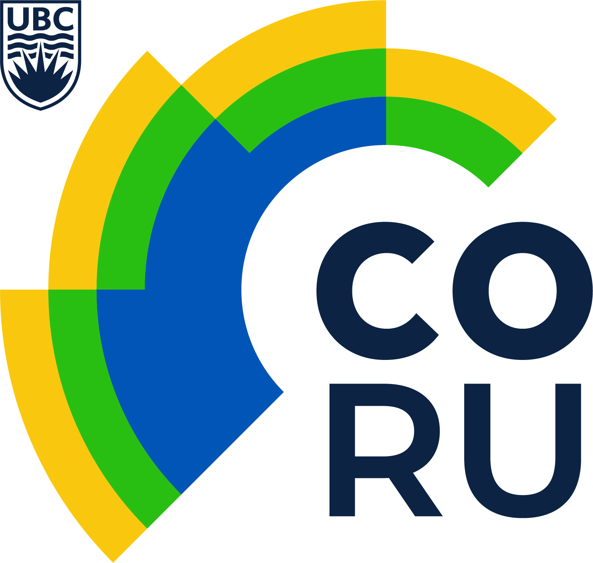

## Quick Intro

I graduated in Biology in 2012 from the *Universidad Autónoma Metropolitana* in Mexico City. During my time as an undergrad I did research aiming to improove food security on coastal communities in Mexico. After my undergrad I worked at the Global Institute for Sustainability and managed my own diving center in Mexico City. In 2014 I was honored with a [Latin American Fisheries Fellowship](http://www.laff.bren.ucsb.edu/) by the Walton Fundation to study a Masters in Environmental Science & Management from the Bren School of Environmental Science and Management at the University of California, Santa Barbara. My [group dissertation](http://www.esm.ucsb.edu/research/2016Group_Projects/documents/CopyofFinal_INTERTIDALFINALREPORT_Bren2016.pdf) worked along with the Bureau of Energy and Management of the United States and focused on the development of a citizen science monitoring protocol for the rocky intertidal in the west coast of the US. Currently, I'm doing a Ph.D at the University of British Columbia in Vancouver, Canada. Under the guidence of Dr. William Cheung, my work looks at the socio-ecological implications of climate change on fish that moves freely between the national waters (transboundary) of Canada, United States and Mexico.

If you are interested, you can download my CV at the bottom of this page. Feel free to contact me to discuss any of my past or current projects and please keep in mind that the most recent ones might not be there. On my [GitHub](https://github.com/jepa?utf8=%E2%9C%93&tab=repositories&q=&type=source&language=) profile you will find some of my scripts revealing my computer programming skills.

----

## Current Projects 

### Building a Meta-database of Marine Research in Mexico

**Collaborators:** Arreguín-Sánchez F, Cheung W. William, Cisneros-Mata Miguel A, Cisneros-Montemayor Andres, Rodriguez Laura

**Description:** The Meta-database of Marine Research in Mexico project aims to create a meta-database of all marine research data developed in Mexico. A meta-database is a documentation of the sources of information instead of a database of the actual data. Since October of 2016 we have collected more than 100 k records containing information from more than 300 k data points, from more than 60 on-line repositories. You can read the details on the project's webpage as well as some of our preeliminary results.

[Visit Project's Webpage](https://jepa.shinyapps.io/marmetadatamexeng/) •
 [Visitar la Página del Proyecto](https://jepa.shinyapps.io/marmetadatamexesp/)

----

### Transboundary Fisheries Management in Changing North Atlantic and Pacific Oceans: Taking Stock, Future Scenarios

**Collaborators:** Cheung W. William, Sumaila Rashid, et al.

**Description:** This project aims to understand how possible shifts on species distribution due to climate change can affect the transboundary fisheries of Canada and the United States. Transboundary fisheries are defined as fish stocks that move freely between (1) State Countries Economic Exclusive Zones (EEZ) and between (2) EEZ’s and the high seas, imposing an extra challenge for fisheries management.

----

## Publications on Scientific Journals

[Visit My Google Schoolar Profile](https://scholar.google.ca/citations?user=EZpBcjcAAAAJ&hl=en)

- Malin L. Pinsky, Reygondeau G., Caddell R., **Palacios-Abrantes J.**, Spijkers J., Cheung W.L (2018) Preparing ocean governance for species on the move: Policy must anticipate conflict over geographic shifts. Science, Vol. 360, Issue 6394, pp. 1189-1191, DOI: 10.1126/science.aat2360 *[Full paper](http://science.sciencemag.org/content/360/6394/1189.full)* • *[Artículo en Español](Translations/Border_Crossing_Esp.pdf)*

- **Palacios-Abrantes J.,** Felins E., Handelman T., Liu R.O., Howard A., Mpelack J., Gilbane, L. Using citizen science to monitor the rocky intertidal: A tool for the Bureau of Ocean Energy Management in the US. *[Under review]*

- **Palacios-Abrantes J.,** Herrera-Correal J., Molina R., Rodriguez Van Dyck S. & Brunkow J. Evaluating the performance of a Callo de hacha restoration plan in La Paz, Mexico *[Under review]*

- **Palacios-Abrantes J.**, Melo-Ruiz V., Urbano B., Falcón-Gerónimo J. & Gazga-Urioste C. (2017). Nutritional Analysis of Octopus hubbsorum B (Cephalopoda: Octopodidae) from the Pacific Ocean, Acapulco, Guerrero, México. Journal of Applied Life Sciences International, 10(3), 1–6. *[Full paper](http://doi.org/10.9734/JALSI/2017/31031)*

- **Palacios-Abrantes J.,** Melo-Ruiz V., Diaz-Garcia R., Gazga-Urioste C. & Urbano B. (2016). Iron Profile of Octopus hubbsorum (Cephalopoda: Octopodidae) for Enrichment of the Mexican Diet, 10, 1–4. doi.org/10.17265/1934-7375/2016.05.008 *[Full paper](http://www.davidpublisher.org/index.php/Home/Article/index?id=28446.html)* • *[Artículo en Español](Translations/Iron_Profile_Esp.pdf)*

- Ruiz V. M., Aguirre H. D., Martínez B., **Palacios-Abrantes J.** & Vargas, N. (2013). Plaga de ortópteros, recurso de nuetrientes para la población. Entomologia Mexicana (2) 1077–1079. *[Full paper](http://www.entomologia.socmexent.org/revista/entomologia/2013/EA/1077-1079.pdf)*

- Melo V., Jiménez H., **Palacios-Abrantes J.** & Barreda T. Q. (2013). Fruto de Capulín Prunus Serotina y larvas de Synopsia Mexicanaria W, representan una buena fuente de nutrientes en la dieta cotidiana. Entomologia Mexicana, 12 (2), 1084–1086. *[Full paper](http://www.entomologia.socmexent.org/revista/entomologia/2013/EA/1084-1086.pdf)*

----

## Full Curriculum Vitae

[Download Full CV](CV.PalaciosAbrantes.pdf)

<object data="CV.PalaciosAbrantes.pdf" type="application/pdf" width="700px" height="700px">
    <embed src="CV.PalaciosAbrantes.pdf">
        This browser does not support PDFs. Please download the PDF to view it: <a href="CV.PalaciosAbrantes.pdf">Download PDF</a>.

    </embed>
</object>

---- 

## Affiliations

 

 

 

**Contact**

Juliano Palacios Abrantes | j.palacios@oceans.ubc.ca • [Google Schoolar](https://scholar.google.ca/citations?user=EZpBcjcAAAAJ&hl=en)

<!-- Global site tag (gtag.js) - Google Analytics -->

