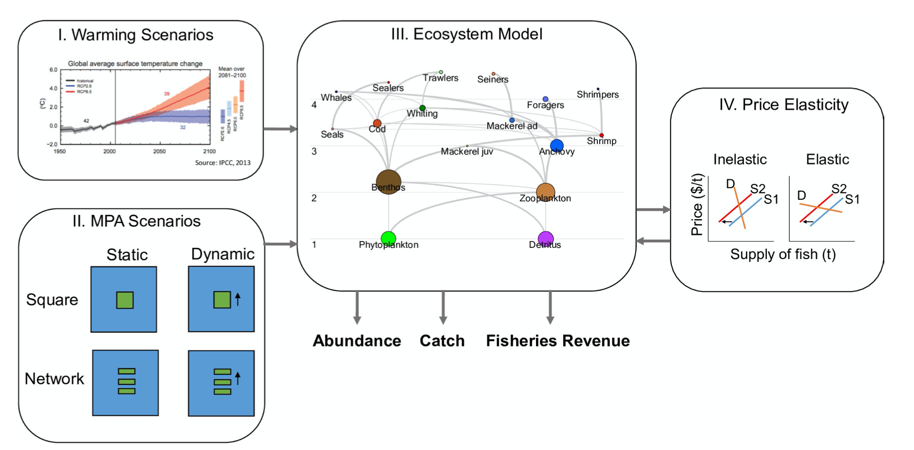

<!-- Global site tag (gtag.js) - Google Analytics -->

<!-- <script async src="https://www.googletagmanager.com/gtag/js?id=UA-105699898-4"></script> -->
<!-- <script> -->
<!--   window.dataLayer = window.dataLayer || []; -->
<!--   function gtag(){dataLayer.push(arguments);} -->
<!--   gtag('js', new Date()); -->

<!--   gtag('config', 'UA-105699898-4'); -->
<!-- </script> -->

<!-- </center> -->


- **NOTA: esta es una traducción al español del artículo:** *Shifting seas, shifting boundaries: Dynamic marine protected area designs for a changing climate*, escrito por Tim Cashion, Tu Nguyen, Talya ten Brink, Anne Mook, Juliano Palacios- Abrantes, Sarah M. Roberts  y que se puede encontrar en la siguiente [liga](https://journals.plos.org/plosone/article?id=10.1371/journal.pone.0241771).

- **Forma de Citar**: Cashion, T., Nguyen, T., Brink, ten, T., Mook, A., Palacios-Abrantes, J., and Roberts, S. M., 2020. Shifting seas, shifting boundaries: Dynamic marine protected area designs for a changing climate. PLoS ONE, 15 (11), e0241771.

<center>

<a span class="label label-success" href= "shifting_mpa_Esp.pdf" >Descargar Artículo en Español</span></a>

</center>

<br>

<!-- Abstract rectangle -->
<style>
div.blue { background-color:#e6f0ff; border-radius: 5px; padding:20px;}
</style>
<div class = "blue">

```{r setup, eval = T, echo=F, warning=F,message=F, results='hide'}

#### Library ####
packages <- c(
  "knitr",
  "kableExtra",
  "png",
  "grid"
)

MyFunctions::my_lib(packages)

```

# Resumen

Las áreas marinas protegidas (AMP) son herramientas valiosas para la conservación que tienen como objetivo principal limitar los impactos humanos a los sistemas marinos a través de la protecicón de especies y hábitats. Sin embargo, áreas originalmente designadas como AMP pueden tener poca semejanza con su estado original a causa del cambio en la distribución de las especies marinas en respuesta al cambio climático. Se han sugerido diferentes enfoques para hacer frente al cambio en la conservación marina, por lo que en este trabajo probamos la efectividad de diferentes diseños de AMP para proteger especies marinas cuya distribución está cambiando. Hacemos esto mediante la elaboración de un modelo ecosistémico, utilizando un ecosistema teórico e implementando distintos diseños de AMPs como AMPs dinámicas o corredores de AMPs. Nuestros hallazgos sugieren que las AMPs dinámicas pueden beneficiar a algunas especies (por ejemplo anchoveta) y flotas pesqueras, y estos beneficios pueden informar el diseño o la adaptación de las AMPs en todo el mundo. Además, encontramos que es importante diseñar AMPs con objetivos específicos y tener en cuenta los efectos de la presión de pesca y las interacciones de especies en el diseño de AMPs bajo el cambio climático.


<!-- Image for Abstract -->

<center>




**Mapa conceptual de los métodos utilizados para este estudio (Ver [Figura 1](https://journals.plos.org/plosone/article/figure?id=10.1371/journal.pone.0241771.g001) para la desceipción completa).**  


</center>

<br>

</div>

----------------------------------------------------------------------------------------------------------------------------

# Introducción

Las áreas marinas protegidas (AMPs) se encuentran entre las herramientas más populares para la gestión costera, sobre todo cuando el objetivo es proteger especies y ecosistemas de los posibles impactos de las actividades humanas [1]. Las AMP varían en diseño, forma y tamaño y pueden generar diferentes beneficios socio-ecológicos dentro de los límites de área protegida. Por ejemplo, las AMPs tienen la capacidad de aumentar la biomasa, la densidad y el tamaño de los peces, así como mantener la diversidad de especies y apoyar la producción de alimentos y el suministro de valores estéticos, recreativos y espirituales [2, 3]. Algunos de estos beneficios también ocurren fuera de los límites de las AMPs a través del derrame de peces adultos desde su interior hacia las áreas circundantes. Dicha migración puede tener impactos positivos en la biomasa de peces en aguas de hasta dos kilómetros de distancia de la AMP, resultando en un posible aumento del rendimiento pesquero en las zonas aledañas a las AMPs [4]. Dichos beneficios pueden conducir a una mayor eficiencia pesquera en los bordes de las AMPs debido a la alta concentración de biomasa de peces, compensando parcialmente la pérdida de ingresos por pesca generado por el área vedada.  Sin embargo, la distribución de dichos beneficios no siempre sucede de manera equitativa [5-7], por lo que muchas veces es necesario un sistema de recompensa entre los usuarios beneficiados y los perjudicados.

Existe una gran evidencia de que las especies marinas está cambiando su distribución en respuesta a los efectos del cambio climático [8-12] y se espera que dicho movimiento de especies continúe [13-17], incluso en un futuro en donde se respete el Acuerdo de París realizando una fuerte mitigación de los gases de efecto invernadero [18]. Esto conlleva a una posible pérdida en la función de las AMP en proteger hábitats específicos o especies en movimiento dados sus límites estáticos [19, 20] comprometiendo los beneficios futuros de las AMP y su capacidad para cumplir objetivos de conservación [21]. Por lo tanto, la gestión marina debe considerar explícitamente el cambio climático para proteger las especies con distribuciones cambiantes [6, 21].

En este artículo abordamos dicha problemática mediante un ejercicio de modelaje matemático en donde examinamos los efectos biológicos y económicos de distintos diseños de AMP en la protección de grupos funcionales a medida que cambian sus distribuciones debido al cambio climático [21-23]. Si bien el diseño de AMPs resilientes al cambio climático es un tema que ha sido identificado como un área de investigación necesaria, los autores no conocen ningún estudio de modelado sobre los efectos del cambio climático en múltiples diseños de AMP. Nuestro objetivo es explorar los beneficios teóricos de las AMP dinámicas para responder a los efectos del cambio climático a través de un enfoque de modelado de ecosistemas. Evaluamos estos beneficios en términos de tres resultados diferentes: biomasa, captura e ingresos pesqueros. Estos resultados son medidas relevantes del éxito del AMP [24] y para un grupo principal de usuarios de recursos adyacentes a muchas AMP [25]. Por lo tanto, este estudio comprende dos objetivos centrales: 

i) determinar cómo los resultados de las AMP varían bajo el cambio climático, y

ii) evaluar cómo los diferentes diseños de AMP (estáticos vs. dinámicos, de red vs. individuales) se desempeñan bajo el cambio climático.

# Resultados

## Resultados agregados

Al compara los diferentes diseños de AMPs contra un escenario sin AMP se encontró que tan solo el diseño "Cuadrado móvil" presenta una diferencia significativa de biomasa ([Fig. 2](https://doi.org/10.1371/journal.pone.0241771.g002) y Tabla S6) pero la magnitud de dicha diferencia es mínima (<5% de diferencia en la biomasa comparado con todos los diseños de AMP) (Tabla S7). Por otra parte, todos los diseños de AMP generaron una captura significativamente mayor (valor medio del 12%; *p* <0,001) que el escenario sin AMP (Table S8). Comparando los distintos escenarios entre si, se encontró que ninguno supera, significativamente, a los demás en términos de biomasa y captura. De hecho, a pesar de resultar en mayor captura, los ingresos fueron significativamente más bajos (valor medio de -10%; *p* <0,001) en todos los diseños de AMP que en el escenario sin AMP ([Fig. 2](https://doi.org/10.1371/journal.pone.0241771.g002)). Esto es debido a una combinación de la elasticidad del precio de venta de captura y el aumento en la captura de especies de menor valor. En general, existe una fuerte variación en las especies capturadas de acuerdo a los diferentes diseños de AMPs, especialmente en los diseños de "Red". Sin embargo, cuando las capturas son agregadas en grupos pesqueros, los cambios en las capturas entre los diseños de AMP son mínimos ([Fig. 3](https://journals.plos.org/plosone/article/figure?id=10.1371/journal.pone.0241771.g003)).

También se notaron diferencias significativas al comparar los diseños de AMP dinámicas con sus contrapartes estáticas. En el caso de los diseños cuadrados, la versión dinámica superó a la versión estática con capturas significativamente más altas (15% en comparación con 11,8%, valor *p* = <0,001), ingresos (-8,6% en comparación con -10,5%, *p* = <0,001) y biomasa (0,6% en comparación con 0,0%, *p* = <0,001). Ya los diseños de red funcionaron de manera similar presentando una diferencia de <1% entre su desempeño relativo en comparación con el escenario sin AMP y sus intervalos de confianza del 95% se superponen para todas sus medidas ([Fig. 3](https://journals.plos.org/plosone/article/figure?id=10.1371/journal.pone.0241771.g003)). En general, las AMPs dinámicas cuadradas superaron significativamente a las de red en términos de captura total, ingresos y biomasa ([Fig. 2](https://journals.plos.org/plosone/article/figure?id=10.1371/journal.pone.0241771.g002) y Tablas S7-S9).

Al analizar la biomasa promedio latitudinal se pueden apreciar cambios en la distribución de algunas especies dentro del ecosistema de acuerdo el diseño del AMP ([Fig. 4](https://journals.plos.org/plosone/article/figure?id=10.1371/journal.pone.0241771.g004)). Por ejemplo, el efecto de introducir cual quier diseño de AMP genera un cambio dramático en la caballa adulta, concentrando su distribución casi exclusivamente dentro de las AMP ([Fig. 4](https://journals.plos.org/plosone/article/figure?id=10.1371/journal.pone.0241771.g004) y Fig. S11). En el caso de los diseños de AMPs horizontales estáticas, la biomasa de la mayoría de los grupos funcionales se concentró en latitudes más al norte mientras que en las AMPs verticales (también estáticas) la biomasa se distribuyó de manera más uniforme. Ya los diseños de red tanto estáticos como dinámicos presentaron una concentración de biomasa más alta en latitudes más al sur. Cabe destacar que para muchas otras especies, la implementación de cualquier AMPs no alteró su distribución de manera drástica independientemente del diseño ([Fig. 4](https://journals.plos.org/plosone/article/figure?id=10.1371/journal.pone.0241771.g004) y Fig. S11).

## Resultados por especie

Hay especies y pesquerías ganadoras y perdedoras cuando se consideran distintos diseños de AMPs y los efectos del cambio climático (Figs. S8-S24). El aumento en la captura fuera de las AMPs a partir del efecto de derrame de individuos fue observable para aquellas especies que prosperaron dentro de las AMPs. Sin emabrgo, la intensaidad del efecto dependió del tipo de diseño (por ejemplo, las capturas de pescadilla (*Merlangius merlangus*) aumentaron en todos los diseños de AMP, Fig. S17)


El aumento de la biomasa de cualquier especie dentro del AMP está mediado por las interacciones depredador-presa. Dichas interacciones pueden verse afectadas por el efecto positivo que algunas especies reciben por la protección contra las pesquerías. Por ejemplo, dentro de las AMP, los camarones se ven afectados negativamente debido a la protección de su depredador, la pescadilla. Tanto la pescadilla como la anchoa son las dos especies que más se benefician de los distintos diesños de AMPs con aumentos promedio en la biomasa del 28% y 26%, respectivamente ([Fig. 5](https://doi.org/10.1371/journal.pone.0241771.g005)). La anchoa, pescadilla y ballenas se ven mejor beneficiadas con los diseños Estático Vertical, Horizontal y Cuadrado y Cuadrado Dinámico a comparación de la caballa (juvenil y adulta) y el camarón. Esto es particularmente notorio pata la caballa adulta (disminución promedio de -65%) para todos los diseños de AMPs.

## Resultados por pesquería

Las capturas fueron más altas bajo todos los escenarios de AMP en comparación con el escenario sin AMP, sin embargo los ingresos por pesca fueron más bajos en escenarios de AMPs. Esto se debe a que las capturas de especies de alto valor como los camarones fueron menores mientras que las de bajo valor, como lo son las anchoas y pescadillas, fueron más altas ([Fig. 6](https://doi.org/10.1371/journal.pone.0241771.g006)).

El aumento de la biomasa de las anchoas y pescadillas generó un aumento en las capturas bajo el mismo esfuerzo pesquero, lo que condujo a una mayor captura por unidad de esfuerzo (Fisg. S8-S24). Así, la flota pesquera de 'forrajeros' de anchoa y la de arrastre de pescadilla aumentaron sus capturas entre un 15% y un 30% según el escenario, respectivamente. Por el contrario, la flota pesquera de caballa obtuvo capturas menores, no solo por la reducción de la zona de pesca a consecuencia del establecimiento de la AMP, sino también por la disminución en la biomasa de caballa. Así, los cambios en los perfiles de captura de los escenarios con AMPs condujeron a una pérdida general de ingresos pesqueros, a pesar de reportar un aumento en las  capturas totales. De hecho, solo la flota pesquera de anchoas experimentó beneficios económicos en todos los escenarios con AMPs, mientras que las demás flotas tuvieron ingresos un poco menores o iguales a los generados en el escenario sin AMP ([Fig. 6](https://doi.org/10.1371/journal.pone.0241771.g006)).

# Discusión 

Los hallazgos de la presente investigación muestran un aumento en la biomasa en algunos escenarios de AMP (en particular, estáticos vertical y de red y cuadrado dinámico), lo que sugiere que las AMP podrían proporcionar beneficios a nivel regional, incluso bajo el efecto del cambio climático. Varios diseños de AMPs obtuvieron resultados relativamente similares en términos de captura e ingresos, en comparación con el escenario sin AMP, lo que sugiere que las AMP podrían ser beneficiosas independientemente del diseño. Sin embargo, no existe un diseño ideal que mantenga todas las funciones ecológicas y las pesquerías asociadas bajo el cambio climático. Así mismo, todos los escenarios de AMPs presentaron ingresos por pesca inferiores a los reportados en el escenario sin AMP lo que refuerza la necesidad de concesiones mutuas entre la conservación y la pesca [36, 37]. Sin embargo, las capturas fueron más altas en los bordes de las AMPs lo que sugiere que flotas pesqueras lograron capitalizar a partir de los efectos del derrame de biomasa proveniente de las AMPs.

Los diseños estático vertical y cuadrado dinámico pueden mitigar los impactos negativos del cambio climático en la biomasa de las AMPs. Mientras que el diseño estático vertical cubre un mayor gradiente de temperatura, el cuadrado dinámico es capaz de "seguir" a las especies a medida que migran a aguas más frías. Estas características podrían resolver (parcialmente) la problemática de las AMPs tropicales señalada por [19] referente a un aumento de la temperatura del agua por encima del límite tolerado por las especies protegidas. Sin embargo, dicha protección no sería efectiva en los casos en los que la migración de las especies a aguas más frías fuera hacia aguas más profundas y no hacia los polos [38]. Por otro lado, mientras que en términos generales la red de AMP aumentó la biomasa del sistema, algunas especies se vieron más perjudicadas en este escenario que en cualquier otro escenario de AMP. Esto se debe a que las flotas pesqueras se concentraron en los bordes de las AMPs aprovechando el efecto del derrame de biomasa. De acuerdo a este resultado, las AMPs diseñadas en forma de red tienen el mejor desempeño en términos de ingresos pesqueros.

Es probable que los posibles beneficios de las AMPs dinámicas se vean perjudicados por las interacciones depredador-presa y por los cambios en el esfuerzo pesquero lo que refuerza el concepto de que los beneficios generados por AMPs varían según la especie [2]. Si bien a menudo las AMP se crean para proteger un ecosistema de las acciones humanas, en este análisis parecen modificar un ecosistema previamente pescado, exacerbando las interacciones depredador-presa y resultando en un aumento de algunas poblaciones a consecuencia de una reducción drástica de otras. Un ejemplo de dicho efecto es la interacción ballenas-caballa. Si bien las caballas estaban protegidas de la pesca dentro del AMP, su biomasa no aumentó substancialmente debido al aumento paralelo de la población de ballenas. Por lo tanto, la creación de AMPs con el objetivo de restaurar un ecosistema a un estado original se complica por los efectos de la pesca y las la relaciones ecológicas interespecíficas. Es por esto que los diseños de AMPs requieren concesiones económicas y ecológicas que modifican el funcionamiento del ecosistema y, por lo tanto, afectan al sector pesquero y demás personas que dependen de estos ecosistemas [39]. Si bien los diseños dinámicos de AMPs pueden generar beneficios ecológicos [40, 41], su creación cerca de zonas costeras con amplia variedad de actividades humanas y donde las comunidades dependen del medio costero para su sustento puede reducir dichos beneficios [42]. Esta problemática es menos notable en el alta mar, donde las AMP dinámicas podrían beneficiar a muchas especies amenazadas [20].


Los resultados del presente estudio resaltan la importancia de las interacciones depredador-presa, y la necesidad de que los gestores de recursos consideren estas interacciones antes de implementar un AMP. La gestión basada en ecosistemas puede ser particularmente útil en lugar de la gestión basada en una sola especie, ya que la primera tiene en cuenta las interacciones entre especies [43, 44]. El modelo muestra que la implementación de un AMP puede cambiar el equilibrio de un ecosistema favoreciendo ciertos grupos funcionales. Esto se debe a que el establecimiento de una AMP perturba un ecosistema ya presionado por la actividad pesquera afectando, de manera distinta, a las poblaciones naturales. Dichas dinámicas socio-ecológicas pueden examinarse a partir de modelos matemáticos que exploren las respuestas tróficas de distintos niveles de presión pesquera una especie en particular [45]. Es por ello que es importante diseñar AMPs con objetivos específicos en mente, ya sea la protección de una sola especie, ciertas especies o la protección general del ecosistema.

# Limitaciones

El presente estudio se basa en un modelo espacial ecosistémico e incorpora los efectos del cambio climático a partir del incremento en la temperatura superficial del agua. El modelo permite explorar los diferentes costos y beneficios entre los resultados socio-ecológicos de los diseños de AMPs. El presente análisis no es empírico, por lo que los resultados deben interpretarse como demostrativos de principios y posibles escenarios, en lugar de una interpretación estrictamente literal. El modelo, tal como se ha implementado, no está sujeto a otros desafíos de manejo pesquero, como lo son el incumplimiento de las áreas de veda, especialmente para las AMPs dinámicas. Así mismo, el modelo no considera las preferencias de hábitat de los diferentes grupos funcionales con excepción de la temperatura. Esto se hizo intencionalmente para aislar el efecto del diseño del AMP de una posible superposición con el hábitat de una especie. Además, los cambios en la temperatura de la superficie del mar son más relevantes para algunos grupos funcionales (por ejemplo, anchoa) que para otros (por ejemplo, bacalao).

El modelo produce un derrame de individuos y el aumento de capturas en todos los escenarios de AMP indica que dicho efecto compensa la pérdida de captura en áreas cerradas a la pesca. Este hallazgo demuestra que el modelo predice beneficios para las pesquerías a partir del derrame de individuos en función de los valores de dispersión utilizados y probados en el análisis de sensibilidad (ver Archivo S1). El modelo se mostró robusto a los valores de dispersión utilizados (Fig. S5). Sin embargo, es probable que la fuerza del efecto del derrame de individuos varíe según la especie [2].

Los resultados del monelaje matemático pueden informar los posibles beneficios y costos de diferentes diseños de AMPs. Sin embargo, los resultados pueden no ser precisos para todos los ecosistemas. Por lo que es importante considerar las características específicas de cada ecosistema durante el procesos de implementación de una AMP y en ejercicios como este. Esto resalta el valor de la información durante el diseño de las AMPs [46].

# Conclusion
