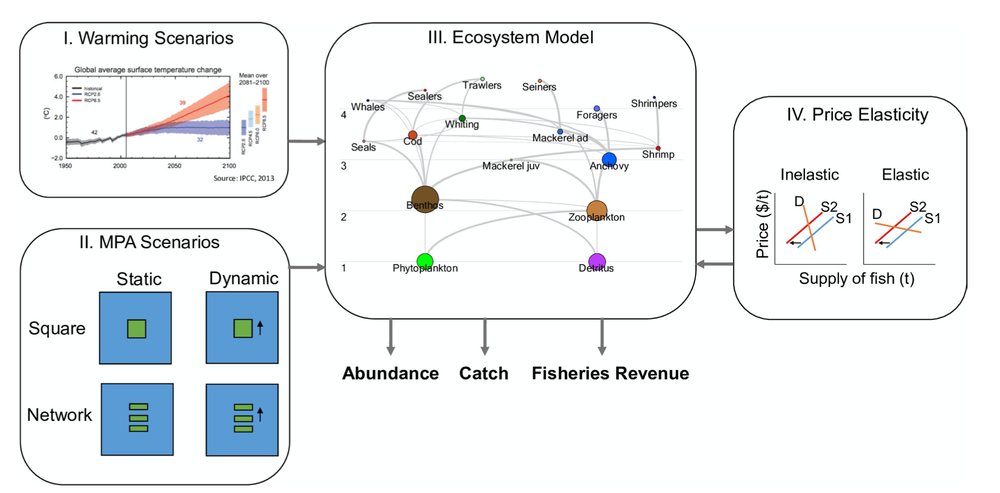

<!-- Global site tag (gtag.js) - Google Analytics -->

<script async src="https://www.googletagmanager.com/gtag/js?id=UA-105699898-4"></script>
<script>
  window.dataLayer = window.dataLayer || [];
  function gtag(){dataLayer.push(arguments);}
  gtag('js', new Date());

  gtag('config', 'UA-105699898-4');
</script>

<!-- </center> -->


- **NOTA: esta es una traducción al español del artículo:** *Shifting seas, shifting boundaries: Dynamic marine protected area designs for a changing climate*, escrito por Tim Cashion, Tu Nguyen, Talya ten Brink, Anne Mook, Juliano Palacios-Abrantes, Sarah M. Roberts y que se puede encontrar en la siguiente [liga](https://journals.plos.org/plosone/article?id=10.1371/journal.pone.0241771).

- **Forma de Citar**: Cashion, T., Nguyen, T., Brink, ten, T., Mook, A., Palacios-Abrantes, J., and Roberts, S. M., 2020. Shifting seas, shifting boundaries: Dynamic marine protected area designs for a changing climate. PLoS ONE, 15 (11), e0241771.

<center>

<a span class="label label-success" href= "shifting_mpa_Esp.pdf" >Descargar Artículo en Español</span></a>

</center>

<br>

<!-- Abstract rectangle -->
<style>
div.blue { background-color:#e6f0ff; border-radius: 5px; padding:20px;}
</style>
<div class = "blue">

```{r setup, eval = T, echo=F, warning=F,message=F, results='hide'}

#### Library ####
packages <- c(
  "knitr",
  "kableExtra",
  "png",
  "grid"
)

MyFunctions::my_lib(packages)

```

# Resumen

Las áreas marinas protegidas (AMP) son herramientas valiosas para la conservación. Tienen como objetivo principal limitar los impactos antrópicos a los sistemas marinos a través de la protección de especies y hábitats. Sin embargo, zonas que fueron designadas como AMP, podrían no asemejarse a su estado original debido, por ejemplo, a modificaciones en la distribución de las especies marinas en respuesta al cambio climático. Varios diseños de AMPs han sido sugeridos para hacer frente al cambio climático, pero existen pocos estudios que evalúen dichos diseños. En el presente trabajo se prueba la efectividad de diferentes diseños de AMP para proteger especies marinas cuya distribución está cambiando. Esto se hace mediante la elaboración de un modelo ecosistémico, utilizando un ecosistema teórico e implementando distintos diseños de AMPs, ya sea con manejos dinámicos, asi como en red. Los resultados sugieren que las AMPs dinámicas pueden beneficiar a algunas especies (por ejemplo, a la anchoveta) y a las flotas pesqueras, y que estos beneficios pueden informar el diseño o la adaptación de las AMPs en todo el mundo. Además, se resalta la importancia de diseñar AMPs con objetivos específicos y que tengan en cuenta los efectos de la presión de la pesca, así como las interacciones de especies en el contexto de cambio climático.


<!-- Image for Abstract -->

<center>




<!-- **Mapa conceptual de los métodos utilizados para este estudio (Ver [Figura 1](https://journals.plos.org/plosone/article/figure?id=10.1371/journal.pone.0241771.g001) para la descripción completa de la figura).**   -->


</center>

<br>

</div>

----------------------------------------------------------------------------------------------------------------------------

# Introducción

Las áreas marinas protegidas (AMPs) se encuentran entre las herramientas más populares para la gestión marina y costera, sobre todo cuando el objetivo es proteger especies y ecosistemas de los posibles impactos de las actividades humanas [1]. Las AMPs varían en diseño, forma y tamaño y pueden generar diferentes beneficios socio-ecológicos dentro de los límites protegidos. Por ejemplo, las AMPs tienen la capacidad de aumentar la biomasa, la densidad de poblaciones de fauna, el tamaño de los individuos, así como mantener la diversidad de especies y apoyar la producción de alimentos y el suministro de valores estéticos, recreativos y espirituales [2, 3]. Algunos de estos beneficios también ocurren fuera de los límites de las AMPs, a través de lo que se conoce como efecto derrame: las poblaciones residentes o transeúntes de zonas con AMPs se benefician de esta protección y los individuos adultos se desplazan desde el interior de la zona protegida, hacia las áreas circundantes. Dicho derrame de individuos puede tener impactos positivos en la biomasa de peces en aguas de hasta dos kilómetros de distancia de la AMP, resultando en un posible aumento del rendimiento pesquero en las zonas aledañas a las AMPs [4]. Estos beneficios pueden conducir a una mayor eficiencia pesquera en los alrededores de las AMPs debido a la alta concentración de biomasa, compensando parcialmente la pérdida de ingresos de pesca generado por el área vedada. Sin embargo, la distribución de dichos beneficios no siempre sucede de manera equitativa [5-7], por lo que muchas veces es necesario un sistema de recompensa entre los usuarios beneficiados y los perjudicados.

Existe gran evidencia de que las especies marinas están cambiando su distribución en respuesta a los efectos del cambio climático [8-12] y se espera que dicho fenómeno continúe [13-17], incluso en un futuro en donde se respete el Acuerdo de París y se realice una fuerte mitigación de los gases de efecto invernadero [18]. Dados los límites estáticos de las AMPs, esto conlleva una posible pérdida en la función de las mismas de proteger hábitats específicos o especies que cambien su distribución [19, 20]. Como consecuencia, los beneficios futuros de las AMP y su capacidad para cumplir objetivos de conservación se ven comprometidos por el cambio climático [21]. Por lo tanto, la gestión marina debe considerar explícitamente dichos fenómenos para proteger a las especies cuya distribución está cambiando en respuesta al cambio climático [6, 21].

En este artículo se aborda dicha problemática mediante un ejercicio de modelaje matemático, en donde se examinan los efectos biológicos y económicos de distintos diseños de AMPs a medida que las especies cambian sus distribuciones como respuesta al cambio climático [21-23]. Si bien el diseño de AMPs resilientes al cambio climático es un tema que ha sido identificado como un área de investigación necesaria, los autores no tienen conocimiento de la existencia de estudios que hayan modelado los efectos del cambio climático en múltiples diseños de AMPs. El objetivo de este trabajo es explorar los beneficios teóricos de las AMPs dinámicas para responder a los efectos del cambio climático a través de un enfoque de modelado de ecosistemas. Se evalúan dichos beneficios en términos de biomasa total del sistema, captura e ingresos pesqueros de grupos funcionales objetivo. Éstos son parámetros relevantes cuando se quiere medir el éxito de un AMP [24] y para un grupo principal de usuarios de recursos adyacentes al AMP [25]. Específicamente, este estudio comprende dos objetivos centrales:


i)	determinar cómo los beneficios de las AMP varían bajo escenarios de cambio

ii)	comparar los diferentes diseños de AMP (estáticos vs. Dinámicos; de red vs. individuales) en términos de desempeño bajo escenarios de cambio climático.


# Métdos

Para realizar este análisis se utilizó *Ecospace*, la forma espacial del software de modelado ecosistémico *Ecopath* que se integra con *Ecosim* [26]. Este software permite la incorporación de criterios ecológicos y socio-económicos en la exploración de diferentes estrategias de gestión de AMPs [27]. Todos los modelos de *Ecospace* comienzan con una parametrización de un modelo estático de masa balanceada (*Ecopath*), modificado por un escenario temporal (*Ecosim*) y finalmente aplicado a un espacio determinado del hábitat (*Ecospace*). En este estudio se adaptó el ecosistema teórico de “*Anchovy Bay*” ya que hay pocos modelos de *Ecospace* desarrollados por los altos requisitos de datos [28-29]. Los efectos del cambio climático fueron incorporados a partir de la proyección de la temperatura superficial del mar. Este tipo de simulación se ajusta bien a un ecosistema teórico ya que se puede ignorar la incertidumbre relacionada con la parametrización del modelo ecosistémico a razón de separar los efectos del cambio climático y el diseño del AMP. El modelo inició con una representación del ecosistema de *Anchovy Bay* en el año 2000 simulando 100 años (entre los años 2000 y 2100). Se calcularon variables de biomasa promedio, captura pesquera promedio y los ingresos pesqueros considerando los últimos 10 años de la proyección (entre 2090 y 2100).

El presente estudio se centró en dos diseños principales de AMPs que se han identificado como posibles soluciones para la conservación de especies con distribuciones cambiantes: AMP dinámicas y AMPs en red [21, 20]. Se evaluó la efectividad de las AMPs bajo un escenario de cambio climático (considerando un aumento de la temperatura superficial del mar de $4^oC$), o si los efectos negativos del cambio en la distribución de las puede reducirse mediante ciertos diseños de AMPs ([Figura 1](https://journals.plos.org/plosone/article/figure?id=10.1371/journal.pone.0241771.g001)).


## Diseño del modelo

Para este trabajo, se adoptaron los parámetros de líneabase y la estructura de la red trófica del modelo de *Ecospace*, *Anchovy Bay* [28]. El diseño espacial del ecosistema se realizó en una cuadrícula de 20 por 20 (400 celdas en total), dando como resultado que cada celda estuviera representada como un cuadrado de 20 km por 20 km. El modelo fue compuesto por 11 grupos funcionales de los cuales 10 contaban con una clase de edad y uno con dos clases (juveniles y adultos; [Tabla 1](https://journals.plos.org/plosone/article/figure?id=10.1371/journal.pone.0241771.t001)). Los parámetros de línea-base del modelo *Ecopath* se pueden encontrar en la [Tabla S1](https://doi.org/10.1371/journal.pone.0241771.s001) y la matriz de dieta en la [Tabla S2](https://doi.org/10.1371/journal.pone.0241771.s002). De los 11 grupos funcionales, seis fueron grupos objetivo de cinco flotas pesqueras específicas a cada grupo ([Tabla 1](https://journals.plos.org/plosone/article/figure?id=10.1371/journal.pone.0241771.t001)). Las poblaciones de los grupos funcionales se distribuyeron en función de la presencia de presas y de su preferencia de temperatura. Algunos grupos funcionales tienen la capacidad física de viajar más lejos que otros, por lo que los resultados del modelo fueron influenciados por la capacidad de movilidad de cada grupo funcional, así como de su preferencia de temperatura. La capacidad de movilidad se denominó “dispersión” y los valores utilizados en este modelo se basaron en un estudio anterior que cubre la mayoría de los grupos funcionales en este ecosistema ([Tabla S3](https://doi.org/10.1371/journal.pone.0241771.s003); [30]). El presente estudio utilizó un ecosistema hipotético debido a la naturaleza teórica de los métodos, así como a la falta de disponibilidad de datos para la creación de modelos de ecosistemas reales espacialmente explícitos que puedan incorporar efectos del cambio climático.

El modelo de *Ecopath* de este estudio comenzó en un estado estable de masa balanceada para después simular la expansión y disminución poblacional de los grupos funcionales en función de su afinidad con el ecosistema y la abundancia relativa de sus presas y depredadores. Por lo tanto, el modelo consideró las interacciones depredador-presa en el espacio y el tiempo. Además de estas dinámicas ecológicas, el esfuerzo de pesca se distribuyó espacialmente de acuerdo a los costos de pesca, considerado a partir de información sobre la distancia desde el puerto pesquero y el precio de venta del grupo-objetivo. El objetivo adjudicado a las flotas pesqueras fue el de maximizar sus ganancias, mientras que para los límites de expansión y contracción de la flota se usó información de las tasas de inversión de capital. El modelo utilizado se adaptó del original (*Anchovy bay*) de las siguientes maneras: incorporación de los impactos del cambio climático a través de funciones de forzamiento; inclusión de un gradiente de temperatura de la superficie del mar de norte a sur; y eliminación de características del hábitat (para no restringir grupos funcionales). Se mantuvo la dinámica de depredador-presa restante entre los grupos funcionales (incluidas las pesquerías).

Se simuló el ecosistema durante un período de 100 años para comparar los resultados de diferentes diseños de AMPs bajo efectos del cambio climático. Se adoptó una aproximación de los efectos del cambio climático en la temperatura superficial del mar, basada en los resultados de las estimaciones del Panel Intergubernamental sobre Cambio Climático (IPCC, por sus siglas en inglés) [31]. En términos generales, se consideró un cambio de $4^oC$ en la temperatura superficial del mar hacia fines del siglo XXI (2100) simulando un escenario sin mitigación de gases de efecto invernadero (RCP 8.5). Dicho efecto fue incorporado en el modelo ecosistémico forzando funciones que se aplicaron a grupos funcionales de productores y consumidores. Se asumió que el aumento en la temperatura del agua afecta a la capacidad de los organismos para encontrar presas (es decir, tasa de búsqueda). Este método es común en los modelos de *Ecosim* cuando el objetivo es influenciar la supervivencia de grupos funcionales a partir de sus preferencias de temperatura dados los efectos del cambio climático. Bajo este supuesto, la efectividad de un organismo para encontrar presas disminuye a medida que la temperatura se aleja del rango óptimo, volviéndose así, más vulnerable a ser depredado.

Se definieron los parámetros de respuesta ambiental para las especies en función de sus preferencias de profundidad y temperatura. Luego se incorporaron los cambios en la temperatura superficial del mar a la respuesta específica de cada grupo funcional. Se creó un gradiente de temperatura asumiendo un ecosistema del hemisferio norte con aguas más frías en las celdas “norte” y más cálidas en las celdas “sur”. Así, los grupos funcionales pudieron ubicarse entre esta cuadrícula espacial en función de sus preferencias térmicas.

Para estimar los ingresos de la pesca, el modelo utilizó los precios de primera venta para diferentes grupos funcionales multiplicados por la cantidad de captura en cada año. Se utilizaron los precios predeterminados del modelo *Ecopath* original [28] ([Tabla S4](https://doi.org/10.1371/journal.pone.0241771.s004)). La elasticidad del precio de la oferta, es decir la respuesta de los precios a aumentos o disminuciones en la oferta, se incorporó al modelo de acuerdo a información previa para cada especie/grupo comercial. Los valores se obtuvieron de una síntesis de la misma elasticidad del producto [32] y se tomó un promedio cuando se reportaron múltiples valores para un grupo funcional ([Tabla S5](https://doi.org/10.1371/journal.pone.0241771.s005)). Así, el comportamiento del esfuerzo pesquero respondió a cambios en los precios y por ende a la rentabilidad de las operaciones pesqueras. La incorporación de la elasticidad de precios combinada con los costos de pesca basados en la distancia a puerto permitió tener una respuesta relativamente realista de los incentivos y el comportamiento de la flota pesquera.

Se pueden encontrar más detalles sobre la parametrización del modelo en el [Archivo S1 -(en inglés)](https://doi.org/10.1371/journal.pone.0241771.s034). Se utilizó un escenario sin AMP como referencia para todas las simulaciones y se comparó con los escenarios de diferentes diseños de AMP bajo los efectos del cambio climático.

## Diseños de AMPs

Se desarrollaron seis diseños de AMPs: cuatro AMPs estáticas (cuadrada, vertical, horizontal y de red) para comparar con dos diseños de AMPs dinámicos (cuadrada dinámica y red dinámica) bajo el cambio climático ([Figura S2](https://doi.org/10.1371/journal.pone.0241771.s011)). Las dos AMP dinámicas tuvieron las mismas dimensiones que sus contrapartes estáticas y se desplazaron una celda (20 km) cada 20 años ([Figura S3](https://doi.org/10.1371/journal.pone.0241771.s012)). Esta tasa de movimiento se considera conservadora ya que las estimaciones actuales se encuentran entre 15,5 km / década y 25,6 km / década para escenarios de bajas y altas emisiones, respectivamente [33]. La diferenciación entre las AMPs estáticas horizontales y verticales fue en respuesta a la hipótesis de que las AMPs orientadas verticalmente son más propensas a beneficiar a las especies a medida que se desplazan hacia los polos debido al cambio climático [8, 9]. Es relevante incluir esta diferenciación porque la orientación vertical podría cumplir papeles similares a las redes de áreas protegidas que se extienden a través de gradientes latitudinales [34, 35]. No se incluyeron contra partes dinámicas de AMPs verticales, ya que el objetivo hipotético del AMP vertical estático es cubrir un amplio gradiente de temperatura brindando protección a medida que las especies migran hacia los polos. Todos los diseños de AMPs fueron diseñados con un mismo tamaño de área protegida (por ejemplo, 42 de 400 celdas, aproximadamente el 10% del ecosistema), y los diseños de AMPs se pueden encontrar en las (Figuras [S2](https://doi.org/10.1371/journal.pone.0241771.s011) y [S3](https://doi.org/10.1371/journal.pone.0241771.s012)).

## Estadística 

Se aplicaron modelos de regresión lineal para evaluar las diferencias en los niveles agregados de biomasa, captura e ingresos entre los varios diseños de AMPs y el escenario de referencia sin AMP. Los resultados se presentan a continuación, comparando los valores promedio del ecosistema actual (años 0-10) con el ecosistema a fin de siglo (años 90-100).

# Resultados

## Resultados agregados

Al comparar los diferentes diseños de AMPs contra un escenario sin AMP se observa que tan solo el diseño “cuadrado dinámico” presenta una diferencia significativa de biomasa ([Figura 2](https://doi.org/10.1371/journal.pone.0241771.g002) y [Tabla S6](https://doi.org/10.1371/journal.pone.0241771.s006https://doi.org/10.1371/journal.pone.0241771.s006)) pero la magnitud de dicha diferencia es mínima (<5% de diferencia en la biomasa comparado con todos los diseños de AMP) ([Tabla S7](https://doi.org/10.1371/journal.pone.0241771.s007)). Por otra parte, todos los diseños de AMP generan una captura significativamente mayor (valor medio del 12%; *p* <0,001) que el escenario sin AMP ([Tabla S8](https://doi.org/10.1371/journal.pone.0241771.s008). Comparando los distintos diseños de AMPs entre sí, se observa que ninguno supera significativamente, a los demás en términos de biomasa y captura. De hecho, a pesar de resultar en una mayor captura, los ingresos son significativamente más bajos (valor medio de -10%; *p* <0,001) en todos los diseños de AMP respecto al escenario sin AMP ([Figura 2](https://doi.org/10.1371/journal.pone.0241771.g002)). Esto es debido a una combinación de la elasticidad del precio de venta de captura y el aumento en la captura de especies de menor valor. En general, existe una fuerte variación en las especies capturadas de acuerdo a los diferentes diseños de AMPs, especialmente en los diseños de “Red”. Sin embargo, cuando las capturas son agregadas en grupos pesqueros, los cambios en las capturas entre los diseños de AMP son mínimos ([Figura 3](https://journals.plos.org/plosone/article/figure?id=10.1371/journal.pone.0241771.g003)).


También existen diferencias significativas al comparar los diseños de AMP dinámicas con sus contrapartes estáticas. En el caso de los diseños cuadrados, la versión dinámica supera a la versión estática con capturas significativamente más altas (15% en comparación con 11,8%, valor *p* = <0,001), ingresos (-8,6% en comparación con -10,5%, *p* = <0,001) y biomasa (0,6% en comparación con 0,0%, *p* = <0,001). Los diseños de red funcionan de manera similar presentando una diferencia de <1% en su desempeño relativo en comparación con el escenario sin AMP y sus intervalos de confianza del 95% se superponen para todas sus medidas ([Figura 3](https://journals.plos.org/plosone/article/figure?id=10.1371/journal.pone.0241771.g003)). En general, las AMPs dinámicas cuadradas superan significativamente a las de red en términos de captura total, ingresos y biomasa ([Figuras 2](https://journals.plos.org/plosone/article/figure?id=10.1371/journal.pone.0241771.g002) y Tablas S7-S9).


Se observan cambios en la distribución de algunas especies dentro del ecosistema de acuerdo el diseño del AMP mediante el análisis de biomasa promedio por latitud ([Figura 4](https://journals.plos.org/plosone/article/figure?id=10.1371/journal.pone.0241771.g004)). Por ejemplo, el efecto de introducir cualquier diseño de AMP genera un cambio dramático en la caballa adulta, concentrando su distribución casi exclusivamente dentro de las AMP ([Figura 4](https://journals.plos.org/plosone/article/figure?id=10.1371/journal.pone.0241771.g004) y [Figura S11](https://doi.org/10.1371/journal.pone.0241771.s020)). En el caso de los diseños de AMPs horizontales estáticas, la biomasa de la mayoría de los grupos funcionales se concentra en latitudes más al norte que las de AMPs verticales (también estáticas). Sin embargo, la biomasa se distribuye de manera más uniforme en las AMPs verticales. Los diseños en red tanto estáticos como dinámicos presentan una concentración de biomasa más alta en el sur que en el norte. Cabe destacar que la distribución de muchas otras especies no se ve alterada de manera drástica con la implementación de un AMP, independientemente del diseño de esta ([Figura 4](https://journals.plos.org/plosone/article/figure?id=10.1371/journal.pone.0241771.g004) y [Figura S11](https://doi.org/10.1371/journal.pone.0241771.s020)).

## Resultados por especie

Hay especies y pesquerías ganadoras y perdedoras cuando se consideran distintos diseños de AMPs y los efectos del cambio climático (Figs. S8-S24). El aumento en la captura fuera de las AMPs, a partir del efecto de derrame de individuos se observa para aquellas especies que prosperan dentro de las AMPs. Sin embargo, la intensidad del efecto depende del tipo de diseño (por ejemplo, las capturas de pescadilla (*Merlangius merlangus*) aumentan en todos los diseños de AMP, [Figura S17](https://doi.org/10.1371/journal.pone.0241771.s026)). El aumento de la biomasa de cualquier especie dentro del AMP está mediado por las interacciones depredador-presa. Dichas interacciones pueden verse afectadas por el efecto positivo que algunas especies perciben a partir de la protección contra las pesquerías. Por ejemplo, dentro de las AMP, los camarones se ven afectados negativamente debido a la protección de su depredador, la pescadilla. Tanto la pescadilla como la anchoa son las dos especies que más se benefician de los distintos diseños de AMPs con aumentos promedio en la biomasa del 28% y 26%, respectivamente ([Figura 5](https://doi.org/10.1371/journal.pone.0241771.g005)). La anchoa, pescadilla y ballenas se ven mejor beneficiadas con los diseños estático vertical, horizontal y cuadrado y cuadrado dinámico a comparación de la caballa (juvenil y adulta) y el camarón. Esto es particularmente notorio pata la caballa adulta (disminución promedio de -65%) en todos los diseños de AMPs.

## Resultados por pesquería

Mientras que las capturas son más altas en todos los diseños de AMP en comparación con el escenario sin AMP, los ingresos por pesca son más bajos. Esto se debe a una disminución en las capturas de especies de alto valor como los camarones y un aumento en las capturas de especies de bajo valor como las anchoas y las pescadillas ([Figura 6](https://doi.org/10.1371/journal.pone.0241771.g006)). El aumento en la biomasa de las anchoas y pescadillas genera un aumento en las capturas bajo el mismo esfuerzo pesquero, lo que conlleva a una mayor captura por unidad de esfuerzo (Figuras S8-S24). Así, las capturas de las flotas pesqueras de ‘forrajeros’ de anchoa y de arrastre de pescadilla aumentan entre 15% y 30% según el diseño de AMP, respectivamente. Por el contrario, la reducción en la zona de pesca a consecuencia del establecimiento de la AMP y disminución en la biomasa de la caballa resultan en una disminución de en su captura. Es por ello que los cambios en los perfiles de captura de los diseños de AMPs conducen a una pérdida general de ingresos pesqueros, a pesar del aumento en las capturas totales. Tan solo la flota pesquera de anchoas experimenta beneficios económicos en todos los diseños de AMPs, mientras que las demás flotas presentan ingresos un poco menores o iguales a los generados en el escenario sin AMP ([Figura 6](https://doi.org/10.1371/journal.pone.0241771.g006)).

# Discusión 

Los hallazgos de la presente investigación muestran un aumento en la biomasa en algunos diseños de AMP (en particular, estáticos vertical y de red y cuadrado dinámico), lo que sugiere que las AMP podrían proporcionar beneficios a nivel regional, incluso bajo los efectos del cambio climático. Varios diseños de AMPs muestran resultados relativamente similares en términos de captura e ingresos, en comparación con el escenario sin AMP, lo que sugiere que las AMP podrían ser beneficiosas independientemente del diseño. Sin embargo, no existe un diseño ideal que mantenga todas las funciones ecológicas y las pesquerías asociadas con cambio climático. Así mismo, todos los diseños de AMPs presentan ingresos por pesca inferiores a los reportados en el escenario sin AMP, reforzando la necesidad de concesiones mutuas entre la conservación y la pesca [36, 37]. Finalmente, las capturas son más altas en los bordes de las AMPs, lo que sugiere que las flotas pesqueras logran capitalizar los efectos del derrame de biomasa proveniente de las AMPs.

Los diseños estático vertical y cuadrado dinámico pueden mitigar los impactos negativos del cambio climático en la biomasa de las AMPs. Mientras que el diseño estático vertical cubre un mayor gradiente de temperatura, el cuadrado dinámico es capaz de “seguir” a las especies a medida que migran a aguas más frías. Estas características podrían resolver (parcialmente) la problemática de las AMPs tropicales señalada por [19] referente a un aumento de la temperatura del agua por encima del límite tolerado por las especies protegidas. Sin embargo, dicha protección no sería efectiva en los casos en los que la migración de las especies a aguas más frías fuera hacia aguas más profundas y no hacia los polos [38]. Por otro lado, mientras que en términos generales la red de AMP aumenta la biomasa del sistema, algunas especies se ven más perjudicadas en este escenario que en cualquier otro escenario de AMP. Esto se debe a que las flotas pesqueras se concentran en los bordes de las AMPs aprovechando el efecto del derrame de biomasa. De acuerdo a este resultado, las AMPs diseñadas en forma de red tienen el mejor desempeño en términos de ingresos pesqueros.

Es probable que los posibles beneficios de las AMPs dinámicas se vean perjudicados por las interacciones depredador-presa y por los cambios en el esfuerzo pesquero, lo que refuerza el concepto de que los beneficios generados por AMPs varían según la especie [2]. Si bien a menudo las AMP se crean para proteger un ecosistema de las acciones humanas, en este análisis parecen modificar un ecosistema previamente modificado por la pesca, exacerbando las interacciones depredador-presa y resultando en un aumento de algunas poblaciones a consecuencia de una reducción drástica de otras. Un ejemplo de dicho efecto es la interacción ballenas-caballa. Si bien las caballas están protegidas de la pesca dentro del AMP, su biomasa no aumenta sustancialmente debido al aumento paralelo de la población de ballenas. Por lo tanto, la creación de AMPs con el objetivo de restaurar un ecosistema a un estado original se comploca dados los efectos de la pesca y las relaciones ecológicas interespecíficas. Es por esto que los diseños de AMPs requieren acciones económicas y ecológicas que modifiquen el funcionamiento del ecosistema, y por lo tanto afecten al sector pesquero y demás actividades que dependen de estos ecosistemas [39]. Si bien los diseños dinámicos de AMPs pueden generar beneficios ecológicos [40, 41], su creación cerca de zonas costeras con amplia variedad de actividades humanas y donde las comunidades dependen del medio costero para su sustento puede reducir dichos beneficios [42]. Esta problemática es menos notable en alta mar, donde las AMP dinámicas podrían beneficiar a muchas especies amenazadas [20].

Los resultados del presente estudio resaltan la importancia de las interacciones depredador-presa, y la necesidad de que los gestores de recursos marinos consideren estas interacciones antes de implementar un AMP. La gestión basada en ecosistemas puede ser particularmente útil en lugar de la gestión basada en una sola especie, ya que la primera tiene en cuenta las interacciones entre especies [43, 44]. El modelo muestra que la implementación de un AMP podría cambiar el equilibrio de un ecosistema favoreciendo ciertos grupos funcionales. Esto se debe a que el establecimiento de una AMP perturba un ecosistema ya presionado por la actividad pesquera afectando, de manera distinta, a las poblaciones naturales. Dichas dinámicas socio-ecológicas pueden examinarse a partir de modelos matemáticos que exploren las respuestas tróficas de distintos niveles de presión pesquera una especie en particular [45]. Es por ello que es importante considerar los objetivos específicos de conservación a la hora de diseñar AMPs, sean estos la protección de una sola especie, ciertas especies o la protección general del ecosistema.


# Limitaciones

El presente estudio se basa en un modelo espacial ecosistémico e incorpora los efectos del cambio climático a partir del incremento en la temperatura superficial del agua. El modelo permite explorar los diferentes costos y beneficios entre los resultados socio-ecológicos de los diseños de AMPs. El presente análisis no es empírico, por lo que los resultados deben interpretarse como demostrativos de principios y posibles escenarios, en lugar de una interpretación de la realidad. El modelo, tal como se ha implementado, no está sujeto a otros desafíos de manejo pesquero, como lo son el incumplimiento de las áreas de veda, especialmente para las AMPs dinámicas. Así mismo, el modelo no considera las preferencias de hábitat de los diferentes grupos funcionales con excepción de la temperatura. Esto se hizo intencionalmente para aislar el efecto del diseño del AMP de una posible superposición con el hábitat de una especie. Además, los cambios en la temperatura superficial del mar son más relevantes para algunos grupos funcionales (por ejemplo, anchoa) que para otros (por ejemplo, bacalao).
El modelo simula un derrame de individuos y un aumento de capturas en todos los escenarios de AMP, lo que indica que dicho efecto compensa de manera parcial la pérdida de captura en áreas cerradas a la pesca. Este hallazgo demuestra que el modelo predice beneficios para las pesquerías a partir del derrame de individuos en función de los valores de dispersión utilizados y probados en el análisis de sensibilidad [Archivo S1](https://doi.org/10.1371/journal.pone.0241771.s034)). El modelo se muestra robusto a los valores de dispersión utilizados (Figura S5). Sin embargo, es probable que la fuerza del efecto del derrame de individuos varíe según la especie [2].

Los resultados del modelaje matemático pueden informar los posibles beneficios y costos de diferentes diseños de AMPs. Sin embargo, los resultados pueden no ser precisos para todos los ecosistemas,por lo que es importante considerar las características específicas de cada ecosistema durante el proceso de implementación de una AMP y en ejercicios como este. Esto resalta el valor de la información durante el diseño de las AMPs [46].

# Conclusion

Los resultados del presente estudio sugieren que no existe una solución óptima frente al cambio climático, pero diferentes diseños de AMPs podrían generar beneficios regionales en términos de biomasa y captura. En este estudio, los beneficios de las AMPs dinámicas superan a las de redes, tanto en la versión estática como en la dinámica. Además, el rango de algunas especies puede ser abarcado completamente a través de una AMP que se extienda sobre un gradiente ambiental. Como muestra este estudio, los administradores de AMPs deben anticipar los efectos del AMP sobre la re-localización del esfuerzo de pesca, así como las interacciones entre especies para alcanzar objetivos de conservación. La investigación que modela consecuencias de políticas entre conservación y manejo pesquero sigue siendo relevante a escala local y mundial bajo el efecto del cambio climático.


- **Forma de Citar**: Cashion, T., Nguyen, T., Brink, ten, T., Mook, A., Palacios-Abrantes, J., and Roberts, S. M., 2020. Shifting seas, shifting boundaries: Dynamic marine protected area designs for a changing climate. PLoS ONE, 15 (11), e0241771.

Traducción Juliano Palacios Abrantes. Revisión técnica de Marina Abas.

# Referencias

1. Song A, Temby O, Krantzberg G, Hickey GM. Institutional Features of US-Canadian Transboundary Fisheries Governance. In: Temby O, Stoett PJ, editors. Towards Continental Environmental Policy. New York: SUNY Press; 2017. pp. 156–179.
2. Lester S, Halpern B, Grorud-Colvert K, Lubchenco J, Ruttenberg B, Gaines S, et al. Biological effects within no-take marine reserves: A global synthesis. Marine Ecology Progress Series. 2009;384: 33–46.
View Article Google Scholar
3. Lester SE, Costello C, Halpern BS, Gaines SD, White C, Barth JA. Evaluating tradeoffs among ecosystem services to inform marine spatial planning. Marine Policy. 2013;38: 80–89.
View Article Google Scholar
4. Halpern BS, Lester SE, Kellner JB. Spillover from marine reserves and the replenishment of fished stocks. Environmental Conservation. 2009;36: 268–276.
View Article Google Scholar
5. Wielgus J, Sala E, Gerber LR. Assessing the ecological and economic benefits of a no-take marine reserve. Ecological Economics. 2008;67: 32–40.
View Article Google Scholar
6. Davies TE, Maxwell SM, Kaschner K, Garilao C, Ban NC. Large marine protected areas represent biodiversity now and under climate change. Scientific Reports. 2017;7: 9569. pmid:28851885
View Article PubMed/NCBI Google Scholar
7. Wabnitz CCC, Cisneros-Montemayor AM, Hanich Q, Ota Y. Ecotourism, climate change and reef fish consumption in Palau: Benefits, trade-offs and adaptation strategies. Marine Policy. 2018;88: 323–332.
View Article Google Scholar
8. Poloczanska ES, Burrows MT, Brown CJ, García Molinos J, Halpern BS, Hoegh-Guldberg O, et al. Responses of Marine Organisms to Climate Change across Oceans. Frontiers in Marine Science. 2016;3: 515–21.
View Article Google Scholar
9. Perry A, Low P J., Ellis JR, Reynolds JD. Climate change and distribution shifts in marine fishes. Science. 2005;308: 1912–1915. pmid:15890845
View Article PubMed/NCBI Google Scholar
10. Pinsky ML, Worm B, Fogarty MJ, Sarmiento JL, Levin SA. Marine Taxa Track Local Climate Velocities. Science. 2013;341: 1239–1242. pmid:24031017
View Article PubMed/NCBI Google Scholar
11. Baudron AR, Brunel T, Blanchet M-A, Hidalgo M, Chust G, Brown EJ, et al. Changing fish distributions challenge the effective management of European fisheries. Ecography. 2020;43: 494–505.
View Article Google Scholar
12. Erauskin-Extramiana M, Arrizabalaga H, Hobday AJ, Cabré A, Ibaibarriaga L, Arregui I, et al. Large-scale distribution of tuna species in a warming ocean. Global Change Biology. 2019;25: 2043–2060. pmid:30908786
View Article PubMed/NCBI Google Scholar
13. Cheung WWL, Lam VWY, Sarmiento JL, Kearney K, Watson R, Pauly D. Projecting global marine biodiversity impacts under climate change scenarios. Fish and Fisheries. 2009;10: 235–251.
View Article Google Scholar
14. Cheung WWL. The future of fishes and fisheries in the changing oceans. Journal of Fish Biology. 2018 [cited 19 May 2020]. Available: https://onlinelibrary.wiley.com/doi/full/10.1111/jfb.13558?casa_token=jBeQR1M52PYAAAAA%3AuKiK1709iLMGpW_VjaNUvMehWhq_jq8Mz7yJQ3lF4S14AOmjhwgRriq6oHW7mB4H2Cem03DYTaFepw pmid:29537084
View Article PubMed/NCBI Google Scholar
15. Gaines SD, Costello C, Owashi B, Mangin T, Bone J, Molinos JG, et al. Improved fisheries management could offset many negative effects of climate change. Science Advances. 2018;4: eaao1378. pmid:30167455
View Article PubMed/NCBI Google Scholar
16. Barange M, Merino G, Blanchard JL, Scholtens J, Harle J, Allison EH, et al. Impacts of climate change on marine ecosystem production in societies dependent on fisheries. Nature Climate Change. 2014;4: 211–216.
View Article Google Scholar
17. Pecl GT, Araújo MB, Bell JD, Blanchard J, Bonebrake TC, Chen I-C, et al. Biodiversity redistribution under climate change: Impacts on ecosystems and human well-being. Science. 2017;355. pmid:28126774
View Article PubMed/NCBI Google Scholar
18. Cheung WWL, Reygondeau G, Frölicher TL. Large benefits to marine fisheries of meeting the 1.5°C global warming target. Science. 2016;354: 1591–1594. pmid:28008069
View Article PubMed/NCBI Google Scholar
19. Bruno JF, Bates AE, Cacciapaglia C, Pike EP, Amstrup SC, Hooidonk R van, et al. Climate change threatens the world’s marine protected areas. Nature Climate Change. 2018;8: 499–503.
View Article Google Scholar
20. Maxwell SM, Gjerde KM, Conners MG, Crowder LB. Mobile protected areas for biodiversity on the high seas. Science. 2020;367: 252–254. pmid:31949070
View Article PubMed/NCBI Google Scholar
21. Fredston-Hermann A, Gaines SD, Halpern BS. Biogeographic constraints to marine conservation in a changing climate. Annals of the New York Academy of Sciences. 2018;1429: 5–17. pmid:29411385
View Article PubMed/NCBI Google Scholar
22. Grüss A, Kaplan DM, Guénette S, Roberts CM, Botsford LW. Consequences of adult and juvenile movement for marine protected areas. Biological Conservation. 2011;144: 692–702.
View Article Google Scholar
23. Kleisner KM, Fogarty MJ, McGee S, Barnett A, Fratantoni P, Greene J, et al. The Effects of Sub-Regional Climate Velocity on the Distribution and Spatial Extent of Marine Species Assemblages. PLoS ONE. 2016;11: e0149220. pmid:26901435
View Article PubMed/NCBI Google Scholar
24. Gill DA, Mascia MB, Ahmadia GN, Glew L, Lester SE, Barnes M, et al. Capacity shortfalls hinder the performance of marine protected areas globally. Nature. 2017;543: 665–669. pmid:28329771
View Article PubMed/NCBI Google Scholar
25. Gill DA, Cheng SH, Glew L, Aigner E, Bennett NJ, Mascia MB. Social Synergies, Tradeoffs, and Equity in Marine Conservation Impacts. Annual Review of Environment and Resources. 2019;44: annurev–environ–110718–032344. pmid:32587484
View Article PubMed/NCBI Google Scholar
26. Walters C, Pauly D, Christensen V. Ecospace: Prediction of Mesoscale Spatial Patterns in Trophic Relationships of Exploited Ecosystems, with Emphasis on the Impacts of Marine Protected Areas. Ecosystems. 1999;2: 539–554.
View Article Google Scholar
27. Beattie A, Sumaila UR, Christensen V, Pauly D. A model for the bioeconomic evaluation of marine protected area size and placement in the North Sea. Natural Resource Modeling. 2008;15: 413–437.
View Article Google Scholar
28. Christensen V. Tutorial 9: Spatial model of Anchovy Bay. 2018. Available: https://web.archive.org/web/20190619234139/https://sites.google.com/site/fish501summer2018/lectures/tutorial-7
View Article Google Scholar
29. Colléter M, Valls A, Guitton J, Gascuel D, Pauly D, Christensen V. Global overview of the applications of the Ecopath with Ecosim modeling approach using the EcoBase models repository. Ecological Modelling. 2015;302: 42–53. https://doi.org/10.1016/j.ecolmodel.2015.01.025
View Article Google Scholar
30. Beattie A, Christensen V, Sumaila UR, Pauly D. Marine protected areas in the North Sea: A preliminary bioeconomic evaluation using Ecoseed, a new game theory tool for use with ecosystem simulation Ecopath with Ecosim. University of British Columbia; 2001.
View Article Google Scholar
31. IPCC. Climate Change 2013: The Physical Science Basis. Contribution of Working Group I to the Fifth Assessment Report of the Intergovernmental Panel on Climate Change. Stocker TF, Qin D., Plattner G.-K., Tignor M, Allen S.K., Boschung J., et al., editors. Cambridge, UK; New York, USA: Cambridge University Press; 2013. Available: https://www.ipcc.ch/report/ar5/wg1/
32. Asche F, Bjørndal T, Gordon DV. Demand structure for fish. SNF Working Paper. 2005;37: 44.
View Article Google Scholar
33. Jones MC, Cheung WWL. Multi-model ensemble projections of climate change effects on global marine biodiversity. ICES Journal of Marine Science. 2015;72: 741–752.
View Article Google Scholar
34. Hole DG, Huntley B, Arinaitwe J, Butchart SHM, Collingham YC, Fishpool LDC, et al. Toward a Management Framework for Networks of Protected Areas in the Face of Climate Change: Management of Protected-Area Networks. Conservation Biology. 2011; no–no. pmid:21284728
View Article PubMed/NCBI Google Scholar
35. Johnston A, Ausden M, Dodd AM, Bradbury RB, Chamberlain DE, Jiguet F, et al. Observed and predicted effects of climate change on species abundance in protected areas. Nature Climate Change. 2013;3: 1055–1061.
View Article Google Scholar
36. Davies TE, Epstein G, Aguilera SE, Brooks CM, Cox M, Evans LS, et al. Assessing trade-offs in large marine protected areas. Chapman M(G, editor. PLOS ONE. 2018;13: e0195760. pmid:29668750
View Article PubMed/NCBI Google Scholar
37. Levin PS, Kaplan I, Grober‐Dunsmore R, Chittaro PM, Oyamada S, Andrews K, et al. A framework for assessing the biodiversity and fishery aspects of marine reserves. Journal of Applied Ecology. 2009;46: 735–742.
View Article Google Scholar
38. Burrows MT, Bates AE, Costello MJ, Edwards M, Edgar GJ, Fox CJ, et al. Ocean community warming responses explained by thermal affinities and temperature gradients. Nature Climate Change. 2019;9: 959–963.
View Article Google Scholar
39. Rees SE, Attrill MJ, Austen MC, Mangi SC, Rodwell LD. A thematic cost-benefit analysis of a marine protected area. Journal of Environmental Management. 2013;114: 476–485. pmid:23206804
View Article PubMed/NCBI Google Scholar
40. Game ET, Bode M, McDonald-Madden E, Grantham HS, Possingham HP. Dynamic marine protected areas can improve the resilience of coral reef systems: Dynamic MPAs in coral reef systems. Ecology Letters. 2009;12: 1336–1346. pmid:19807775
View Article PubMed/NCBI Google Scholar
41. Maxwell SM, Hazen EL, Lewison RL, Dunn DC, Bailey H, Bograd SJ, et al. Dynamic ocean management: Defining and conceptualizing real-time management of the ocean. Marine Policy. 2015;58: 42–50.
View Article Google Scholar
42. Bennett NJ, Dearden P. Why local people do not support conservation: Community perceptions of marine protected area livelihood impacts, governance and management in Thailand. Marine Policy. 2014;44: 107–116.
View Article Google Scholar
43. Walters CJ, Christensen V, Martell SJ, Kitchell JF. Possible ecosystem impacts of applying MSY policies from single-species assessment. ICES Journal of Marine Science. 2005;62: 558–568.
View Article Google Scholar
44. Serpetti N, Baudron AR, Burrows MT, Payne BL, Helaouët P, Fernandes PG, et al. Impact of ocean warming on sustainable fisheries management informs the Ecosystem Approach to Fisheries. Scientific Reports. 2017;7. pmid:28127057
View Article PubMed/NCBI Google Scholar
45. Mitchell JD, McLean DL, Collin SP, Taylor S, Jackson G, Fisher R, et al. Quantifying shark depredation in a recreational fishery in the Ningaloo Marine Park and Exmouth Gulf, Western Australia. Marine Ecology Progress Series. 2018;587: 141–157. Available: https://www.int-res.com/abstracts/meps/v587/p141-157
View Article Google Scholar
46. Costello C, Rassweiler A, Siegel D, De Leo G, Micheli F, Rosenberg A. The value of spatial information in MPA network design. Proceedings of the National Academy of Sciences. 2010;107: 18294–18299. pmid:20176962
View Article PubMed/NCBI Google Scholar