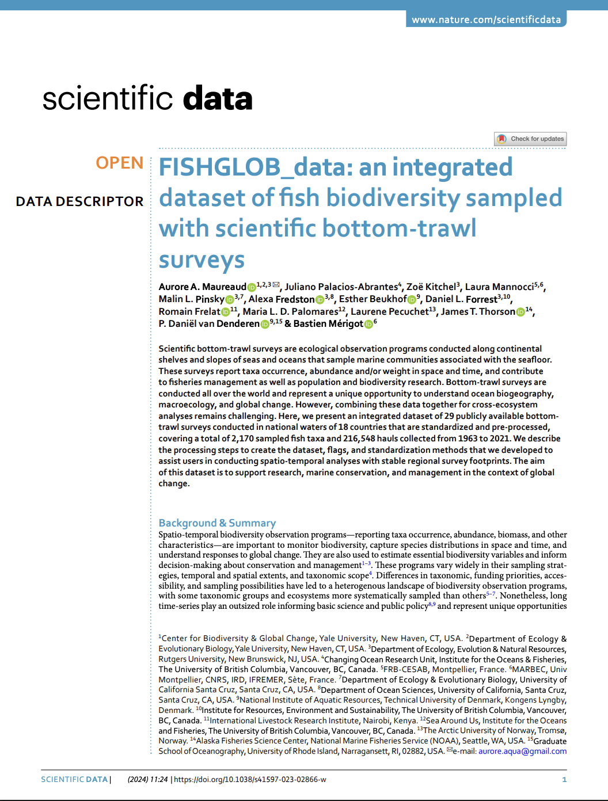

<!-- Logo -->
<a href="https://www.nature.com/articles/s41597-023-02866-w" target="_blank" rel="noopener noreferrer">
  
</a>

<!-- Google tag (gtag.js) -->


<script async src="https://www.googletagmanager.com/gtag/js?id=G-HG1RRBT88J"></script>

<script>
  window.dataLayer = window.dataLayer || [];
  function gtag(){dataLayer.push(arguments);}
  gtag('js', new Date());

  gtag('config', 'G-HG1RRBT88J');
</script>


-   **NOTA: esta es una traducción al español del artículo:** *ARTICUOLO*, escrito por LEAD AUTHOR y colaboradores y que se puede encontrar en la siguiente [liga](LINK). No cuenta con la sección de XXXX.

    -   Traducido por Juliano Palacios. Revisión técnica de Guillermo Palacios.

-   **Forma de Citar**:

<center><a span class="label label-success" href= "LIGAPDF" >Descargar Artículo en Español</span></a></center>

<br>

<!-- Abstract rectangle -->


<style>
div.blue { background-color:#e6f0ff; border-radius: 5px; padding:20px;}
</style>


::: blue


```{r setup, eval = T, echo=F, warning=F,message=F, results='hide'}

#### Library ####
packages <- c(
  "knitr",
  "kableExtra",
  "png",
  "grid"
)

MyFunctions::my_lib(packages)

```

# Resumen

<center>


**LEYENDA IMAGEN**

</center>

<br>
:::

------------------------------------------------------------------------


Ver referencias en [texto original](LIGA).

-   **Forma de Citar**: 

-   Traducido por Juliano Palacios. Revisión técnica de Guillermo Palacios. *ChatGPT* y *Google Translator* fueron utilizados en la traducción de este artículo del inglés al español.
