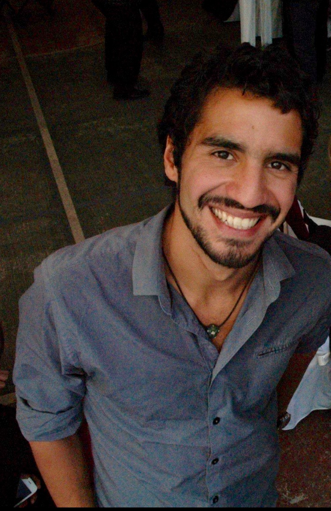

 

Welcome to my personal webpage. I am a PhD. student at the University of British Columbia in Vancouver, Canada. As part of The Changing Ocean Research Unit [(CORU)](http://coru.oceans.ubc.ca/), I am particularly interested on how climate change will impact fisheries management in Latin America and how to mitigate its socio-ecological implications. My projects and emerging professional direction look to understand how does climate change impacts affect social structures, such as food security and local economies, how they can be measured, and how to create social adaptive capacity to such changes.

I support collaborative-inter-disciplinary work and I believe that all scientific work (and data) should be public and of open access. As a Brazilian-Mexican citizen, I am committed to support policy-making and resources management decisions with a strong interdisciplinary science. I have worked with different governmental (e.g. *Comisión Nacional Para el Conocimiento de la BIodiversidad (CONABIO)*) and non-governmental organizations (e.j. Environmental Defense Fund - Mexico and The nature Conservancy - Peru) to tackle important problems facing fisheries in Latin America.

 

On my free time I like to explore the above-and-under water world, play some soccer, take random walks, and watch movies, all of these in company of my pup, Niema. In my webpage you will find information regarding my research and other work-related activities. You will also find a section intended to share some of my personal hobbies. Please refer to the contact section for any comments or future communication.

 

**Contact**

Juliano Palacios Abrantes | j.palacios@oceans.ubc.ca • [Googel Schoolar](https://scholar.google.ca/citations?user=EZpBcjcAAAAJ&hl=en)

<!-- Global site tag (gtag.js) - Google Analytics -->
<head>

</head>