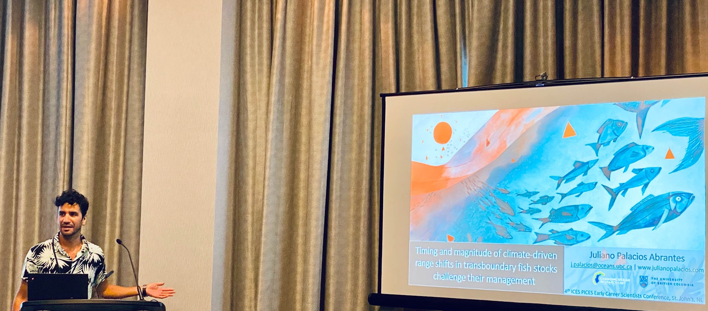

 

# On Paper

Here is a list of news articles and blogs featuring my work or where I have been quoted:

## English
- Inside Climate News - [As an Obscure United Nations Gathering Deliberates the Fate of Deep-Sea Mining, the Tuna Industry Calls for a Halt](https://insideclimatenews.org/news/11072023/tuna-deep-sea-mining/){target="_blank"}

- Vector: The British Royal Academy Sci-Fi magazine - [The living infinite](https://vector-bsfa.com/2022/09/30/the-living-infinite/){target="_blank"}
- University of British Columbia - [Nature, society, and culture should be taken into consideration when dealing with climate change](https://oceans.ubc.ca/2022/10/20/nature-society-and-culture-should-be-taken-into-consideration-when-dealing-with-climate-change/){target="_blank"}
- The Conversation Canada - [Managing fish stocks shared by nations must focus on the impacts of climate change](https://theconversation.com/managing-fish-stocks-shared-by-nations-must-focus-on-the-impacts-of-climate-change-181828){target="_blank"}
- Glacier Media Group - [Fish populations are shifting around the planet and ‘someone is going to lose out,’ says UBC researcher](https://www.timescolonist.com/highlights/fish-populations-are-shifting-around-the-planet-and-someone-is-going-to-lose-out-says-ubc-researcher-4973909){target="_blank"}
- University of British Columbia - [Global fish stocks can’t rebuild if nothing done to halt climate change and overfishing](https://news.ubc.ca/2022/09/01/global-fish-stocks-cant-rebuild-climate-change-overfishing/){target="_blank"}
- Canada’s National Observer - [Climate change could spark international fish fights](https://www.nationalobserver.com/2022/01/21/news/climate-change-could-spark-international-fish-fights){target="_blank"}
- COMPASS, Celebrating Latino Conservation Week - [The Importance of Giving Back](https://www.compassscicomm.org/the-importance-of-giving-back/){target="_blank"}
- University of British Columbia - [Nearly half of countries shared fish stocks are on the move due to climate change prompting dispute concerns]("https://oceans.ubc.ca/2022/01/18/nearly-half-of-countries-shared-fish-stocks-are-on-the-move-due-to-climate-change-prompting-dispute-concerns/){target="_blank"}
- Centre for Ocean Solutions - [New study emphasizes importance cooperative fisheries management](https://oceansolutions.stanford.edu/stories-events/no-visas-fish-new-study-emphasizes-importance-cooperative-fisheries-management){target="_blank"}
- University of British Columbia - [Management of exploited transboundary fish stocks requires international cooperation](https://oceans.ubc.ca/2020/10/21/transboundary/){target="_blank"}
- National Geographic - [Climate change drives fish wars science environment](https://news.nationalgeographic.com/2018/06/climate-change-drives-fish-wars-science-environment/){target="_blank"}
- Washington Post - [Climate change is moving fish around faster than laws can handle study says](https://www.washingtonpost.com/news/speaking-of-science/wp/2018/06/14/climate-change-is-moving-fish-around-faster-than-laws-can-handle-study-says/?noredirect=on&utm_term=.ef8d0372e603){target="_blank"}
- University of British Columbia - [Understanding the data about data how metadatabases could improve Mexico's ocean management](http://oceans.ubc.ca/2019/06/12/understanding-the-data-about-data-how-metadatabases-could-improve-mexicos-ocean-management/){target="_blank"}
- Oceans Deeply - [Tear down that paywall, the movement to make ocean research free for all](https://www.newsdeeply.com/oceans/articles/2018/01/18/tear-down-that-paywall-the-movement-to-make-ocean-research-free-for-all){target="_blank"}

## Español

- CONACyT Prensa - [¿Cómo afectará el cambio climático las pesquerías del mundo?](http://www.conacytprensa.mx/index.php/ciencia/ambiente/24771-cambio-climatico-pesquerias-mundo){target="_blank"}
- adn40 - [Plataforma permitira conocer riqueza de los oceanos de México](https://www.adn40.mx/noticia/mexico/nota/2019-06-08-20-21/plataforma-permitira-conocer-riqueza-de-los-oceanos-de-mexico/?utm_source=adn40mxNota&utm_medium=tw&utm_campaign=M)
- Blog de EDF de México - [La ciencia es parte vital de nuestra vision de conservacion ambiental ](https://mexico.edf.org/blog/2019/06/07/la-ciencia-es-parte-vital-de-nuestra-vision-de-conservacion-ambiental?utm_campaign=edf-de-mexico_none_upd_ocn&utm_id=1559913502&utm_medium=social-media&utm_source=twitter)
- Blog de EDF de México - [Colabora en la construccion de un catalogo sobre informacion marina en México](http://mexico.edf.org/blog/2017/06/13/colabora-en-la-construccion-de-un-catalogo-sobre-informacion-marina-en-mexico){target="_blank"}
- CONACYT Prensa - [Crean base de metadatos de investigacion marina en México](http://conacytprensa.mx/index.php/ciencia/mundo-vivo/13008-crean-base-de-metadatos-de-investigacion-marina-en-mexico){target="_blank"}

----

# On the Radio

Here is a list of radio interviews I have been invited to:

## English

- Quirks and Quarks with Bob McDonald (CBC) - [Climate change could spark fish wars around the globe](https://www.cbc.ca/listen/live-radio/1-51/clip/15893391){target="_blank"}

- The Mike Smith Show - [Are fish on the move due to climate change?](https://omny.fm/shows/mike-smyth/are-fish-on-the-move-due-to-climate-change){target="_blank"}

## Spanish

- Radio El Colégio de Michoacán - [Los peces no necesitan Visa](www.radiomichoacanb.com){target="_blank"}

----

# Invited speaker

Here is a list of public talks, seminars and webinars I have been invited to:

## English

- Workshop 4 of the Effects of Climate Change on the World's Oceans (ECCWO) conference, Norway. *Using modelling to inform transboundary fisheries management under climate change*. 

- NWFSC Monster Seminar Jam (webinar) - [Marine fishes do not need visas: managing shared fish stocks in a changing world.](https://www.fisheries.noaa.gov/west-coast/science-data/nwfsc-monster-seminar-jam#seminar-recordings){target="_blank"}

- Workshop organized by the Marine Stewardship Council (MSC) and the United Nations Food and Agricultural organization (FAO), Italy - *Timing and magnitude of climate-driven range shifts in transboundary fish stocks challenge their management*

-  Seminar Series, Center for Limnology, University of Wisconsin-Madison, United States - *Challenges of managing transboundary stocks on the move*

- Lenfest Ocean Program - [New Research to Adaptive Allocation for Transboundary Fish Stocks](https://www.lenfestocean.org/news-and-publications/multimedia/webinar-on-new-research-to-adaptive-allocation-for-transboundary-fish-stocks){target="_blank"}

- Skype a scientist, Canada - *The marine pathway of a Latin American student*

- Seminar Series, Marine Institute, School of Fisheries, Memorial University, Canada - *Marine fish do not need visas: Transboundary fisheries management under climate change*

- Center for Complex Systems Transition, Stellenbosch Institute for Advanced Study, South Africa - *Marine governance in the anthropocene: Lessons from South Africa and Latin America*

-  State of the Gulf of Mexico Conference, Texas - *Towards the creation of a metadata of marine research in Mexico: a case study of the Gulf of Mexico*

- Weekly seminars. The United Nations Environment World Conservation Monitoring Center (UN-WCMC), UK - *Building capacity for fisheries management under climate change in Latin America*

## Español

- Centro Austral de Investigaciones Científicas (CADIC-CONICET), Argentina. - *Efectos del cambio climático en el manejo de especies transfronterisas*

- Webinarios del Laboratorio Nacional de Resiliencia Costera, México. - [Límites dinámicos como herramientas para la protección marina en océanos cambiantes ](https://www.facebook.com/LANRESC/videos/4140220856092892)

- Consejo nacional para la Biodiversidad (CONABIO), México - *Hacia la creación de una base de metadatos de investigación marina en México*. 

- *Hacia la creación de una base de metadatos de investigación marina en México*. Serie de charlas en diversas institutiones mexicanas incluyendo: Unidad Académica Sisal del Instituto de Ciencias del mar y Limnología de la Universidad Nacional Autónoma de México, Sisal, Yucatán; El Centro de Investigación y de Estudios Avanzados del Instituto Politécnico Nacional, Mérida, Yucatán; Centro Interdisciplinario de Ciencias Marinas del Instituto Politécnico Nacional, La Paz, BCS, y Centro de Investigación Científica y de Educación Superior de Ensenada, Baja California Norte, México

----

# Illustrations

Here is a list of illustrations featuring my work, note that not all of them were created by me:

- [Marine species do not need visas: Regulatory boundaries and species distributions often do not align (A. Pozas and K. McMullen)](./Images/Infographics/FishForVisa.png){target="_blank"}

- [Graphic summary for Palacios-Abrantes et al., 2020 ](https://github.com/jepa/EmergingFish/blob/master/Figures/Fig00.png?raw=true){target="_blank"}

---- 

**Contact**

j.palacios [at] oceans.ubc.ca | [Google Scholar](https://scholar.google.ca/citations?user=EZpBcjcAAAAJ&hl=en){target="_blank"} | [Twitter](https://twitter.com/julianop_a)

